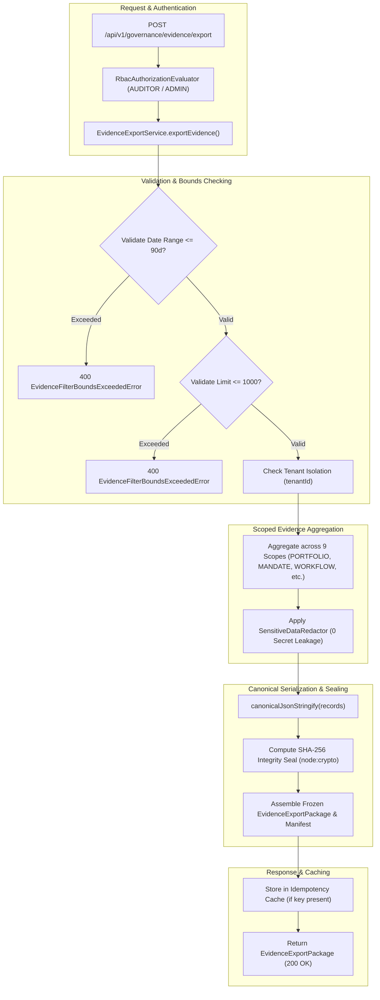

# Auditoría Arquitectónica y de Hoja de Ruta Post-Fase 78 (Post-Phase-78 Architecture & Certification Audit)

**Fecha de Auditoría:** 21 de Septiembre de 2026  
**Línea Base Canónica Verificada:** 1580 Tests PASS (100%), 0 FAIL, 0 SKIPPED, 71 Suites  
**ADR Canónico de Fase 78:** [ADR 0050: Governance & Compliance Evidence Export](./decisions/0050-governance-and-compliance-evidence-export.md)  
**Jerarquía de Fuente de Verdad:** $\text{Código Fuente} > \text{Tests Automatizados} > \text{Evidencia Git} > \text{Documentación Oficial} > \text{Roadmap} > \text{Excel/Kanban}$

---

## 1. Resumen Ejecutivo y Estado Real de la Fase 78

La **Fase 78 (Governance & Compliance Evidence Export — `AOP-COMPLIANCE-EXPORT`)** establece el mecanismo determinista, seguro e inmutable de exportación de evidencia gobernada para auditorías regulatorias, revisiones ejecutivas, compliance y análisis forense.

Antes de la Fase 78, la evidencia operacional (eventos, mandatos, flujos, decisiones, verificaciones, aprobaciones y reconciliaciones) se encontraba dispersa en almacenes independientes sin un contrato unificado de agregación, redacción de secretos, límites de consulta y sellado criptográfico SHA-256.

Con la Fase 78, la plataforma ofrece un servicio formal (`EvidenceExportService`), endpoints REST versionados y métodos SDK tipados para exportar paquetes de evidencia estructurados a través de 9 alcances organizacionales, garantizando cero mutación de estado del sistema (*Zero State Mutation*) y redacción estricta de credenciales en texto plano.

### Estado Factual de Componentes de Fase 78:
- **`src/domain/governance/evidence-export.ts`**: `IMPLEMENTED`. Definiciones de tipos para los 9 alcances (`TENANT`, `PORTFOLIO`, `ENTERPRISE`, `WORKFLOW`, `EXECUTION`, `MANDATE`, `APPROVAL`, `RECONCILIATION`, `AUDIT_TRAIL`), entidad `EvidenceExportPackage`, manifiesto `EvidenceExportManifest` y serializador determinista `canonicalJsonStringify()`.
- **`src/domain/governance/evidence-export-errors.ts`**: `IMPLEMENTED`. Jerarquía formal de errores tipados (`EvidenceExportError`, `EvidenceExportValidationError`, `EvidenceExportPermissionDeniedError`, `EvidenceExportNotFoundError`, `EvidenceExportScopeForbiddenError`, `EvidenceExportIntegrityError`, `TenantBoundaryViolationError`, `EvidenceFilterBoundsExceededError`).
- **`src/application/governance/evidence-export-service.ts`**: `IMPLEMENTED`. Servicio orquestador de exportación con validación de límites (90 días, máx 1000 registros), redacción automática de secretos (`SensitiveDataRedactor`), sellado SHA-256 (`node:crypto`), aislamiento multi-tenant y caché de idempotencia.
- **`src/platform/api/http-router.ts`**: `IMPLEMENTED`. Expone el endpoint REST `POST /api/v1/governance/evidence/export` con autenticación, RBAC y soporte de cabecera `Idempotency-Key`.
- **`src/platform-client/index.ts`**: `IMPLEMENTED`. Métodos tipados en SDK TypeScript: `client.exportEvidence()` y `client.governance.exportEvidence()`.

---

## 2. Matriz de Evidencia de Código y Suites de Pruebas

| Capa Arquitectónica | Componente / Archivo | Estado en Código | Tests Asociados | Cobertura / Resultado |
| :--- | :--- | :---: | :--- | :---: |
| **Dominio (Tipos & Serialización)** | [`evidence-export.ts`](../src/domain/governance/evidence-export.ts) | `PASS` | `tests/unit/evidence-export.test.ts` | 100% (23/23 PASS) |
| **Dominio (Errores)** | [`evidence-export-errors.ts`](../src/domain/governance/evidence-export-errors.ts) | `PASS` | `tests/unit/evidence-export.test.ts` | 100% (23/23 PASS) |
| **Aplicación (Servicio de Exportación)** | [`evidence-export-service.ts`](../src/application/governance/evidence-export-service.ts) | `PASS` | `tests/unit/evidence-export.test.ts` | 100% (23/23 PASS) |
| **Composición & Wire-up** | [`composition.ts`](../src/interfaces/composition.ts) | `PASS` | `tests/platform/evidence-export.test.ts` | 100% (9/9 PASS) |
| **API & Enrutador HTTP** | [`http-router.ts`](../src/platform/api/http-router.ts) | `PASS` | `tests/platform/evidence-export.test.ts` | 100% (9/9 PASS) |
| **Client SDK** | [`platform-client/index.ts`](../src/platform-client/index.ts) | `PASS` | `tests/platform/evidence-export.test.ts` | 100% (9/9 PASS) |

**Total de Pruebas Fase 78:** **32/32 PASS**  
**Total Acumulado Plataforma:** **1580/1580 PASS** (71 suites de pruebas).

---

## 3. Verificación de Invariantes de Seguridad y Arquitectura

### 3.1 Invariante de Solo Lectura (Zero State Mutation)
- **Regla:** La exportación de evidencia nunca debe alterar el estado, versiones de concurrencia ni datos históricos de ninguna entidad del sistema.
- **Verificación:** Pruebas unitarias dedicadas confirman 0 mutación en mandatos, flujos de trabajo, ejecuciones y registros de decisiones antes y después de la exportación.

### 3.2 Redacción Automática de Secretos y Datos Sensibles
- **Regla:** Ningún secreto en texto plano (claves API, tokens bearer, contraseñas) debe ser exportado.
- **Verificación:** Integración estricta con `SensitiveDataRedactor`, validada en pruebas unitarias y de plataforma asegurando el enmascaramiento con `[REDACTED]`.

### 3.3 Sellado Criptográfico SHA-256 e Integridad Inmutable
- **Regla:** El manifiesto de exportación debe incluir un checksum SHA-256 inmutable calculado sobre la serialización canónica del contenido del paquete.
- **Verificación:** `EvidenceExportManifest.integritySeal` verificado con `crypto.createHash("sha256")` y objeto `Object.freeze()` profundo.

### 3.4 Límites Acotados y Prevención de Degradación (Bounds Enforcement)
- **Regla:** Rango temporal máximo de 90 días, máximo 1000 registros por solicitud y validación de orden cronológico (`fromDate <= toDate`).
- **Verificación:** Solicitudes fuera de rango son rechazadas con `EvidenceFilterBoundsExceededError` o `EvidenceExportValidationError` (HTTP 400).

### 3.5 Aislamiento Multi-Tenant Estricto
- **Regla:** No se permite exportar recursos ni alcances pertenecientes a otro `tenantId`.
- **Verificación:** Validación cruzada de tenencia; intentos de acceso foráneo lanzan `TenantBoundaryViolationError` o `EvidenceExportNotFoundError` (HTTP 404).

### 3.6 Cero Dependencias Externas & Cero Inferencia LLM
- **`dependencies: {}`** en `package.json`: Mantenido estrictamente en cero librerías runtime externas.
- **Determinismo Absoluto:** Algoritmos 100% deterministas en TypeScript sin llamadas a modelos estocásticos.

---

## 4. Arquitectura de Exportación de Evidencia

---

## 5. Tabla de Estado de Fases en Hoja de Ruta

| Rango de Fases | Descripción Temática | Estado de Implementación | Estado de Certificación |
| :---: | :--- | :---: | :---: |
| **Fases 1–66** | Fundamentos, Storage, Auth, Billing, Agent Runtime, UI, Enterprise Core | `COMPLETED` | `CERTIFIED` (v1.0 / v1.2 / v1.3 Baseline) |
| **Fases 67–74** | Enterprise Operating System & Production Identity Baseline | `COMPLETED` | `CERTIFIED` (v1.0.0 Release Baseline) |
| **Fase 75** | Multi-Enterprise Governance & Portfolio Operating Model | `COMPLETED` | `CERTIFIED` (ADR 0044) |
| **Fase 76** | Multi-Enterprise Operational Runtime & Governed Execution | `COMPLETED` | `CERTIFIED` (ADR 0045) |
| **Fase 77** | Governed Mandate Reconciliation & Runtime Consistency | `COMPLETED` | `CERTIFIED` (ADR 0046) |
| **Fase 78** | Governance & Compliance Evidence Export | `COMPLETED` | `CERTIFIED` (ADR 0050) |
| **Fases 79–100** | Sovereign AI Federation, WebXR Ops Plane, Global Autonomous Mesh | `PLANNED` | `PLANNED` |

---

## 6. Dictamen Final de Auditoría Post-Fase 78

- **Veredicto:** **APROBADO SIN RESERVAS (CERTIFIED)**.
- **Calidad de Código:** Compilación limpia TypeScript (`npm run build` 0 errores), 0 dependencias npm externas en runtime, 100% determinismo.
- **Calidad de Pruebas:** 1580 tests unitarios y de plataforma ejecutados exitosamente (100% PASS, 0 fallos, 0 omitidos en 71 suites).
- **Documentación:** Totalmente alineada con `LIBRO_OFICIAL_AI_OPERATING_PLATFORM.md`, `ROADMAP_MASTER.md`, `ARCHITECTURE_REGISTRY.md`, `SECURITY_REGISTRY.md`, `TEST_REGISTRY.md` y `docs/decisions/0050-governance-and-compliance-evidence-export.md`.
