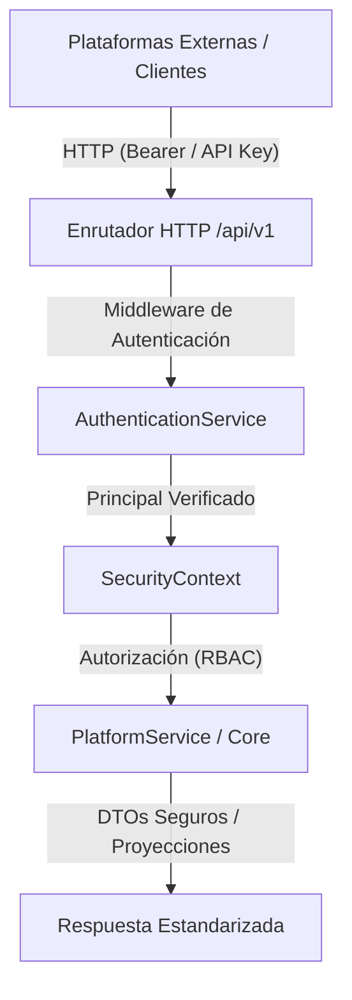

# Plataforma Operativa de IA — Contrato de API de Plataforma (/api/v1)

## Visión General

La API de Plataforma (`/api/v1`) proporciona una interfaz HTTP REST desacoplada, segura y de nivel de producción sobre el Core de la Plataforma Operativa de IA. Conecta plataformas cliente externas, ejecutores de flujo de trabajo y adaptadores de aplicaciones (como Tentaciones) al motor de ejecución subyacente sin acoplarse a los detalles internos de la plataforma o eludir las garantías de seguridad.

---

## Arquitectura y Límite de Seguridad



Cada solicitud entrante a un endpoint protegido debe someterse a:
1. **Autenticación**: Credenciales extraídas del encabezado `Authorization` (`Bearer <token>` o `ApiKey <keyId>.<secret>`) o del encabezado `X-API-Key`. Validadas mediante `AuthenticationService`.
2. **Establecimiento de Contexto**: Se construye un `SecurityContext` verificado que contiene `principalId`, `roles`, `tenantId`, `correlationId` y marcas de tiempo (timestamps).
3. **Autorización**: Evaluada a través de `RbacAuthorizationEvaluator` frente a los permisos requeridos (por ejemplo, `public.read`, `agent.read`, `task.create`, `task.read`, `task.cancel`).
4. **Aislamiento de Inquilino (Tenant Isolation)**: Las tareas se crean con y se filtran por el `tenantId` verificado del llamador. El acceso a datos entre inquilinos se rechaza estrictamente.
5. **Vinculación de Identidad del Llamador**: `callerId` se vincula automáticamente desde `SecurityContext.principal.id` y no puede ser falsificado en las cargas útiles (payloads) de la tarea.
6. **Sanitización de Errores y DTOs Seguros**: Los seguimientos de pila (stack traces) internos, errores de sistema en bruto y parámetros de agentes sensibles (por ejemplo, secretos de entorno) se redactan antes de la serialización.

---

## Estándar de Sobre de Respuesta

Todas las respuestas de `/api/v1` se adhieren a una estructura uniforme:

### Respuesta Exitosa (`200 OK` / `201 Created`)
```json
{
  "success": true,
  "data": { ... },
  "correlationId": "req-1726265000000-abc123"
}
```

### Respuesta de Error (`4xx` / `5xx`)
```json
{
  "error": "Acceso denegado: falta el permiso task.create",
  "status": 403,
  "code": "SECURITY_DEFAULT_DENY",
  "requestId": "req-1726265000000-abc123"
}
```

---

## Referencia de Endpoints

### 1. Sonda de Salud (Público)
- **Método y Ruta**: `GET /api/v1/health`
- **Autenticación**: Ninguna (Público)
- **Permisos**: Ninguno
- **Descripción**: Verificación ligera de salud, liveness, readiness y tiempo de actividad para balanceadores de carga y orquestadores de contenedores.
- **Estado de Éxito**: `200 OK`
- **Respuesta**:
```json
{
  "status": "HEALTHY",
  "version": "1.0.0",
  "uptime": 123.456,
  "timestamp": "2026-09-13T22:00:00.000Z",
  "liveness": "UP",
  "readiness": "READY"
}
```

---

### 2. Capacidades de Plataforma y Metadatos (Protegido)
- **Método y Ruta**: `GET /api/v1/platform`
- **Autenticación**: Requerida
- **Permiso Requerido**: `public.read` / `platform:read`
- **Descripción**: Devuelve capacidades de plataforma no sensibles, proveedores de modelos registrados, nombres de herramientas, recuentos de agentes y estado operativo.
- **Estado de Éxito**: `200 OK`
- **Respuesta**:
```json
{
  "version": "1.0.0",
  "environment": "production",
  "capabilities": {
    "multiAgent": true,
    "streaming": false,
    "durability": true,
    "rbac": true
  },
  "registeredAgentsCount": 12,
  "availableTools": ["calculator"],
  "supportedModels": ["stub-model", "gpt-4o", "claude-3-5-sonnet"]
}
```

---

### 3. Listar Agentes Seguros (Protegido)
- **Método y Ruta**: `GET /api/v1/agents`
- **Autenticación**: Requerida
- **Permiso Requerido**: `agent.read` / `agents:read`
- **Descripción**: Devuelve agentes registrados con metadatos redactados/sanitizados. Se omiten las instrucciones internas, los secretos y los prompts del sistema.
- **Estado de Éxito**: `200 OK`
- **Respuesta**:
```json
[
  {
    "id": "foundation-agent",
    "name": "Foundation Agent",
    "description": "Agente operativo de propósito general predeterminado",
    "status": "ACTIVE",
    "model": "stub-model",
    "tools": ["calculator"]
  }
]
```

---

### 4. Crear Tarea (Protegido)
- **Método y Ruta**: `POST /api/v1/tasks`
- **Autenticación**: Requerida
- **Permiso Requerido**: `task.create` / `tasks:create`
- **Encabezados**:
  - `Idempotency-Key` (Opcional): Clave de idempotencia única. Repetir una solicitud con la misma clave devuelve el resultado de la tarea completada en caché sin volver a ejecutar.
  - Si una solicitud concurrente ya está en vuelo con la misma clave, se devuelve HTTP `409 Conflict` (`code: IDEMPOTENCY_CONCURRENT_EXECUTION`).
  - Si una solicitud repetida proporciona una carga útil que difiere de la solicitud inicial, se devuelve HTTP `409 Conflict` (`code: IDEMPOTENCY_PAYLOAD_MISMATCH`).
- **Cuerpo (Body)**:
```json
{
  "agentId": "foundation-agent",
  "input": {
    "message": "Calcular total"
  },
  "traceId": "trace-uuid-1234"
}
```
- **Descripción**: Crea y programa una nueva tarea de ejecución de plataforma. `callerId` se vincula automáticamente desde el `SecurityContext.principal.id` verificado y `tenantId` se vincula desde el inquilino del principal.
- **Estado de Éxito**: `201 Created` (o `200 OK` si devuelve una tarea idempotente almacenada en caché existente)
- **Respuesta**:
```json
{
  "task": {
    "id": "task-uuid-1234",
    "agentId": "foundation-agent",
    "status": "COMPLETED",
    "input": {
      "message": "Calcular total",
      "metadata": {
        "callerPrincipalId": "service-tentaciones",
        "callerTenantId": "tenant-tentaciones",
        "idempotencyKey": "idemp-001"
      }
    }
  },
  "execution": {
    "id": "exec-uuid-5678",
    "status": "COMPLETED",
    "result": { "total": 42 }
  }
}
```

---

### 5. Obtener Tarea por ID (Protegido)
- **Método y Ruta**: `GET /api/v1/tasks/:id`
- **Autenticación**: Requerida
- **Permiso Requerido**: `task.read` / `tasks:read`
- **Descripción**: Recupera el estado detallado de la tarea. Rechaza el acceso entre inquilinos con `404 Not Found` para evitar ataques de enumeración.
- **Estado de Éxito**: `200 OK`

---

### 6. Cancelar Tarea (Protegido)
- **Método y Ruta**: `POST /api/v1/tasks/:id/cancel`
- **Autenticación**: Requerida
- **Permiso Requerido**: `task.cancel` / `tasks:cancel`
- **Cuerpo (Body)**:
```json
{
  "reason": "El usuario canceló la solicitud a través del panel"
}
```
- **Descripción**: Señala la cancelación para una tarea en vuelo o pendiente. Las tareas terminales no cancelables devuelven `409 Conflict`.
- **Estado de Éxito**: `200 OK`

---

### 7. Obtener Línea de Tiempo de Eventos de Tarea (Protegido)
- **Método y Ruta**: `GET /api/v1/tasks/:id/events`
- **Autenticación**: Requerida
- **Permiso Requerido**: `task.read` / `tasks:read`
- **Descripción**: Devuelve eventos de registro de auditoría duraderos asociados con el flujo de tareas especificado.
- **Estado de Éxito**: `200 OK`

---

## SDK de Cliente TypeScript (`PlatformClient`)

La plataforma exporta un cliente oficial de Node.js / TypeScript en `src/platform-client`:

```typescript
import { PlatformClient } from "@platform/client";

const client = new PlatformClient({
  baseUrl: "http://localhost:3000",
  apiKey: "key_service.secret_xyz123"
});

// Verificación de salud
const health = await client.health();

// Obtener capacidades de la plataforma
const meta = await client.platform.get();

// Listar agentes seguros
const agents = await client.agents.list();

// Crear y ejecutar tarea
const result = await client.tasks.create({
  agentId: "foundation-agent",
  input: { message: "Seguridad de IA" },
  idempotencyKey: "uuid-v4-client-key"
});

// Consultar estado de la tarea
const task = await client.tasks.get(result.task.id);

// Cancelar tarea
await client.tasks.cancel(task.id, "Cancelado por el cliente");

// Leer flujo de eventos de auditoría
const events = await client.tasks.events(task.id);
```
