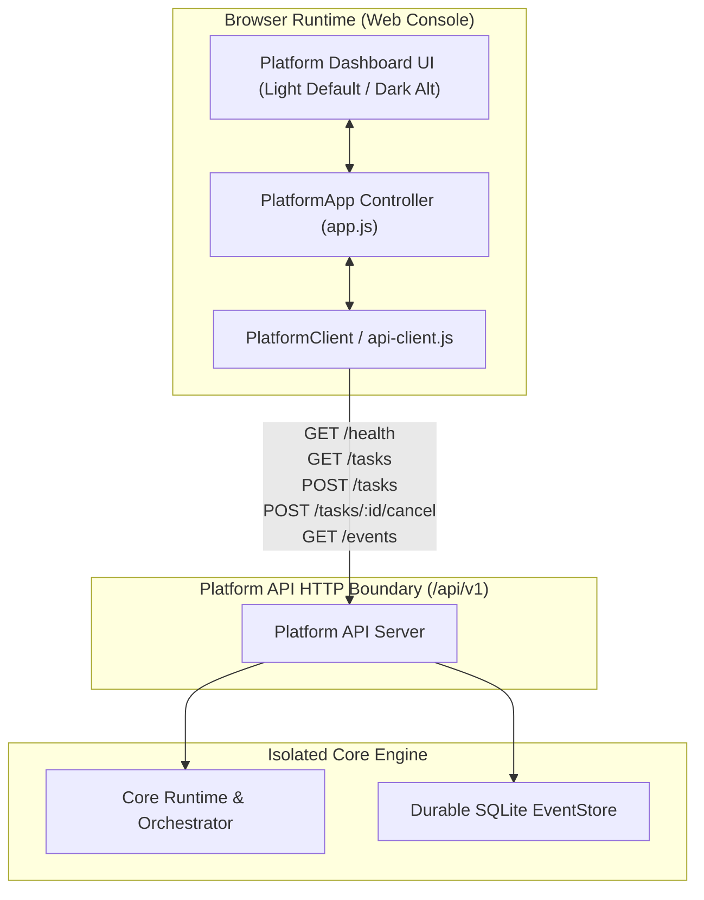

# AI Operating Platform — Platform Dashboard & Runtime Console

## 1. Executive Summary & Architectural Invariant

The **Platform Dashboard & Runtime Console** constitutes the primary operational interface of the AI Operating Platform. It strictly respects the mandatory three-tier boundary:

```text
CORE ENGINE ≠ PLATFORM PRODUCT ≠ APPLICATIONS
```

The Web Console operates exclusively as an unprivileged client of the public Platform API (`/api/v1` and `/api/platform/v1`), interacting via the typed `PlatformClient` SDK and `api-client.js`. It performs zero direct imports or invocations of domain logic, SQLite repositories, event stores, or runtime loops.



---

## 2. Operational Telemetry & Component Readiness

The dashboard monitors real-time system health and readiness across all foundational subsystems:

| Component | Telemetry Metric | Status Values | Description |
|---|---|---|---|
| **Platform Health** | `health.status` | `HEALTHY`, `DEGRADED`, `OFFLINE` | Global operational readiness indicator |
| **Platform API** | `components.api.status` | `ONLINE`, `DEGRADED`, `OFFLINE` | REST endpoint responsiveness & latency |
| **Core Runtime** | `components.coreRuntime.status` | `ONLINE`, `BUSY`, `OFFLINE` | Active agent executions and task processing |
| **Persistence** | `components.persistence.status` | `ONLINE`, `DEGRADED` | SQLite WAL durable database connection |
| **Event Store** | `components.eventStore.status` | `ONLINE`, `OFFLINE` | Append-only event store ledger & sequence tracking |

---

## 3. Task Management & Execution Lifecycle

The runtime console allows operators to:
1. **Submit Objectives**: Dispatch high-level objectives to active registered AI agents.
2. **Observe Real-Time Execution**: Stream multi-round reasoning steps, tool invocations, and model generations.
3. **Inspect Plan Progress**: Visualize execution plans, ordered steps, and intermediate observations.
4. **Abort / Cancel Tasks**: Issue controlled cancellation signals (`POST /api/v1/tasks/:id/cancel`) with audit reasons.

### Controlled Polling & Visibility Lifecycle

- **Automatic Termination**: Execution polling loops terminate immediately when reaching a terminal state (`COMPLETED`, `FAILED`, `CANCELLED`, `TIMEOUT`, `POLICY_DENIED`).
- **Tab Visibility Awareness**: The `document.visibilitychange` event suspends interval timers when the browser tab is in the background (`document.hidden === true`), and immediately refreshes telemetry upon returning to the foreground.
- **Exponential Backoff**: Polling frequency throttles smoothly (from 250ms up to 1500ms) to prevent server contention.

---

## 4. Frontend Security & XSS Mitigation

1. **Zero `innerHTML` Usage**: All dynamic content (agent names, tool payloads, LLM responses, errors) is rendered strictly through `document.createElement`, `textContent`, `append`, and safe DOM attributes.
2. **Fail-Closed Error Handling**: Network failures and API rejections are mapped to normalized, safe UI status badges without exposing internal stack traces.
3. **No Inlined Secrets**: Client code never handles or stores sensitive master keys; all authentication tokens are exchanged over standard HTTP headers.

---

## 5. Design System & Theme Foundation

- **Default Canvas**: Executive Light Theme (`--bg-primary: #f8fafc`, `--text-primary: #0f172a`, `--card-bg: #ffffff`).
- **Alternative Canvas**: Executive Dark Theme (`--bg-primary: #08090d`, `--text-primary: #f1f5f9`, `--card-bg: #11141c`).
- **Toggle Control**: Instant theme switching persisted via `localStorage` (`ai_platform_theme`).
