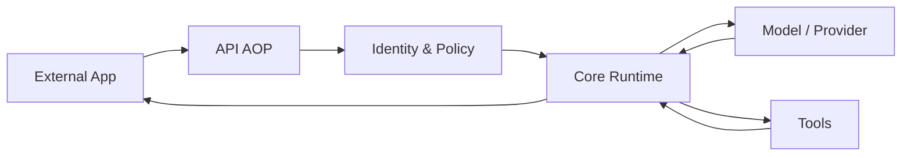
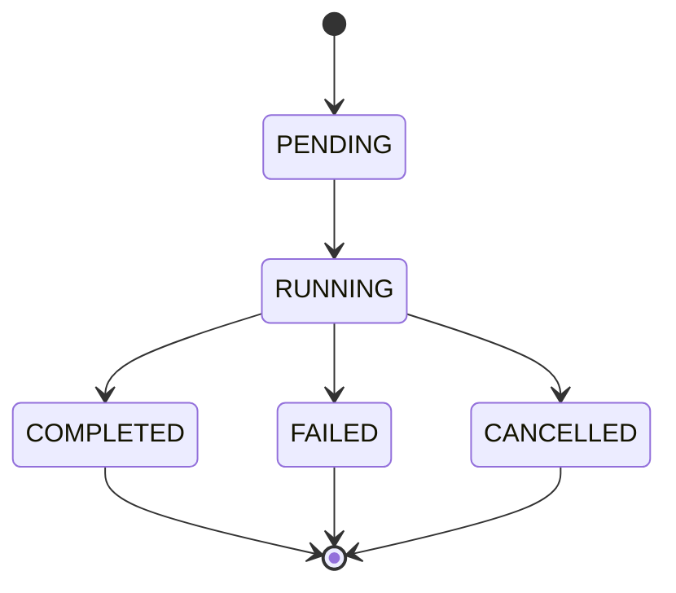

# AI Operating Platform (AOP) - Narrativa de Plataforma

## Executive Snapshot
```text
Version:           1.4.0
Status:            Production Hardened
Tests:             1400+ PASS, 0 FAIL
Runtime deps:      0 (only Node.js built-ins)
Providers:         OpenAI, Anthropic, Gemini, Ollama, Stub
Agents:            First-class with tool whitelist and memory isolation
Budget:            Multi-dimensional team quotas with atomic enforcement
Multi-tenancy:     Strict tenant isolation (Organization > Area > Team)
API:               100+ REST endpoints under /api/v1
Known limitations: No live TLS, no live OIDC IdP
Production exit:   CERTIFIED WITH OPEN GAPS
```

## 1. La Plataforma en Una Página
La plataforma es un sistema operativo para la inteligencia artificial empresarial. No es un chatbot ni un LLM. Es la capa de control entre tus aplicaciones y los modelos de IA. Sirve para que cualquier equipo pueda usar IA de forma segura, controlada y auditable.



## 2. La Historia de una Solicitud
Cuando una aplicación hace una petición, ocurre este flujo exacto:

`REQUEST → IDENTITY → POLICY → BUDGET → PLAN → EXECUTION → OBSERVATION → DECISION → AUDIT`

**Ejemplo**: Una tienda de ropa pide clasificar una foto de producto.

1. **REQUEST**: La app envía la foto y pide usar el Agente "Clasificador".
2. **IDENTITY**: La plataforma verifica quién hace la petición (Ej: Tenant "Ventas").
3. **POLICY**: Verifica si "Ventas" tiene permiso para usar el Agente "Clasificador".
4. **BUDGET**: Comprueba si "Ventas" tiene saldo para pagar esta llamada.
5. **PLAN**: Determina qué herramientas y modelos necesita el Agente.
6. **EXECUTION**: Envía la foto al modelo de visión (Ej: GPT-4V).
7. **OBSERVATION**: Mide cuánto tiempo tardó y cuántos tokens se usaron.
8. **DECISION**: Evalúa si el modelo respondió correctamente o si pidió usar otra herramienta.
9. **AUDIT**: Guarda un registro inmutable de todo lo que pasó y descuenta el coste exacto.

## 3. Las Reglas que Nunca se Rompen

1. **El Agente no es la Ejecución**: La definición del agente y su ejecución en memoria están separados.
2. **El Planificador no es el Ejecutor**: Quien decide qué hacer no es quien lo hace.
3. **El Evaluador de Decisiones no es el Ejecutor**: Las decisiones del modelo se evalúan antes de ejecutarse.
4. **CoreRuntime es el dueño único de la ejecución**: Nadie más puede invocar herramientas o modelos.
5. **Fail-Closed por defecto**: Ante la duda o error, se deniega el acceso.
6. **Aislamiento de inquilinos estricto (Tenant isolation)**: Los datos de un Tenant jamás cruzan a otro.
7. **Listas blancas de herramientas (Tool whitelist)**: Un agente solo ve y usa lo que se le aprueba explícitamente.
8. **Aislamiento de memoria**: Los agentes no pueden leer la memoria de otros a menos que se autorice.
9. **Autonomía acotada**: Los agentes tienen un límite estricto de pasos (maxSteps) y de tiempo.
10. **Trazabilidad total (traceId correlation)**: Cada acción se vincula a un ID de traza inmutable.
11. **Dependencias cero en runtime**: Solo se usan módulos nativos de Node.js.
12. **Persistencia SQLite WAL**: Se usa concurrencia optimista y modo WAL para velocidad y seguridad.
13. **Tipado estricto**: Todo fluye a través de contratos definidos en TypeScript strict mode.

## 4. Agentes

| Atributo | Descripción |
| :--- | :--- |
| **QUÉ ES** | Una tarjeta de permisos y configuración para un trabajador de IA. |
| **PARA QUÉ SIRVE** | Define qué modelo, qué herramientas y qué memoria puede usar la IA. |
| **QUÉ RECIBE** | Configuración: `name`, `model`, `tools[]`, `memoryScope`. |
| **QUÉ PRODUCE** | Nada por sí mismo. El `CoreRuntime` hace el trabajo real. |
| **QUÉ NO HACE** | NO ejecuta, NO hace bucles, NO programa tareas (schedule). |

## 5. Ejecución
Las ejecuciones tienen un ciclo de vida definido por máquinas de estado. Una Tarea (`Task`) representa la intención, y la Ejecución (`Execution`) representa el intento de completarla.



| Atributo | Descripción |
| :--- | :--- |
| **QUÉ ES** | El proceso que materializa una solicitud. |
| **PARA QUÉ SIRVE** | Para realizar el trabajo de forma segura y controlada. |
| **QUÉ RECIBE** | Un contexto de agente, un input y límites. |
| **QUÉ PRODUCE** | Un resultado (`Output`), métricas y consumo de tokens. |
| **QUÉ NO HACE** | NO toma decisiones propias fuera del plan aprobado. |

## 6. Autonomía Acotada
La autonomía (`AutonomousOperation`) funciona como un chef en una cocina comercial.

| Atributo | Descripción |
| :--- | :--- |
| **QUÉ ES** | Un bucle de decisión controlado por la plataforma. |
| **PARA QUÉ SIRVE** | Permite al modelo encadenar llamadas a herramientas para resolver problemas complejos. |
| **QUÉ RECIBE** | Un límite de iteraciones (ej: máximo 5 pasos). |
| **QUÉ PRODUCE** | Una secuencia de observaciones y acciones. |
| **QUÉ NO HACE** | NO funciona de forma infinita. NO ejecuta acciones no autorizadas. |

## 7. Seguridad
El modelo principal es **Fail-Closed**. Si falla una comprobación, la solicitud se rechaza.

| Atributo | Descripción |
| :--- | :--- |
| **QUÉ ES** | La capa protectora del sistema. |
| **PARA QUÉ SIRVE** | Evita fugas de datos, acceso no autorizado y abusos. |
| **QUÉ RECIBE** | Tokens de identidad, políticas y reglas de negocio. |
| **QUÉ PRODUCE** | Decisiones binarias: Permitir o Denegar. |
| **QUÉ NO HACE** | NO asume permisos por defecto. NO permite excepciones temporales. |

## 8. Presupuesto y Costes
La plataforma separa las finanzas en tres capas.

| Atributo | Descripción |
| :--- | :--- |
| **QUÉ ES** | El sistema de control de gasto. |
| **PARA QUÉ SIRVE** | Evita facturas sorpresa y reparte los costes por equipo. |
| **QUÉ RECIBE** | El conteo de tokens consumidos y las tarifas del proveedor. |
| **QUÉ PRODUCE** | Descuentos en cuotas (Resource Governance), asientos contables (Cost Accounting) y reglas financieras (Financial Governance). |
| **QUÉ NO HACE** | NO permite el sobregiro no autorizado. NO adivina los costes antes de ejecutarlos. |

## 9. Memoria y Datos
Se utiliza SQLite en modo WAL para una persistencia rápida y segura.

| Atributo | Descripción |
| :--- | :--- |
| **QUÉ ES** | El almacén de contexto y estado de la plataforma. |
| **PARA QUÉ SIRVE** | Guarda las conversaciones, los datos de los inquilinos y el estado de las tareas. |
| **QUÉ RECIBE** | Objetos JSON y metadatos de las ejecuciones. |
| **QUÉ PRODUCE** | Un registro histórico persistente y seguro. |
| **QUÉ NO HACE** | NO mezcla datos entre Tenants (aislamiento estricto). |

## 10. Observabilidad
La observabilidad está dividida por diseño.

| Atributo | Descripción |
| :--- | :--- |
| **QUÉ ES** | Los ojos de la plataforma. |
| **PARA QUÉ SIRVE** | Para entender qué está pasando, por qué falla y cuánto rinde. |
| **QUÉ RECIBE** | Eventos del sistema. |
| **QUÉ PRODUCE** | LOGS (para depurar), METRICS (para alertas), TRACES (para rendimiento) y AUDIT (para seguridad y legal). |
| **QUÉ NO HACE** | NO guarda datos sensibles en los logs en texto claro. |

## 11. Resiliencia y Recuperación
El sistema asume que los proveedores de IA van a fallar.

| Atributo | Descripción |
| :--- | :--- |
| **QUÉ ES** | Las defensas contra fallos externos e internos. |
| **PARA QUÉ SIRVE** | Mantiene la plataforma viva cuando hay problemas. |
| **QUÉ RECIBE** | Errores de red, caídas de modelos, interrupciones. |
| **QUÉ PRODUCE** | Reintentos, cortocircuitos (circuit breaker) y modo degradado (stub fallback). |
| **QUÉ NO HACE** | NO se bloquea esperando infinitamente. |

## 12. API
La puerta de entrada a la plataforma.

| Atributo | Descripción |
| :--- | :--- |
| **QUÉ ES** | Una interfaz RESTful bajo `/api/v1`. |
| **PARA QUÉ SIRVE** | Permite a las aplicaciones externas interactuar con la AOP. |
| **QUÉ RECIBE** | Peticiones HTTP JSON. |
| **QUÉ PRODUCE** | Respuestas estandarizadas y documentadas en la especificación OpenAPI. |
| **QUÉ NO HACE** | NO rompe contratos entre versiones menores. |

## 13. Operaciones
Para saber cómo operar la plataforma en producción, consulte `OPERATIONS.md`.

## 14. Evidencia
La plataforma no asume que funciona, lo demuestra. Categorías: Unit (Unitaria), Contract (Contratos), Integration (Integración), Platform (Plataforma completa), Failure Injection (Inyección de fallos).

## 15. AOP-V1-EXIT
Para el estado actual, brechas conocidas y certificación de producción, consulte `AOP-V1-EXIT.md`.

## 16. Roadmap
- **v1.4**: Producción endurecida (Actual).
- **v1.5**: Refactorización del enrutador de modelos.
- **v2.0**: Arquitectura distribuida.

---

> "Una solicitud entra. La plataforma identifica quién la hace. Comprueba qué puede hacer. Comprueba cuánto puede consumir. Planifica. Ejecuta bajo control. Observa. Decide. Registra. Y si algo falla, detiene o recupera de forma segura."
