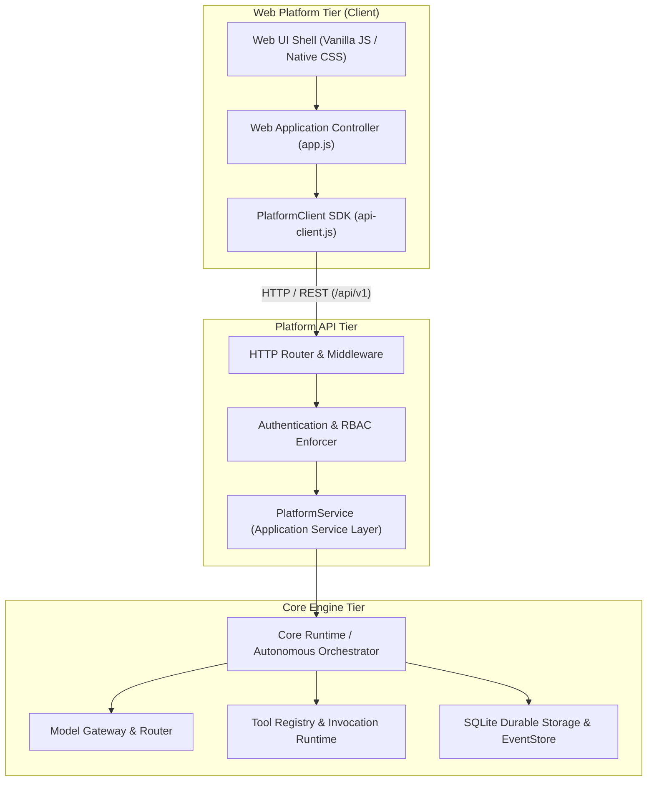

# AI Operating Platform — Platform Product & Web Console Architecture

## 1. Architectural Principle & Separation of Concerns

The AI Operating Platform enforces strict structural decoupling across all three major tiers:

```text
CORE ENGINE ≠ PLATFORM PRODUCT ≠ APPLICATIONS
```

The Web Platform (Product Console) is a **consumer** of the public Platform API (`/api/v1`) via `PlatformClient`. It contains zero direct imports from the Domain, Application Runtime, Persistence, or Infrastructure layers.



---

## 2. Information Architecture & Navigation

The Web Platform shell provides an enterprise navigation model organized into four functional domains:

### Control & Observability
- **Platform Operations (`/`)**: Real-time telemetry, objective input, live execution monitoring, and durable event stream.
- **Dashboard (`/dashboard`)**: Aggregated system status, active task counts, agent workload, and capability summaries.

### Autonomous Engine
- **Agents (`/agents`)**: Registered agent definitions, capabilities, memory scopes, and activation state.
- **Operations (`/operations`)**: Autonomous multi-step operations, budget consumption, and plan progression.
- **Executions (`/executions`, `/executions/:id`)**: Detailed execution telemetry, round progression, tool calls, and model outputs.

### Runtime & Capabilities
- **Models (`/models`)**: Connected inference providers, available models, capabilities, and health status.
- **Tools (`/tools`)**: Versioned tool catalog, input/output schemas, risk levels, and approval requirements.
- **Playground (`/playground`)**: Controlled testbed for evaluating sequential workflows and deterministic tool calling.

### Governance & Ecosystem
- **Blueprints (`/blueprints`)**: Interactive architectural maps and system design specifications.
- **Governance (`/governance`)**: RBAC roles, tenant isolation policies, and audit observation trails.
- **Applications (`/applications`)**: Ecosystem landing page for domain applications (e.g., Tentaciones AI Commerce).
- **Settings (`/settings`)**: Connection endpoints, auth token configuration, and diagnostic tools.

---

## 3. Design System Foundation

- **Default Theme**: Clean Executive Light Theme (`--bg-primary: #f8fafc`, `--text-primary: #0f172a`).
- **Alternative Theme**: Executive Dark Theme (`[data-theme="dark"]`, `--bg-primary: #08090d`).
- **Native CSS Variables**: 100% native CSS geometry, spacing, borders, elevation, and status accents without heavyweight third-party CSS dependencies.
- **Typography**: High-legibility system sans-serif font stack paired with JetBrains Mono for code, payloads, and event logs.

---

## 4. Frontend Security & Data Escaping

1. **Strict DOM Construction**: Dynamic elements are constructed using `document.createElement` and `textContent`. Untrusted data from API, model outputs, or tool payloads are never injected via `innerHTML`.
2. **Zero Inlined Secrets**: API keys, credentials, and tokens are never bundled in client assets.
3. **Authorization-Aware UI**: Controls are conditionally displayed based on caller capabilities, while backend API middleware remains the sole authoritative security enforcement gate.
4. **Error Normalization**: HTTP error responses (400, 401, 403, 404, 409, 500) are mapped to user-friendly status banners without leaking backend stack traces.

---

## 5. Applications Boundary (Tentaciones Integration)

Domain-specific business logic (such as Tentaciones E-Commerce catalog, cart, and fitting room) resides in the Applications tier. The Platform Web Console only provides management and observability over platform-level entities (Tasks, Agents, Tools, Health), maintaining complete architectural isolation.