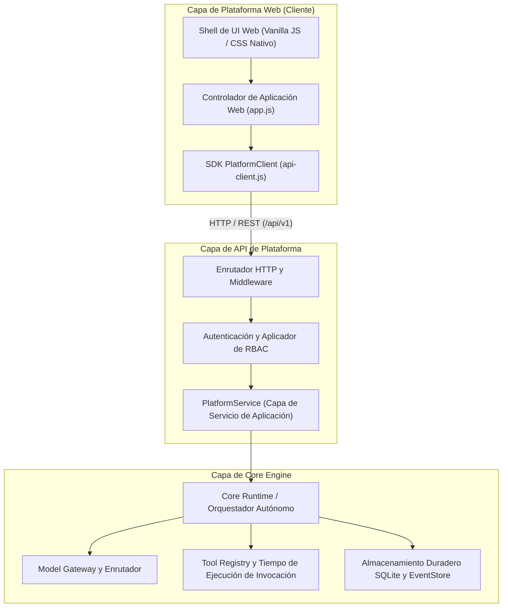

# Plataforma Operativa de IA — Producto de Plataforma y Arquitectura de Consola Web

## 1. Principio Arquitectónico y Separación de Preocupaciones

La Plataforma Operativa de IA impone un desacoplamiento estructural estricto en las tres capas principales:

```text
CORE ENGINE ≠ PLATFORM PRODUCT ≠ APLICACIONES
```

La Plataforma Web (Consola de Producto) es un **consumidor** de la API de Plataforma pública (`/api/v1`) a través de `PlatformClient`. Contiene cero importaciones directas de las capas de Dominio, Tiempo de Ejecución de Aplicación, Persistencia o Infraestructura.


```mermaid
flowchart TD
    subgraph Web_Tier["Capa de Plataforma Web (Cliente)"]
        UI["Shell de UI Web (Vanilla JS / CSS Nativo)"] --> App["Controlador de Aplicación Web (app.js)"]
        App --> Client["SDK PlatformClient (api-client.js)"]
    end

    subgraph API_Tier["Capa de API de Plataforma"]
        Client -->|"HTTP / REST (/api/v1)"| HTTP["Enrutador HTTP y Middleware"]
        HTTP --> Auth["Autenticación y Aplicador de RBAC"]
        Auth --> Service["PlatformService (Capa de Servicio de Aplicación)"]
    end

    subgraph Core_Tier["Capa de Core Engine"]
        Service --> Core["Core Runtime / Orquestador Autónomo"]
        Core --> Model["Model Gateway y Enrutador"]
        Core --> Tool["Tool Registry y Tiempo de Ejecución de Invocación"]
        Core --> Storage["Almacenamiento Duradero SQLite y EventStore"]
    end
```

---

## 2. Arquitectura de la Información y Navegación

El shell de la Plataforma Web proporciona un modelo de navegación empresarial organizado en cuatro dominios funcionales:

### Control y Observabilidad
- **Operaciones de Plataforma (`/`)**: Telemetría en tiempo real, entrada de objetivos, monitoreo de ejecución en vivo y flujo de eventos duraderos.
- **Panel de Control (`/dashboard`)**: Estado del sistema agregado, recuentos de tareas activas, carga de trabajo de agentes y resúmenes de capacidades.

### Motor Autónomo
- **Agentes (`/agents`)**: Definiciones de agentes registrados, capacidades, alcances de memoria y estado de activación.
- **Operaciones (`/operations`)**: Operaciones autónomas de múltiples pasos, consumo de presupuesto y progresión del plan.
- **Ejecuciones (`/executions`, `/executions/:id`)**: Telemetría de ejecución detallada, progresión de rondas, llamadas a herramientas y salidas de modelos.

### Tiempo de Ejecución y Capacidades
- **Modelos (`/models`)**: Proveedores de inferencia conectados, modelos disponibles, capacidades y estado de salud.
- **Herramientas (`/tools`)**: Catálogo de herramientas versionado, esquemas de entrada/salida, niveles de riesgo y requisitos de aprobación.
- **Playground (`/playground`)**: Entorno de prueba controlado para evaluar flujos de trabajo secuenciales y llamadas a herramientas deterministas.

### Gobernanza y Ecosistema
- **Blueprints (`/blueprints`)**: Mapas arquitectónicos interactivos y especificaciones de diseño del sistema.
- **Gobernanza (`/governance`)**: Roles RBAC, políticas de aislamiento de inquilinos y pistas de observación de auditoría.
- **Aplicaciones (`/applications`)**: Página de inicio del ecosistema para aplicaciones de dominio (por ejemplo, Tentaciones AI Commerce).
- **Configuración (`/settings`)**: Endpoints de conexión, configuración de tokens de autenticación y herramientas de diagnóstico.

---

## 3. Base del Sistema de Diseño

- **Tema Predeterminado**: Tema Claro Ejecutivo Limpio (`--bg-primary: #f8fafc`, `--text-primary: #0f172a`).
- **Tema Alternativo**: Tema Oscuro Ejecutivo (`[data-theme="dark"]`, `--bg-primary: #08090d`).
- **Variables CSS Nativas**: 100% geometría CSS nativa, espaciado, bordes, elevación y acentos de estado sin dependencias CSS de terceros pesadas.
- **Tipografía**: Pila de fuentes sans-serif del sistema de alta legibilidad combinada con JetBrains Mono para código, cargas útiles y registros de eventos.

---

## 4. Seguridad Frontend y Escape de Datos

1. **Construcción Estricta del DOM**: Los elementos dinámicos se construyen utilizando `document.createElement` y `textContent`. Los datos no confiables de la API, las salidas del modelo o las cargas útiles de las herramientas nunca se inyectan a través de `innerHTML`.
2. **Cero Secretos en Línea**: Las claves de API, las credenciales y los tokens nunca se empaquetan en los activos del cliente.
3. **Interfaz de Usuario Consciente de la Autorización**: Los controles se muestran condicionalmente en función de las capacidades del llamador, mientras que el middleware de la API de backend sigue siendo la única puerta de cumplimiento de seguridad autoritativa.
4. **Normalización de Errores**: Las respuestas de error HTTP (400, 401, 403, 404, 409, 500) se asignan a banners de estado fáciles de usar sin filtrar los seguimientos de pila (stack traces) del backend.

---

## 5. Límite de Aplicaciones (Integración con Tentaciones)

La lógica empresarial específica del dominio (como el catálogo, el carrito y el probador virtual de Tentaciones E-Commerce) reside en la capa de Aplicaciones. La Consola Web de la Plataforma solo proporciona gestión y observabilidad sobre las entidades a nivel de plataforma (Tareas, Agentes, Herramientas, Salud), manteniendo un aislamiento arquitectónico completo.

---

## 6. Consolas de Gestión y Referencia del Centro de Control

Para especificaciones técnicas profundas, matrices de capacidades e inspectores de esquemas de consolas específicas:
- **Centro de Control de Plataforma**: Consulte [`docs/PLATFORM_CONTROL_CENTER.md`](PLATFORM_CONTROL_CENTER.md) para obtener la documentación completa del centro de control unificado, la consola de modelos, el catálogo de aplicaciones externas y el blueprint visual interactivo.
- **Mapa Maestro Visual**: Consulte [`docs/VISUAL_MASTER_MAP.md`](VISUAL_MASTER_MAP.md) para ver el mapa de arquitectura completo de 7 capas, la tabla de estado de compilación de subsistemas y las infografías de blueprints.
- **Consola de Gestión de Agentes y Herramientas**: Consulte [`docs/AGENT_TOOL_CONSOLE.md`](AGENT_TOOL_CONSOLE.md) para obtener la documentación completa de la gestión del ciclo de vida del agente, las matrices de capacidades autorizadas, los modelos de nivel de riesgo, los modos de ejecución, las puertas de aprobación humana y los inspectores de esquemas JSON seguros de solo lectura.