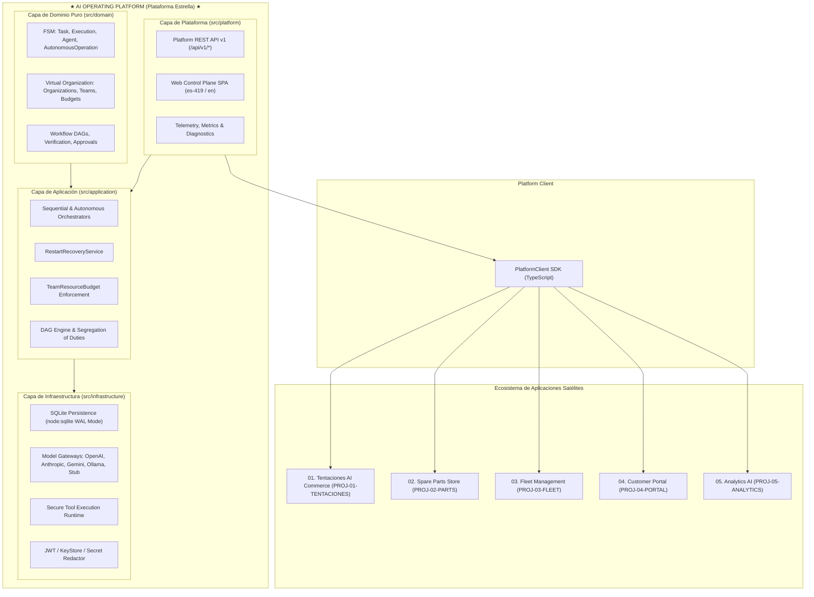

# Línea Base del Producto — AI Operating Platform v1.4.0 (Product Baseline)

Este documento constituye la especificación canónica y el estado del arte consolidado de la **AI Operating Platform** en su versión oficial **1.4.0**, sirviendo como referencia técnica y estratégica para arquitectos, ingenieros, evaluadores y operadores del sistema.

---

## 1. ¿Qué es la AI Operating Platform?

La **AI Operating Platform** es una infraestructura operacional de ingeniería de software diseñada para orquestar, coordinar, gobernar, persistir, observar y exponer capacidades de Inteligencia Artificial como servicios desacoplados, deterministas y reutilizables para múltiples aplicaciones y superficies empresariales.

Opera como la **Plataforma Estrella** del ecosistema, proveyendo un motor central de ejecución gobernada, persistencia relacional duradera, recuperación automática ante caídas, cuotas multitenant por equipos, y pasarelas polimórficas de modelos y herramientas.

---

## 2. ¿Qué NO es la Plataforma?

Para evitar confusiones conceptuales, la plataforma define límites claros:
* **NO es un Chatbot:** No es una aplicación conversacional monolítica, sino la infraestructura sobre la cual se ejecutan flujos conversacionales, agentes autónomos y tareas de backend.
* **NO es un simple Wrapper de APIs:** Implementa máquinas de estado finitas, gestión transaccional de presupuestos, control de concurrencia optimista y segregación de funciones.
* **NO es una Aplicación Monolítica de Negocio:** No contiene la lógica comercial de comercio electrónico ni catálogos de retail en su núcleo de dominio; las aplicaciones de negocio (como *Tentaciones AI Commerce*) son satélites desacoplados.
* **NO es un Monorepo:** Las aplicaciones satélites residen en repositorios independientes y consumen la plataforma exclusivamente mediante la Platform API / SDK.

---

## 3. Arquitectura Canónica Actual (v1.4.0)

La plataforma implementa **Arquitectura Hexagonal (Puertos y Adaptadores)** estructurada en tres niveles principales:



---

## 4. Capacidades Implementadas y Verificadas

1. **Gestión de Tareas y Ejecuciones:** Ciclo de vida determinista (`Task` y `Execution`) con correlación de `traceId`.
2. **Agentes de Primera Clase:** Perfiles, capacidades declaradas/verificadas, evaluación cuantitativa y ámbito de memoria.
3. **Pasarelas de Modelos Polimórficas:** Conectores nativos para OpenAI (`gpt-4o`), Anthropic (`claude-3-5-sonnet`), Google Gemini (1.5/2.0), Ollama local y Stub determinista.
4. **Registro de Herramientas y Sandboxing:** Validación de esquemas, prevención de contaminación de prototipos y listas blancas.
5. **Operaciones Autónomas Acotadas:** Planificación en DAG, bucles supervisados y presupuestos inmutables (`AutonomyBudget`).
6. **Organizaciones Virtuales y Equipos:** Jerarquía corporativa, membresías y cuotas de consumo (`TeamResourceBudget`).
7. **Flujos de Trabajo y Verificación:** Orquestación de DAGs con segregación obligatoria de funciones (Ejecutor $\neq$ Verificador $\neq$ Aprobador).
8. **Supervisión Humana (Human Oversight):** Puntos de control bloqueantes antes de acciones de riesgo crítico.
9. **Exportación de Evidencia de Cumplimiento:** Paquetes inmutables de auditoría con sellado criptográfico SHA-256 (`EvidenceExportManifest`).
10. **Reconciliación Continua de Mandatos:** Detección de mandatos revocados/expirados con pausa/cancelación limpia de ejecuciones activas.

---

## 5. Interfaces Externas y Contratos

* **Platform API REST (`/api/v1/*`):** Endpoints normalizados para tareas, ejecuciones, agentes, operaciones, flujos, organizaciones, credenciales y telemetría.
* **Cliente SDK (`PlatformClient`):** Librería TypeScript con reintentos exponenciales, timeouts configurables y validación de respuestas.
* **Streaming de Eventos (SSE):** Canales de telemetría en tiempo real para observabilidad de ejecuciones y estados de agentes.

---

## 6. Ecosistema de Aplicaciones Satélites

```text
★ AI OPERATING PLATFORM ★
            │
    Platform API / SDK
            │
  ┌─────────┼─────────┬─────────┬─────────┐
  │         │         │         │         │
App 01    App 02    App 03    App 04    App 05
Tentaciones  Spare Parts  Fleet     Customer  Analytics
AI Commerce    Store   Management   Portal      AI
[ACTIVA]   [DISEÑO]  [DISEÑO]  [DISEÑO]  [DISEÑO]
```

* **01. Tentaciones AI Commerce:** Aplicación satélite activa en repositorio independiente, potenciada por IA para descubrimiento de productos de moda, probador virtual AR y checkout gobernado.
* **02 - 05. Aplicaciones Satélites Futuras:** Especificadas arquitectónicamente para integración progresiva sobre la Platform API.

---

## 7. Seguridad, Identidad y Gobernanza

* **Principio Default-Deny:** Denegación estricta por defecto ante solicitudes no autenticadas o fuera de política.
* **Gobernanza de Credenciales API:** Almacenamiento con hash SHA-256 (`keyHash`), prefijo legible (`keyPrefix`) y revelación única de secretos en creación/rotación.
* **Autenticación Asimétrica JWT:** Verificación con RS256/ES256, soporte de KeyStore con rotación dinámica y validación de `iss`, `aud`, `exp`.
* **Aislamiento Multitenant:** Reconciliación obligatoria de cabeceras de tenant y aplicación (`TENANT_MISMATCH`, `APPLICATION_MISMATCH`).
* **Redacción de Datos Sensibles:** Enmascaramiento automático de contraseñas, tokens y claves API en logs estructurados.

---

## 8. Persistencia y Recuperación ante Caídas

* **Motor SQLite WAL Nativo:** Uso de `node:sqlite` (`DatabaseSync`) con transacciones `BEGIN IMMEDIATE`, `PRAGMA journal_mode = WAL` y claves foráneas activas.
* **Control de Concurrencia Optimista (OCC):** Columna numéricas `version` con actualización atómica para prevenir sobreescrituras concurrentes.
* **Rehidratación Inmutable:** Métodos estáticos de fábrica `rehydrate()` blindados con `Object.freeze()`.
* **Recuperación ante Reinicios (`RestartRecoveryService`):** Escaneo y reconciliación atómica al arranque que transiciona tareas u operaciones no terminales interrumpidas hacia estados finales (`FAILED` / `CANCELLED`) con trazabilidad en `EventStore`.

---

## 9. Observabilidad y Diagnóstico

* **Correlación de Trazas:** Invariante de correlación mediante `traceId`, `taskId`, y `executionId` a través de todas las capas.
* **Almacén de Eventos Duraderos (`SqliteEventStore`):** Tabla `events` inmutable append-only con orden monótono.
* **Diagnóstico en Tiempo Real:** Endpoints `/api/v1/diagnostics` y `/api/v1/diagnostics/network` para inspección forense.

---

## 10. Control Plane y Consola Web

* **Arquitectura SPA Nativa:** Desarrollada en HTML5/CSS3/JavaScript vanilla con **0 dependencias externas** en runtime.
* **Seguridad Estricta del DOM:** **0 `.innerHTML`**, utilizando APIs seguras (`textContent`, `createElement`, `setAttribute`).
* **Soporte Bilingüe:** Localización dinámica en tiempo de ejecución con **Español Latinoamericano (`es-419`)** por defecto e **Inglés (`en`)** seleccionable.

---

## 11. Developer Platform y Application Factory

* **Registro Declarativo de Aplicaciones:** Validación de manifiestos, permisos requeridos y endpoints de webhook.
* **Plantillas de Agentes:** Generación gobernada de agentes mediante `SolutionFactory`.

---

## 12. Estado de Brechas (Gaps) y Deuda Técnica

Para mantener la máxima transparencia técnica, las brechas se clasifican rigurosamente:

1. **Brechas de Código Resueltas:**
   - Adaptador Google Gemini (`AOP-MODEL-GEMINI`).
   - Memoria duradera SQLite (`AOP-MEMORY`).
   - Autenticación JWT asimétrica (`AOP-AUTH-JWT`).
   - Reconciliación de mandatos y exportación de evidencias (`AOP-COMPLIANCE-EXPORT`).
2. **Brechas Ambientales Abiertas (Code Ready / Pending Live Host Provisioning):**
   - **`GAP-INF-01` (TLS en Host Físico):** Código y manifiestos de Nginx/Caddy listos; pendiente inyección de certificados SSL reales en servidor de despliegue.
   - **`GAP-SEC-01` (IdP OIDC/JWKS en Vivo):** Verificador asimétrico listo; pendiente URI JWKS de proveedor corporativo activo (Entra ID, Okta, etc.).
3. **Backlog Futuro y Mejoras Post-v1.4:**
   - Runtime distribuido de múltiples nodos.
   - Streaming bidireccional mediante WebSockets de baja latencia.

---

## 13. Evidencia Factual y Métricas de Verificación

* **Versión de Runtime:** `1.4.0` (Declarada en `package.json` y `src/platform/version.ts`).
* **Suites de Pruebas:** 74 suites automatizadas.
* **Pruebas Totales:** **1600 tests PASS (0 FAIL)**.
* **Tiempo de Ejecución:** ~38-40 segundos.
* **Compilación:** `npx tsc` 0 errores (ES2022 / NodeNext).
* **Consistencia Documental:** `npm run docs:check` 100% pasando (17 documentos canónicos, 61 ADRs).

---

## 14. Evaluación Estratégica del Próximo Milestone

| Opción Evaluada | Descripción | Clasificación Estratégica | Justificación Técnica |
| :--- | :--- | :--- | :--- |
| **Opción A: Developer Platform & SDK Productization** | Empaquetado formal del SDK `@ai-platform/client`, CLI de herramientas para desarrolladores y contratos de integración satélite. | **`READY` / `STRATEGIC` (Recomendada)** | El motor y la Platform API están 100% maduros y probados. Facilitará la expansión del ecosistema de aplicaciones satélites. |
| **Opción B: Live OIDC / JWKS Integration** | Conexión en vivo contra un proveedor de identidad OIDC empresarial activo. | `DEPENDENCY-BLOCKED` | Requiere aprovisionamiento de un servidor de identidad corporativo externo con credenciales de nube. |
| **Opción C: Live TLS / Host Deployment** | Despliegue en host físico con certificados SSL y configuración de proxy reverso en vivo. | `DEPENDENCY-BLOCKED` | Depende del host de infraestructura física y DNS de producción. |
| **Opción D: WebSockets / Bidirectional Streaming** | Capa de transporte bidireccional para interacción en tiempo real de baja latencia. | `BACKLOG` | Las necesidades actuales están cubiertas por HTTP REST y SSE reactivo. |
| **Opción E: Distributed Runtime Multi-Node** | Ejecución particionada y consenso entre múltiples servidores de plataforma. | `BACKLOG` | Complejidad prematura para la fase actual; el runtime local con SQLite WAL soporta la carga actual. |
| **Opción F: Expansión de Aplicaciones Satélites (App 02 - Spare Parts)** | Desarrollo de la Aplicación Satélite 02 conectada como consumidor independiente. | `READY` / `STRATEGIC` | Validará la reutilización de la plataforma para un segundo dominio de negocio. |
