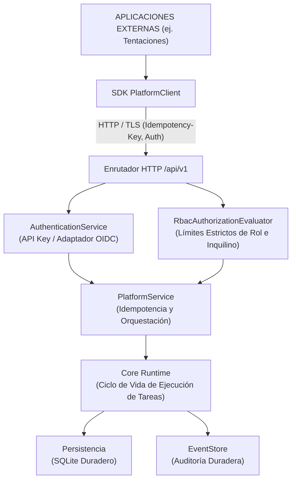
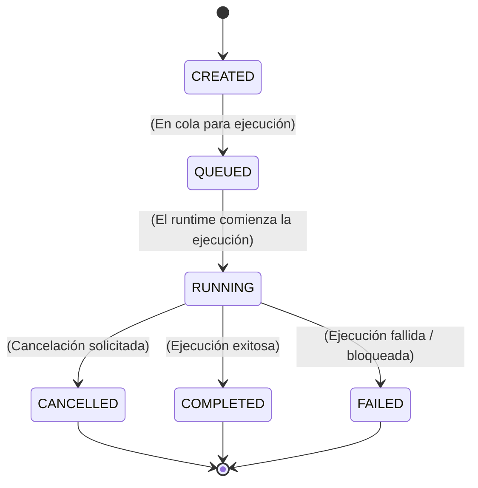

# Plataforma Operativa de IA — Tiempo de Ejecución de Producción e Integración de Plataforma

## 1. Resumen Ejecutivo y Arquitectura del Tiempo de Ejecución

El **Tiempo de Ejecución de la Plataforma Operativa de IA** (AI Operating Platform Runtime) es un entorno de ejecución determinista y de fallo seguro que conecta las solicitudes entrantes de clientes (como Tentaciones E-Commerce) a agentes autónomos, gateways de modelos y herramientas, al tiempo que hace cumplir estrictamente los límites arquitectónicos:

### Axioma Arquitectónico:
`CORE ENGINE ≠ PLATFORM PRODUCT ≠ APLICACIONES`
- Las aplicaciones externas (como Tentaciones) **nunca** importan ni invocan el Core Engine o los aspectos internos del dominio directamente.
- El enrutador HTTP **nunca** llama al `CoreRuntime` directamente; todas las interacciones proceden a través de `PlatformService` y casos de uso autenticados.
- Las entidades de dominio tienen **cero** dependencias de HTTP, red o módulos específicos del framework.

---

## 2. Ciclo de Vida de Ejecución de Tareas

Cada tarea transita por una máquina de estados determinista e inmutable:

### Invariantes:
1. **Inmutabilidad Terminal**: Las tareas en `COMPLETED`, `FAILED` o `CANCELLED` nunca pueden transitar a `RUNNING` o a cualquier otro estado. Cualquier intento lanza un `InvalidTaskTransitionError` (HTTP 409 Conflict).
2. **Reconciliación de Fallos (Crash)**: Al iniciarse, `RestartRecoveryService` reconcilia las tareas en vuelo en `RUNNING` a `FAILED` con el código `CRASH_RECOVERY`, y las tareas en `QUEUED`/`CREATED` a `CANCELLED`.

---

## 3. Gestión de Idempotencia

La plataforma implementa idempotencia estricta a través de `IdempotencyStore`:
- **Alcance de Clave**: `(tenantId, principalId, idempotencyKey)` asegura el aislamiento entre inquilinos y previene colisiones de claves entre inquilinos o llamadores distintos.
- **Coincidencia de Carga Útil**: Calcula un hash SHA-256 canónico de `{ agentId, input }`.
  - **Reintento Idéntico**: Devuelve la respuesta en caché con un código de estado y carga útil idénticos sin volver a ejecutar.
  - **Fallo de Coincidencia de Carga Útil**: Rechaza con `409 Conflict` (`IDEMPOTENCY_PAYLOAD_MISMATCH`).
  - **Ejecución Concurrente en Vuelo**: Rechaza con `409 Conflict` (`IDEMPOTENCY_CONCURRENT_EXECUTION`).

---

## 4. Propiedad de Tareas e Integridad de Identidad del Llamador

La identidad del llamador se establece exclusivamente a través del `SecurityContext` autenticado:
- `body.callerId`, `query.callerId` y `header.callerId` son **estrictamente ignorados y sobrescritos** con `SecurityContext.principal.id` y `SecurityContext.tenantId`.
- **Aislamiento de Inquilino**: Las tareas están asociadas con `callerTenantId`. Cualquier intento por parte del Inquilino B de consultar (`GET /tasks/:id`) o cancelar (`POST /tasks/:id/cancel`) una tarea perteneciente al Inquilino A devuelve `404 Not Found` para evitar la enumeración de ID.

---

## 5. Semántica de Cancelación

- **Cancelación Solicitada vs Detención de Tiempo de Ejecución**:
  - `POST /api/v1/tasks/:id/cancel` establece el estado de la tarea persistente en `CANCELLED` y emite un evento duradero `task.cancelled` que contiene la identidad del llamador, el inquilino y el motivo.
  - Las tareas que ya han alcanzado `COMPLETED` o `FAILED` no pueden cancelarse y devuelven `409 Conflict`.
  - Los bucles de ejecución en vuelo inspeccionan las banderas de cancelación de tareas antes de avanzar entre pasos de operación.

---

## 6. Modelo Principal de Servicio

Las aplicaciones externas (como Tentaciones) se autentican como un principal `SERVICE`:
- `SERVICE ≠ SYSTEM`: Un principal de servicio recibe solo permisos operativos explícitos:
  - `task.create`
  - `task.read`
  - `task.cancel`
  - `task.execute`
  - `agent.read`
  - `public.read`
- Los principales de servicio **no pueden** acceder a endpoints administrativos, otorgar roles, anular inquilinos o escalar privilegios a `SYSTEM`.

---

## 7. Adaptador de Autenticación y Hoja de Ruta OIDC

- **Adaptador Bearer Token**: `BearerTokenAuthenticationProvider` delega a un `BearerTokenVerifier` inyectado.
- **Estructura de Desarrollo**: `DevScaffoldTokenVerifier` está explícitamente delimitado para entornos de desarrollo/pruebas.
- **Fallo Seguro en Producción**: En entornos de producción, los verificadores de tokens no configurados devuelven `UNTRUSTED_BEARER_PROVIDER`, requiriendo un adaptador OIDC/JWKS empresarial sin mutar el motor de autorización core o RBAC.

---

## 8. Sondas de Salud y Preparación (Health & Readiness Probes)

`GET /api/v1/health` proporciona semánticas de salud separadas:
- **Actividad / Liveness (`UP`)**: Confirma que el proceso HTTP responde.
- **Preparación / Readiness (`READY` | `NOT_READY`)**: Verifica que la persistencia duradera de SQLite (modo WAL) y el EventStore duradero estén operativos y listos para aceptar transacciones.
- **Cero Fugas**: Las rutas de archivos internos, los secretos de entorno y las credenciales de conexión nunca se exponen en las cargas útiles de salud.
