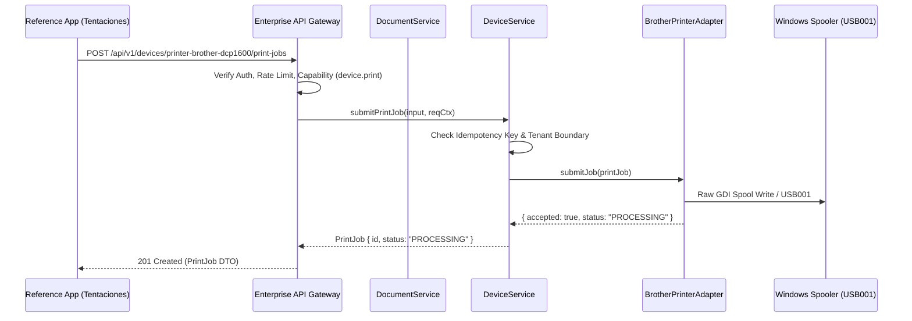

# Print Operations & Document Generation

## 1. Overview

The **Print Operations Layer** provides automated generation and physical spooling of operational documents:
- **Orders & Packing Slips**: Item checklists, quantities, destination addresses, and verification stamps.
- **Customer Receipts**: Non-fiscal purchase summaries with payment details (e.g. Webpay Demo).
- **Inventory Reconciliation Reports**: Category SKU tallies, stock levels, and low-inventory reorder alerts.
- **Custom Plaintext Documents**: Arbitrary text payloads structured for thermal or standard A4/Letter page output.

---

## 2. Print Job Lifecycle

Each print job advances through a deterministic finite-state machine:

$$\text{CREATED} \longrightarrow \text{QUEUED} \longrightarrow \text{PROCESSING} \longrightarrow \begin{cases} \text{COMPLETED} \\ \text{FAILED} \\ \text{CANCELLED} \\ \text{UNAVAILABLE} \end{cases}$$

1. **`CREATED`**: Job validated, formatted, and bound to target `BusinessDevice`.
2. **`QUEUED`**: Job placed in the tenant-isolated dispatch queue.
3. **`PROCESSING`**: Job submitted to the operating system print spooler (`winprint` / GDI raw queue).
4. **`COMPLETED`**: Spooler accepted data and hardware confirmed transmission.
5. **`FAILED`**: Adapter error or invalid printer payload.
6. **`UNAVAILABLE`**: Target printer offline or disconnected (`WorkOffline: true`).
7. **`CANCELLED`**: Job cancelled before completion by operator or user.

---

## 3. Idempotent Dispatch

Print operations support client-provided idempotency keys via the `Idempotency-Key` HTTP header or payload parameter:
- **Hash Verification**: SHA-256 fingerprint of `(deviceId, tenantId, payload, copies)`.
- **Match**: If an identical request arrives with the same key within the cache TTL, the original response is returned with status `201` without duplicate printing.
- **Conflict**: If the key matches a previous request with different parameters, the gateway rejects it fail-closed with `409 IDEMPOTENCY_CONFLICT`.

---

## 4. API Endpoints

| Method | Endpoint | Description |
|---|---|---|
| `POST` | `/api/v1/devices/:id/print-jobs` | Submit a new print job to device spooler |
| `GET` | `/api/v1/devices/:id/print-jobs` | List recent print jobs for device |
| `GET` | `/api/v1/devices/:id/print-jobs/:jobId` | Get detailed print job status |
| `POST` | `/api/v1/devices/:id/print-jobs/:jobId/cancel` | Cancel an active or queued print job |
| `POST` | `/api/v1/documents/generate` | Generate formatted document payload without printing |

---

## 5. End-to-End Workflow

