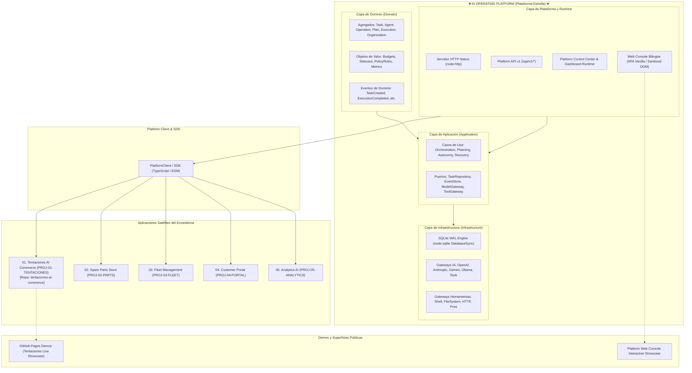

# Nomenclatura Oficial del Proyecto y Ecosistema (Project Nomenclature)

Este documento establece la terminología canónica, las convenciones de nombres, la taxonomía de componentes y el mapa conceptual integral del ecosistema **AI Operating Platform** y sus aplicaciones satélites.

---

## 1. Definición y Jerarquía del Ecosistema

El ecosistema opera bajo una **Arquitectura Desacoplada Multirrepositorio (Arquitectura A)** estructurada en dos niveles:

1. **Plataforma Estrella (`ai-operating-platform`):** Núcleo operativo central, motor de ejecución autónoma, capa de gobernanza, persistencia duradera y exposición de Platform API / SDK.
2. **Aplicaciones Satélites Independientes:** Soluciones de negocio especializadas que consumen la plataforma como clientes desacoplados (e.g., `tentaciones-ai-commerce`).

---

## 2. Glosario Canónico de Términos y Componentes

La siguiente tabla define los términos técnicos oficiales, sus identificadores normativos en inglés y su definición en español neutro (`es-419`):

| Término Oficial | Identificador en Código | Definición y Alcance |
| :--- | :--- | :--- |
| **Plataforma Estrella** | `ai-operating-platform` | Repositorio central y motor principal que provee orquestación, persistencia, gobernanza y API para agentes de IA. |
| **Aplicación Satélite** | `satellite-application` | Repositorio independiente y desacoplado que implementa un producto de negocio consumiendo el Platform API / SDK. |
| **Tentaciones AI Commerce** | `tentaciones-ai-commerce` / `PROJ-01-TENTACIONES` | Aplicación Satélite 01 de comercio electrónico potenciado por IA (catálogo, AR, checkout, soporte). |
| **Cliente de Plataforma** | `PlatformClient` / `platform-client` | SDK tipado en TypeScript para comunicación HTTP/SSE entre aplicaciones satélites y la plataforma. |
| **Motor de Ejecución** | `PlanExecutionEngine` / `SequentialOrchestrator` | Componente de aplicación encargado de procesar planes paso a paso con control de presupuestos y políticas. |
| **Persistencia Duradera** | `SqliteDatabase` / `sqlite/*` | Módulo de persistencia local transaccional basado en `node:sqlite` con journal WAL y rehidratación inmutable. |
| **Recuperación tras Caída** | `RestartRecoveryService` | Servicio de arranque que reconcilia el estado de tareas y operaciones huérfanas tras un reinicio inesperado. |
| **Puerta de Modelos** | `ModelGateway` | Puerto y adaptadores polimórficos para interacción con LLMs (OpenAI, Anthropic, Gemini, Ollama, Stub). |
| **Puerta de Herramientas** | `ToolGateway` / `ToolRegistry` | Registro y motor de invocación segura de herramientas con validación de esquemas y listas blancas. |
| **Consola Web** | `src/platform/web` | Interfaz gráfica liviana, libre de frameworks pesados, con soporte bilingüe (`es-419`/`en`) y renderizado seguro. |
| **Control de Concurrencia Optimista** | `OCC` / `version` | Mecanismo de versionado numérico en registros SQLite para detectar y prevenir actualizaciones conflictivas. |
| **Rehidratación Inmutable** | `rehydrate()` / `Object.freeze()` | Patrón de fábrica estática en agregados de dominio que reconstruye el estado desde la BD garantizando inmutabilidad. |
| **Registro de Eventos** | `EventStore` / `SqliteEventStore` | Almacén inmutable append-only para auditoría y trazabilidad de eventos de dominio (`events` table). |
| **Presupuesto Operacional** | `OperationalBudget` / `ConsumptionBudget` | Límites estrictos asignados a operaciones: pasos máximos, tiempo en milisegundos, llamadas a herramientas y tokens. |
| **Organización Virtual** | `Organization` / `Team` / `VirtualOrganization` | Modelo de gobernanza multitenant con cuotas de recursos, políticas y jerarquías organizacionales. |

---

## 3. Convenciones de Nomenclatura en el Código

### 3.1 Nombres de Archivos y Módulos
* **Archivos TypeScript:** `kebab-case.ts` (e.g., `task-repository.ts`, `sqlite-execution-repository.ts`).
* **Archivos de Prueba:** `kebab-case.test.ts` ubicados en `tests/unit/` o `tests/integration/`.
* **Documentación:** `SCREAMING_SNAKE_CASE.md` en la raíz de `docs/` (e.g., `PROJECT_NOMENCLATURE.md`, `SOURCE_OF_TRUTH.md`).
* **Decisiones Arquitectónicas:** `NNNN-titulo-descriptivo.md` dentro de `docs/decisions/` (e.g., `0024-sqlite-memory-gateway.md`).

### 3.2 Clases, Tipos e Interfaces
* **Agregados y Entidades:** `PascalCase` sustantivo (e.g., `Task`, `Execution`, `Agent`, `Operation`).
* **Puertos e Interfaces:** `PascalCase` con sufijo funcional (e.g., `TaskRepository`, `ModelGateway`, `EventPublisher`).
* **Adaptadores de Infraestructura:** Prefijo tecnológico + Nombre de Puerto (e.g., `SqliteTaskRepository`, `OpenAIModelGateway`, `InMemoryEventPublisher`).
* **Servicios de Aplicación:** `PascalCase` con sufijo `Service` (e.g., `RestartRecoveryService`, `OrganizationService`).

### 3.3 Eventos y Códigos de Error
* **Eventos de Dominio:** `domain.entity.action` en minúsculas con puntos (e.g., `task.created`, `execution.completed`, `operation.failed`).
* **Códigos de Error:** `SCREAMING_SNAKE_CASE` descriptivo (e.g., `TASK_NOT_FOUND`, `BUDGET_EXHAUSTED`, `CONCURRENCY_CONFLICT`, `SCHEMA_VERSION_MISMATCH`).

---

## 4. Política de Idioma e Invariantes

De acuerdo con [SOURCE_OF_TRUTH.md](./SOURCE_OF_TRUTH.md):
1. **Documentación:** Redactada en **Español Latinoamericano (`es-419`)**.
2. **Identificadores Técnicos:** Permanecen en su forma original en **Inglés** (código, APIs, esquemas, eventos, commits).
3. **Interfaz de Usuario Web:** Bilingüe con selector de idioma en tiempo de ejecución.
