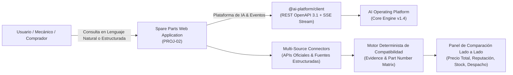
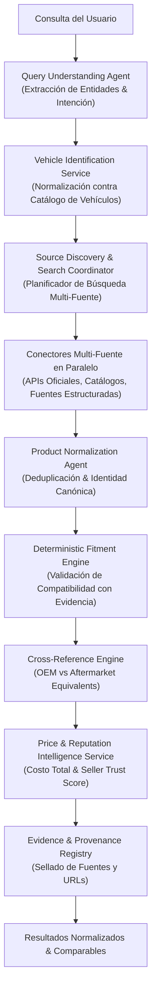
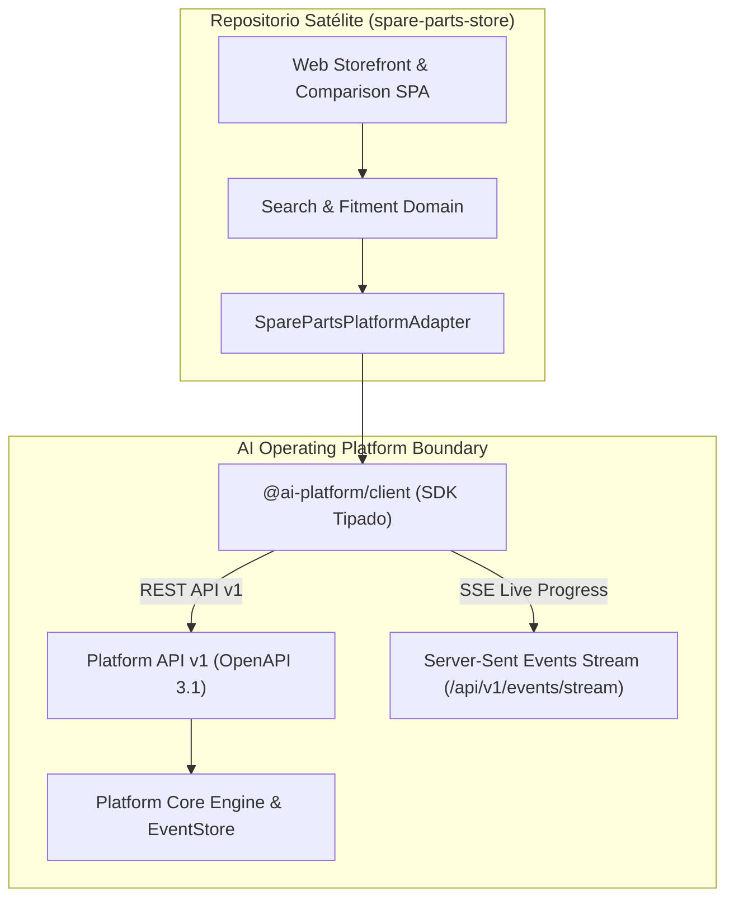

# Carta Constitutiva del Producto (Product Charter) — PROJ-02: Spare Parts Search & Comparison

> **Identificador Oficial de Proyecto:** `PROJ-02-SPAREPARTS`  
> **Nombre Funcional del Producto:** *Spare Parts Search & Comparison* (Comparador Inteligente de Repuestos Automotrices)  
> **Repositorio Previsto:** `spare-parts-store` (Aplicación Satélite Externa)  
> **Rol Arquitectural:** Aplicación Satélite Consumidora de la **AI Operating Platform**  
> **Línea Base del Sistema:** v1.4.0 Baseline  
> **Fecha de Formalización:** 2026-09-24  

---

## 1. Visión y Propuesta de Valor

### 1.1. Visión del Producto
Convertirse en la aplicación web de referencia para la **búsqueda, comparación de precios, verificación determinista de compatibilidad y reputación de vendedores** en el mercado de repuestos automotrices, inspirada en el modelo de comparación multi-tienda de plataformas consolidadas (como SoloTodo), pero potenciada por la inteligencia operativa y orquestación multi-agente de la **AI Operating Platform**.



### 1.2. El Problema que Resuelve
* **Incompatibilidad y Errores de Compra:** Comprar repuestos equivocados genera costos elevados de devolución y vehículos detenidos. La compatibilidad automotriz requiere validar múltiples parámetros técnicos (año, motorización, generación, código de chasis, número de parte OEM).
* **Dispersión de Ofertas y Precios Opacos:** Las piezas se venden en decenas de tiendas y distribuidores con variaciones extremas de precio y costos de envío ocultos.
* **Falta de Confianza en Vendedores:** Dificultad para distinguir entre piezas originales (OEM), equivalentes certificados y repuestos alternativos de dudosa procedencia.

### 1.3. Propuesta de Valor Diferencial
1. **Interpretación Precisa de la Intención:** Búsqueda conversacional y estructurada que traduce necesidades cotidianas (*"pastillas de freno delanteras para Toyota Corolla 2018 1.8"*) en especificaciones técnicas rigurosas.
2. **Compatibilidad Verificada con Evidencia (0 Alucinación):** Nunca se afirma compatibilidad por simple inferencia de un LLM; cada afirmación de compatibilidad se respalda en matrices de aplicación de fabricantes, números OEM y evidencia auditable.
3. **Comparación Transparente de Costo Total:** Presentación del precio real desglosado (producto + despacho + impuestos) y cálculo de reputación objetiva del vendedor.
4. **Trazabilidad y Origen de Datos (Data Provenance):** Cada resultado declara explícitamente su fuente, URL, fecha de consulta y nivel de confianza.

---

## 2. Usuarios Objetivo y Personas

| Perfil | Necesidad Principal | Criterio de Decisión Crítico |
| :--- | :--- | :--- |
| **Dueño de Vehículo Particular** | Encontrar el repuesto exacto sin conocimientos técnicos avanzados; comparar precios y comprar con seguridad. | Certeza de compatibilidad y menor precio total con despacho confiable. |
| **Mecánico / Taller Independiente** | Localizar piezas con números de parte (OEM / Aftermarket), disponibilidad inmediata de stock y entrega rápida. | Disponibilidad en stock, velocidad de despacho y reputación del proveedor. |
| **Comprador de Flotas / Empresas** | Cotizaciones masivas de repuestos de mantenimiento preventivo, trazabilidad de garantías y factura. | Precio por volumen, calidad de marca y garantías explícitas. |

---

## 3. Alcance Funcional del Producto

### 3.1. Lo que el Producto INCLUYE (In Scope)
* **Búsqueda Dual (Estructurada y Conversacional):**
  - Selección guiada por atributos del vehículo.
  - Búsqueda por lenguaje natural en español con extracción de entidades.
  - Búsqueda directa por *Part Number*, número OEM, código de fabricante o marca.
* **Filtros Multi-Criterio Exhaustivos:**
  - Marca y modelo de vehículo, categoría y subcategoría de pieza.
  - Rango de precio total, disponibilidad inmediata / bajo pedido.
  - Tipo de pieza (OEM Original, Equivalente Certificado, Aftermarket Alternativo).
  - Condición (Nuevo / Reacondicionado garantizado).
  - Reputación del vendedor, ubicación geográfica y tiempo de entrega.
* **Motor Determinista de Verificación de Compatibilidad:**
  - Clasificación en 3 estados formales: `COMPATIBLE`, `INCOMPATIBLE`, `UNKNOWN / REQUIRES_VERIFICATION`.
  - Matriz de referencias cruzadas (*Cross-Reference Engine*) con niveles de certeza: `EXACT_EQUIVALENT`, `POSSIBLE_EQUIVALENT`, `UNKNOWN`.
* **Inteligencia de Precios y Costo Total:**
  - Desglose transparente: `productPrice` + `shippingCost` + `taxes` = `totalEstimatedPrice`.
  - Moneda explícita y fecha de última verificación (`lastCheckedAt`).
* **Inteligencia de Reputación y Confianza:**
  - Separación estricta entre **Valoración del Producto** (*Product Rating*) y **Reputación del Vendedor** (*Seller Reputation*).
  - Puntuación de confianza del vendedor (*Seller Trust Score*) basada en fórmula transparente y auditable.
* **Visualizador y Comparador Lado a Lado (*Side-by-Side Comparison*):**
  - Selección de hasta 4 ofertas simultáneas para comparar atributos técnicos, garantías, plazos y costos.
* **Telemetría y Estado en Tiempo Real (SSE):**
  - Indicador de progreso reactivo durante la consulta multi-fuente mediante Server-Sent Events de la plataforma.

### 3.2. Lo que el Producto NO INCLUYE en el MVP (Out of Scope)
* Pasarela de pagos integrada propia o intermediación de cobros (la compra se redirige a la tienda oficial de la oferta).
* Mantenimiento de bodegas o logística física de distribución propia.
* Evasión de controles técnicos, bypass de CAPTCHAs o violación de términos de uso de sitios web de terceros.

---

## 4. Atributos de Búsqueda y Modelado del Dominio

### 4.1. Dimensiones de Identificación del Vehículo
```text
VehicleProfile {
  make: string;            // ej. "Toyota"
  model: string;           // ej. "Corolla"
  year: number;            // ej. 2018
  generation?: string;     // ej. "E210"
  version?: string;        // ej. "GLI"
  engine: string;          // ej. "1.8L 2ZR-FE"
  displacementCc?: number; // ej. 1798
  fuelType: string;        // ej. "Gasolina" | "Diésel" | "Híbrido"
  transmission?: string;   // ej. "Manual 6v" | "CVT"
  drivetrain?: string;     // ej. "FWD" | "AWD" | "RWD"
  bodyStyle?: string;      // ej. "Sedán" | "Hatchback"
}
```

> [!NOTE]
> **Evaluación del Soporte VIN (Vehicle Identification Number):**  
> El VIN se mantiene como campo opcional evaluado. Su implementación plena requiere validar proveedores de decodificación confiables (ej. NHTSA para mercados americanos, catálogos OEM para LATAM), licencias comerciales y cumplimiento de privacidad de datos de vehículos.

### 4.2. Identidad Canónica del Producto y Números de Parte
```text
CanonicalPartIdentity {
  canonicalId: string;
  category: string;             // ej. "Frenos"
  subcategory: string;          // ej. "Pastillas de Freno"
  brand: string;                // ej. "Bosch"
  partNumber: string;           // ej. "0 986 494 657"
  oemNumbers: string[];         // ej. ["04465-02220", "04465-02240"]
  manufacturerCodes: string[];
  specs: Record<string, string>; // eje: "Posición: Delantera", "Sistema: Akebono"
}
```

---

## 5. Arquitectura de Agentes y Componentes de Inteligencia

La arquitectura combina agentes especializados para tareas cognitivas/lingüísticas con componentes deterministas para decisiones críticas:



### Matriz de Responsabilidades (Agente vs Servicio Determinista)

| Componente | Tipo | Responsabilidad | Invariante Crítica |
| :--- | :--- | :--- | :--- |
| **`QueryUnderstandingAgent`** | Agente IA | Interpreta lenguaje natural en español, extrae piezas y vehículos. | Emite estructura tipada `PartQueryIntent`. |
| **`VehicleIdentificationService`** | Servicio Determinista | Mapea variantes a perfiles de vehículos estandarizados. | Resuelve únicamente sobre base de datos de modelos. |
| **`SourceSearchCoordinator`** | Orquestador | Consulta en paralelo las fuentes registradas y autorizadas. | Respeta rate limits y estados de `SourceRegistry`. |
| **`ProductNormalizationAgent`** | Agente IA / Reglas | Asocia nombres de tiendas a la identidad canónica del producto. | No fusiona números de parte incompatibles. |
| **`DeterministicFitmentEngine`** | Componente Determinista | Evalúa compatibilidad vehículo-pieza según catálogo OEM. | **0 inferencia LLM.** Emite `UNKNOWN` ante duda. |
| **`CrossReferenceEngine`** | Componente Determinista | Vincula piezas OEM con equivalentes Aftermarket certificados. | Clasifica certeza (`EXACT`, `POSSIBLE`, `UNKNOWN`). |
| **`PriceIntelligenceService`** | Servicio Matemático | Calcula `totalEstimatedPrice` sumando envío e impuestos. | **0 cálculo aproximado sin datos.** |
| **`SellerReputationService`** | Servicio Algorítmico | Calcula `SellerTrustScore` mediante fórmula ponderada. | Fórmula transparente y auditable. |
| **`EvidenceVerificationService`** | Servicio de Gobernanza | Registra procedencia, URL, timestamp y confianza de cada oferta. | Almacena registro inmutable de procedencia. |

---

## 6. Integración con la AI Operating Platform

`PROJ-02-SPAREPARTS` operará como una aplicación satélite independiente gobernada por contratos formales:



### Invariantes de Integración:
1. **Consumo Exclusivo por Contratos Públicos (MUST):** La aplicación consumirá la plataforma **únicamente** a través del paquete `@ai-platform/client` y la API REST/SSE OpenAPI 3.1.
2. **Aislamiento Físico Total (MUST NOT):** Queda prohibido importar módulos de `src/engine/`, `src/domain/` o bases de datos SQLite internas de la plataforma.
3. **Trazabilidad Correlacionada (MUST):** Toda búsqueda iniciará con un `traceId` único que se propagará a tareas de análisis y flujos de trabajo en la plataforma.
4. **Certificación Obligatoria:** Antes del despliegue, la aplicación deberá pasar el arnés de certificación formal de 9 puntos (`runReferenceAppCertification`).

---

## 7. Roadmap del Producto — Fases Preliminares Candidatas

> [!NOTE]
> **Nota Canónica de Gobernanza y Mapeo de Fases:**  
> En la planificación preliminar del charter se esbozó la secuencia tentativa 141-149. Conforme a la decisión canónica formalizada en [`docs/MASTER_WORK_PLAN.md`](./MASTER_WORK_PLAN.md) (Decisión 141.1.1) y la jerarquía de verdad de [`docs/SOURCE_OF_TRUTH.md`](./SOURCE_OF_TRUTH.md), la ejecución oficial fue estructurada en las **Fases 142 a 150**, culminando en la **Fase 150 (Certificación de Aplicación, Seguridad y Release MVP)** y la **Fase 151 (Post-Release Certification Evidence Hardening)**.

Las fases preliminares de referencia histórica registradas en el diseño inicial fueron:

| Fase | Título de la Fase | Entregable Principal |
| :--- | :--- | :--- |
| **Fase 141** | Discovery y Mapa de Fuentes Automotrices | Catálogo de fuentes, `SourceRegistry`, conectores piloto y términos de uso. |
| **Fase 142** | Modelo de Dominio Vehicle / Part / Fitment / Offer | Esquemas de dominio TypeScript puros para vehículos, piezas, ofertas y vendedores. |
| **Fase 143** | Motor de Búsqueda Multi-Fuente y Conectores | Conectores paralelos con manejo de rate limits, reintentos y tolerancia a fallos. |
| **Fase 144** | Normalización, Deduplicación y Cross-Reference | Identidad canónica de producto y árbol de equivalencias OEM vs Aftermarket. |
| **Fase 145** | Motor Determinista de Verificación de Compatibilidad | Validación matemática de compatibilidad pieza-vehículo basada en evidencia. |
| **Fase 146** | Inteligencia de Precios, Reputación y Costo Total | Desglose de costo total (producto + envío) y cálculo del `SellerTrustScore`. |
| **Fase 147** | UX Web: Búsqueda, Filtros y Comparador Lado a Lado | Interfaz SPA nativa (0 `innerHTML`) con búsqueda dual y tabla comparativa. |
| **Fase 148** | Integración Profunda con AI Operating Platform | Conexión con SDK `@ai-platform/client`, streaming SSE y orquestación de tareas. |
| **Fase 149** | Certificación de Aplicación, Seguridad y Release MVP | Arnés de certificación de 9 puntos, pruebas E2E y publicación del producto. |

---

## 8. Criterios de Éxito del MVP (Minimum Viable Product)

1. **Búsqueda en Tiempo Real:** Respuesta completa en menos de 3.5 segundos en consultas multi-fuente.
2. **Cero Falsa Compatibilidad:** 0 afirmaciones de `COMPATIBLE` sin respaldo en catálogo OEM o número de parte verificado.
3. **Transparencia Total de Ofertas:** Cada tarjeta de resultado presenta el desglose de precio, costo de despacho estimado, reputación del vendedor y enlace directo a la fuente.
4. **Cumplimiento y Certificación:** Aprobación del 100% de las pruebas del arnés de certificación de la AI Operating Platform.
