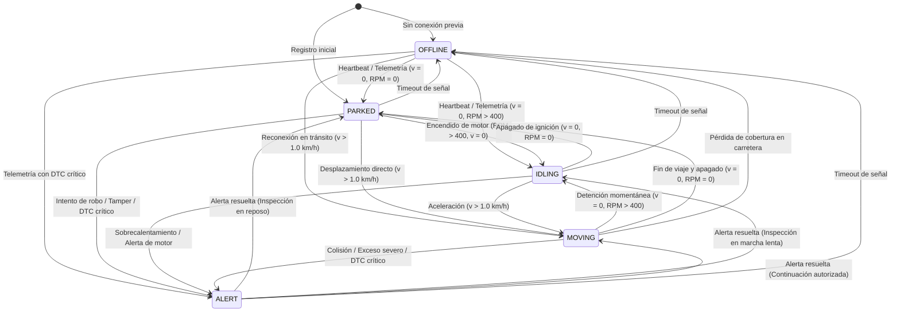

# Especificación del Modelo de Dominio Satélite — PROJ-03: Fleet Management

> **Documento Canónico de Dominio Satélite**  
> **Proyecto:** `PROJ-03-FLEET` (*Fleet Management & Logistics*)  
> **Línea Base del Sistema:** v1.4.0 Baseline  
> **Fase de Implementación:** Fase 166 (Gate Arquitectónico + Fundación de Dominio Satélite)  
> **Iniciativa Canónica:** `AOP-FLEET-LOGISTICS`  
> **Línea Estratégica:** Línea B — Expansión del Portafolio Satélite  
> **Estado:** `CANONICAL / DOMAIN FOUNDATION IMPLEMENTED`  

---

## 1. Gate Arquitectónico (GATE 166.0): Determinación del Boundary

### 1.1. Principio Rector
$$\text{Core Engine} \neq \text{Platform Product} \neq \text{Applications} \neq \text{Public Demo}$$

$$\text{Application} \longrightarrow \text{Platform Client / SDK} \longrightarrow \text{Platform API} \longrightarrow \text{Core Engine}$$

### 1.2. Distinción entre Restricción de Tooling vs Restricción Arquitectónica
* **Restricción de Tooling (Build Constraint):** El script `scripts/build.cjs` y el archivo `tsconfig.json` caminan y transpilan de manera predeterminada los directorios `src/`, `tests/` y `examples/`. El archivo `package.json` no implementa workspaces de npm (`workspaces: []`).
* **Restricción Arquitectónica (Architectural Constraint):** La lógica de negocio de flotas comerciales, telemetría vehicular, despacho de cargas y diagnóstico mecánico automotriz **NO pertenece al Core Engine de la plataforma** (`src/domain/`). Incorporar entidades de flota en `src/domain/` violaría la neutralidad del motor de orquestación central.

### 1.3. Matriz de Evaluación de Alternativas de Ubicación

| Criterio | Opción A: Repo Externo Autónomo (`johangonzahenri/fleet-management`) | Opción B: Workspace Package (`packages/fleet-management/`) | Opción C: Espacio de Ejemplos (`examples/fleet-management/`) | Opción D: Satélite Aislado (`src/satellite/fleet-management/domain/`) |
| :--- | :---: | :---: | :---: | :---: |
| **Aislamiento de Aplicación** | Máximo (100%) | Alto | Medio (Demos) | **Alto (Módulo desacoplado)** |
| **Pureza del Core Engine** | Máximo (100%) | Alto | Alto | **Máximo (0 Core imports)** |
| **Compatibilidad con Tooling Actual** | Requiere repo externo | Incompatible sin refactor monorepo | Compatible | **Compatible nativamente** |
| **Independencia de Despliegue** | Autónomo | Vía build tool | N/A | **Extraíble 1:1 a repo autónomo** |
| **Veredicto** | **Horizonte Final de Release** | Descartado en F166 | Semánticamente incorrecto | **Seleccionado como Ubicación de Transición** |

### 1.4. Decisión Arquitectónica Adoptada
1. **Ubicación Canónica de Implementación:** `src/satellite/fleet-management/domain/`.
2. **Horizonte de Separación:** La estructura interna de carpetas se modela como un paquete autónomo 1:1, permitiendo su extracción directa al repositorio `johangonzahenri/fleet-management` sin reescribir imports de dominio.
3. **Regla de Cero Acoplamiento:**
   - Prohibido importar `src/domain/*` del Core Engine.
   - Prohibido importar `src/infrastructure/*` de la plataforma.
   - Prohibido importar módulos de `PROJ-01` (VTO) o `PROJ-02` (Spare Parts).
   - Verificado estáticamente mediante la prueba automatizada `tests/unit/fleet-domain-foundation.test.ts`.

---

## 2. Inventario de Entidades y Agregados de Dominio

### 2.1. Agregado Raíz: `Vehicle`
Encapsula la identidad, ciclo de vida operacional, odometría monotónica y procesamiento de capturas telemáticas:

* **Identidad:** `vehicleId`, `tenantId`, `fleetId`, `vin`, `licensePlate`, `make`, `model`, `year`.
* **Estado Operacional:** `operationalStatus` (`PARKED`, `IDLING`, `MOVING`, `ALERT`, `OFFLINE`).
* **Invariante de Monotonicidad de Odómetro:** El kilometraje acumulado (`odometerKm`) solo puede avanzar monótonamente:
  $$\text{odometer}_{t+1} \ge \text{odometer}_t$$
* **Frontera de Inquilino (Tenant Boundary):** Cualquier intento de procesar telemetría o asignar recursos de un `tenantId` diferente es rechazado *fail-closed* mediante `TenantIsolationViolationError`.

### 2.2. Value Object Inmutable: `TelemetrySnapshot`
Representa una captura puntual inmutable de telemetría vehicular alineada con `docs/FLEET_TELEMETRY_SPECIFICATION.md`:

* **Campos:** `snapshotId`, `tenantId`, `vehicleId`, `deviceId`, `timestamp`, `position`, `kinematics`, `diagnostics`, `metadata`.
* **Inmutabilidad:** Congelado en memoria (`Object.freeze`) con copias defensivas de coordenadas y arreglos de DTCs.
* **Validación Fail-Closed:** Rechaza inmediatamente coordenadas fuera de rango, velocidades negativas o timestamps futuros irracionales.

### 2.3. Entidad: `Geofence`
Soporta delimitación espacial y evaluación de inclusión geográfica:

* **Modos:**
  1. `CIRCULAR`: Centro WGS 84 y radio en metros. Evaluación mediante distancia Haversine.
  2. `POLYGONAL`: Polígono cerrado de $\ge 3$ vértices WGS 84. Evaluación determinista mediante algoritmo de *Ray-Casting* (regla Even-Odd).
* **Invariante:** Coordenadas de vértices validadas al instanciar.

### 2.4. Entidad: `RoutePlan`
Secuencia ordenada de waypoints para reparto o logística:

* **Campos:** `planId`, `tenantId`, `fleetId`, `vehicleId`, `waypoints`.
* **Waypoints:** Cada parada (`Waypoint`) posee `sequence`, `position`, `name`, `status` (`PENDING`, `ARRIVED`, `COMPLETED`, `SKIPPED`).
* **Inmutabilidad de Transición:** La actualización de estado de un waypoint genera una nueva instancia inmutable de `RoutePlan`.

---

## 3. Máquina de Estados Determinista del Vehículo (`VehicleStateMachine`)

---

## 4. Validación Cinemática y Semántica Temporal

### 4.1. Reglas Cinemáticas
1. **Límites Geográficos WGS 84:** $\text{Latitud} \in [-90, 90]$, $\text{Longitud} \in [-180, 180]$.
2. **Plausibilidad de Velocidad:** Heurística de velocidad física máxima admisible para flotas comerciales $\le 200 \text{ km/h}$. Valores superiores se catalogan como anomalías cinemáticas o riesgos de suplantación (*GPS Spoofing*).
3. **Rumbo Angular (Heading):** Grados angulares normalizados en $[0, 360)$.
4. **Distancia Ortodrómica:** Cálculo mediante la fórmula del Semiverseno (*Haversine*):
   $$d = 2R \arcsin \left( \sqrt{\sin^2\left(\frac{\Delta\phi}{2}\right) + \cos(\phi_1)\cos(\phi_2)\sin^2\left(\frac{\Delta\lambda}{2}\right)} \right)$$
5. **Detección de Teleportación / Spoofing:** Validación de velocidad media entre capturas consecutivas:
   $$v_{\text{calc}} = \frac{d(P_1, P_2)}{\Delta t}$$
   Si $v_{\text{calc}} > 200 \text{ km/h}$, se marca anomalía cinemática por desplazamiento imposible.

### 4.2. Tratamiento de Monotonicidad Temporal
* **$T_{\text{nuevo}} > T_{\text{actual}}$ (En Orden):** Actualiza el estado del vehículo en tiempo real, evalúa transiciones de máquina de estados y emite eventos de dominio.
* **$T_{\text{nuevo}} = T_{\text{actual}}$ (Duplicado):** Detectado como trama duplicada. Rechazado de forma idempotente sin alterar el estado del agregado ni re-emitir eventos.
* **$T_{\text{nuevo}} < T_{\text{actual}}$ (Fuera de Orden / Store-and-Forward):** Aceptado para almacenamiento en bitácora de auditoría histórica sin mutar el estado operacional ni el odómetro actual del vehículo (previene regresiones en el tiempo).

---

## 5. Eventos de Dominio de la Aplicación Satélite (`FleetDomainEvent`)

Los eventos de dominio de flotas están estrictamente tipados y desacoplados del catálogo global del Core Engine (`src/domain/events/events.ts`):

1. **`fleet.telemetry.ingested`**: Emitido tras procesar exitosamente una captura telemática en tiempo real.
2. **`fleet.vehicle.status_changed`**: Emitido cuando ocurre una transición en la máquina de estados del vehículo.
3. **`fleet.geofence.entered` / `fleet.geofence.exited`**: Emitidos ante cruces de fronteras espaciales.
4. **`fleet.alert.diagnostic_trouble`**: Emitido ante la recepción de códigos de falla mecánicos SAE J1979 (DTCs).

---

## 6. Clasificación de Evidencia (Taxonomía E0..E7)

De acuerdo con el marco oficial de [Gobernanza de Calidad](./GOBERNANZA_DE_CALIDAD_Y_AUDITORIAS.md):

* **E0 (Documental):** Este documento técnico de especificación de dominio (`docs/PROJ_03_FLEET_DOMAIN_MODEL.md`) y el Product Charter (`docs/PROJ_03_FLEET_PRODUCT_CHARTER.md`).
* **E1 (Análisis Estático):** Verificación de cero importaciones cruzadas desde `src/satellite/fleet-management/` hacia `src/domain/` y `src/infrastructure/`, y validación de ausencia de tablas de flota en la base de datos de plataforma.
* **E2 (Test Unitario en Memoria):** Suite completa de 10 pruebas automatizadas puras en memoria (`tests/unit/fleet-domain-foundation.test.ts`), sin I/O, sin red, sin dependencias de GPS físico.
