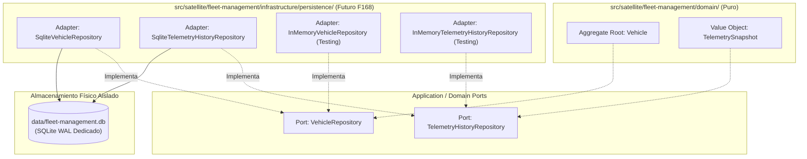
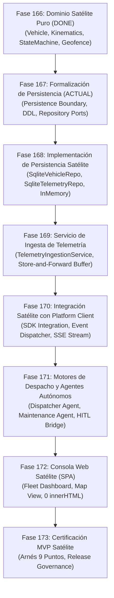

# Arquitectura de Persistencia Satélite y Contratos de Repositorio — PROJ-03: Fleet Management

> **Documento Canónico de Arquitectura de Persistencia Satélite**  
> **Proyecto:** `PROJ-03-FLEET` (*Fleet Management & Logistics*)  
> **Fase del MWP:** Fase 168 (`IMPLEMENTED / VERIFIED`)  
> **Línea Base del Sistema:** v1.4.0 Baseline  
> **Fecha de Formalización:** 2026-10-06  
> **Alineación Arquitectónica:** [ADR 0052: Transitional Satellite Boundary & Repository Isolation](./decisions/0052-transitional-satellite-boundary-and-repository-isolation.md)  
> **Estado:** `CANONICAL SPECIFICATION & IMPLEMENTATION COMPLETE` (Implementación SQLite & InMemory completada en Fase 168)

---

## 1. Misión y Propósito

El presente documento formaliza los **límites arquitectónicos de persistencia, los contratos de repositorio independientes, el diseño relacional conceptual y la gobernanza de concurrencia y retención** para la aplicación satélite **`PROJ-03 Fleet Management & Logistics`**.

### Invariante Fundamental:
> **Los datos de la flota pertenecen exclusivamente a la aplicación satélite y jamás contaminan la persistencia central de la plataforma.**
>
> $$\text{PROJ-03 DATA} \neq \text{PLATFORM CORE DATA}$$

El objetivo de esta formalización es garantizar que cuando se implemente la persistencia en fases posteriores, esta sea física y lógicamente autónoma, evitando contención en base de datos, mezclas de esquemas y dependencias prohibidas.

---

## 2. Decisión de Frontera y Titularidad de Datos (Persistence Boundary & Ownership)

### 2.1. Titularidad Satélite Exclusiva (*Satellite-Owned Persistence*)
- **Propietario:** La aplicación satélite `PROJ-03 Fleet Management` es la dueña exclusiva de sus estructuras de datos, ciclos de migración y almacenamiento.
- **Prohibición Categórica:** Queda estrictamente prohibido crear tablas con prefijo `fleet_*` o campos vehiculares dentro del archivo SQLite central de la plataforma (`data/platform.db` / `data/app.db`).
- **Ubicación de Archivo Físico:** En entornos de archivo local/despliegue embebido, la persistencia de flota reside en su propio archivo dedicado (e.g. `data/fleet-management.db` o `data/fleet.db`), completamente segregado de `data/platform.db`.
- **Modo en Memoria para Tests:** En suites automatizadas unitarias y de integración del satélite, la persistencia utiliza `:memory:` segregado por suite.

### 2.2. Justificación Arquitectónica del Aislamiento
1. **Aislamiento de Rendimiento y Bloqueos (Lock Contention):**
   La telemetría vehicular emite tramas de alta frecuencia (1 Hz por vehículo activo). Si una flota de 100 vehículos emitiera escrituras continuas sobre el WAL de `data/platform.db`, bloquearía las transacciones del motor de orquestación de tareas, ejecuciones de agentes y pistas de auditoría del Core Engine.
2. **Aislamiento de Fallos (Failure Isolation):**
   Una corrupción de índice, bloqueo por concurrencia o saturación de disco originada por ráfagas telemáticas en la base de datos de flota jamás interrumpe la disponibilidad del Core Engine de la plataforma.
3. **Independencia de Respaldo y Retención (Backup & Retention Independence):**
   Los requerimientos de retención telemática (30 días de datos brutos a 1 Hz, 5 años de odometría/resúmenes) difieren radicalmente de las políticas de auditoría corporativa del Core Engine.
4. **Independencia de Despliegue y Migración:**
   La base de datos de flota puede migrar su esquema, escalarse o trasladarse a un motor de series temporales (TimescaleDB / PostgreSQL) sin requerir migraciones ni interrupciones en la base de datos central.

---

## 3. Pureza de Dominio y Separación de Puertos y Adaptadores

Siguiendo la Arquitectura Hexagonal del sistema, los contratos de repositorio se definen como **puertos de aplicación/dominio** y sus futuras implementaciones concretas como **adaptadores de persistencia**:



### Reglas de Dependencia:
1. Las entidades de dominio (`Vehicle`, `TelemetrySnapshot`) **nunca** importan librerías de persistencia (`node:sqlite`), manejadores de archivos (`node:fs`) ni rutas de red.
2. Los puertos de repositorio dependen exclusivamente de los tipos y agregados de dominio.
3. El Core Engine (`src/domain/`, `src/infrastructure/persistence/sqlite/`) no conoce la existencia de los repositorios de flota.

---

## 4. Contratos de Repositorio (Repository Port Contracts)

Para la Fase 167 se restringe el alcance exclusivamente a los **dos contratos mínimos esenciales** para la gestión del ciclo de vida del vehículo y el almacenamiento auditado de telemetría:

### 4.1. `VehicleRepository`
- **Responsabilidad:** Gestionar el ciclo de vida, estado operativo, asignaciones de ruta y odometría acumulada del agregado raíz `Vehicle`.
- **Identidad de Consulta:** `VehicleId` y `tenantId` obligatorios.
- **Operaciones de Lectura:**
  - `findById(vehicleId: VehicleId, tenantId: string): Promise<Vehicle | null>`
  - `findByVin(vin: Vin, tenantId: string): Promise<Vehicle | null>`
  - `listByTenant(tenantId: string, filter?: VehicleFilter): Promise<readonly Vehicle[]>`
- **Operaciones de Escritura:**
  - `save(vehicle: Vehicle): Promise<void>` (Inserción o actualización atómica con control de concurrencia optimista mediante `version`).
- **Semántica de Transacción:** Atómica por agregado. Si el `version` en base de datos difiere del `version` en memoria, se aborta con `FleetOptimisticConcurrencyError`.
- **Aislamiento Multi-Tenant:** Cualquier discrepancia de `tenantId` entre el parámetro de consulta y el estado del agregado resulta en rechazo *fail-closed*.

### 4.2. `TelemetryHistoryRepository`
- **Responsabilidad:** Almacenar la serie temporal inmutable de instantáneas de telemetría (`TelemetrySnapshot`) para auditoría forense, análisis cinemático posterior y replay de rutas.
- **Identidad de Consulta:** `vehicleId`, `tenantId` y rangos de fechas UTC.
- **Operaciones de Lectura:**
  - `findByVehicleAndRange(vehicleId: VehicleId, tenantId: string, from: Date, to: Date, options?: QueryOptions): Promise<readonly TelemetrySnapshot[]>`
  - `findLatestByVehicle(vehicleId: VehicleId, tenantId: string): Promise<TelemetrySnapshot | null>`
- **Operaciones de Escritura:**
  - `append(snapshot: TelemetrySnapshot, tenantId: string, metadata?: TelemetryIngestMetadata): Promise<void>`
  - `appendBatch(snapshots: readonly TelemetrySnapshot[], tenantId: string): Promise<BatchAppendResult>`
  - `pruneOlderThan(cutoffDate: Date, tenantId: string): Promise<number>`
- **Semántica de Transacción:** Inserción de sólo-adición (*append-only*). Idempotencia garantizada por clave compuesta `(tenant_id, vehicle_id, timestamp)`.

### 4.3. Exclusión Justificada de Repositorios Adicionales
En estricto cumplimiento del principio de maduración incremental, los siguientes repositorios quedan **explícitamente fuera del alcance de F167**:
- `RouteRepository` $\rightarrow$ Aplazado a la fase de planificación de rutas y despacho (`F171`).
- `GeofenceRepository` $\rightarrow$ Aplazado a la fase de motor de alertas espaciales (`F171`).
- `MaintenanceRepository` $\rightarrow$ Aplazado a la fase de analítica predictiva de mantenimiento (`F171`).
- `DispatchRepository` $\rightarrow$ Aplazado a la fase de integración multi-agente (`F171`).

---

## 5. Diseño del Esquema Relacional Satélite (SQLite DDL Conceptual)

El esquema conceptual para el archivo dedicado `data/fleet-management.db` se estructura de la siguiente forma:

```sql
-- Metadatos de versión del esquema satélite (independiente de la plataforma)
CREATE TABLE IF NOT EXISTS fleet_schema_metadata (
  key TEXT PRIMARY KEY,
  value TEXT NOT NULL,
  updated_at TEXT NOT NULL
);

-- Agregado raíz de Vehículo
CREATE TABLE IF NOT EXISTS fleet_vehicles (
  id TEXT NOT NULL,
  tenant_id TEXT NOT NULL,
  vin TEXT NOT NULL,
  plate_number TEXT NOT NULL,
  make TEXT NOT NULL,
  model TEXT NOT NULL,
  year INTEGER NOT NULL,
  state TEXT NOT NULL CHECK (state IN ('PARKED', 'IDLING', 'MOVING', 'ALERT', 'OFFLINE')),
  odometer_km REAL NOT NULL DEFAULT 0.0 CHECK (odometer_km >= 0.0),
  last_snapshot_json TEXT,
  last_recorded_timestamp TEXT,
  created_at TEXT NOT NULL,
  updated_at TEXT NOT NULL,
  version INTEGER NOT NULL DEFAULT 1 CHECK (version >= 1),
  PRIMARY KEY (tenant_id, id),
  UNIQUE (tenant_id, vin),
  UNIQUE (tenant_id, plate_number)
);

CREATE INDEX IF NOT EXISTS idx_fleet_vehicles_tenant_state 
  ON fleet_vehicles(tenant_id, state);

-- Serie temporal inmutable de telemetría (Append-Only)
CREATE TABLE IF NOT EXISTS fleet_telemetry_history (
  id TEXT NOT NULL,
  tenant_id TEXT NOT NULL,
  vehicle_id TEXT NOT NULL,
  timestamp TEXT NOT NULL,
  latitude REAL NOT NULL,
  longitude REAL NOT NULL,
  speed_kmh REAL NOT NULL CHECK (speed_kmh >= 0.0 AND speed_kmh <= 200.0),
  heading_deg REAL NOT NULL CHECK (heading_deg >= 0.0 AND heading_deg <= 360.0),
  altitude_m REAL,
  fuel_percent REAL CHECK (fuel_percent IS NULL OR (fuel_percent >= 0.0 AND fuel_percent <= 100.0)),
  battery_percent REAL CHECK (battery_percent IS NULL OR (battery_percent >= 0.0 AND battery_percent <= 100.0)),
  engine_rpm REAL CHECK (engine_rpm IS NULL OR engine_rpm >= 0.0),
  odometer_km REAL NOT NULL CHECK (odometer_km >= 0.0),
  active_dtcs_json TEXT,
  anomaly_flags_json TEXT,
  ingested_at TEXT NOT NULL,
  is_out_of_order INTEGER NOT NULL DEFAULT 0 CHECK (is_out_of_order IN (0, 1)),
  PRIMARY KEY (tenant_id, vehicle_id, timestamp),
  FOREIGN KEY (tenant_id, vehicle_id) REFERENCES fleet_vehicles(tenant_id, id) ON DELETE CASCADE
);

CREATE INDEX IF NOT EXISTS idx_fleet_telemetry_time 
  ON fleet_telemetry_history(tenant_id, vehicle_id, timestamp DESC);

-- Resúmenes diarios/horarios agregados para retención prolongada (Tier 2)
CREATE TABLE IF NOT EXISTS fleet_telemetry_daily_summary (
  tenant_id TEXT NOT NULL,
  vehicle_id TEXT NOT NULL,
  summary_date TEXT NOT NULL, -- 'YYYY-MM-DD'
  total_distance_km REAL NOT NULL DEFAULT 0.0,
  max_speed_kmh REAL NOT NULL DEFAULT 0.0,
  avg_speed_kmh REAL NOT NULL DEFAULT 0.0,
  engine_hours REAL NOT NULL DEFAULT 0.0,
  alerts_count INTEGER NOT NULL DEFAULT 0,
  created_at TEXT NOT NULL,
  PRIMARY KEY (tenant_id, vehicle_id, summary_date),
  FOREIGN KEY (tenant_id, vehicle_id) REFERENCES fleet_vehicles(tenant_id, id) ON DELETE CASCADE
);
```

---

## 6. Modelo Transaccional y Concurrencia

### 6.1. Pragmas Obligatorios de SQLite
Cuando se instancie la base de datos satélite en Node.js mediante `node:sqlite`, se aplicarán estrictamente los siguientes pragmas:
```sql
PRAGMA foreign_keys = ON;
PRAGMA journal_mode = WAL;
PRAGMA synchronous = NORMAL;
PRAGMA busy_timeout = 5000;
```

### 6.2. Estrategia de Concurrencia
1. **Control de Concurrencia Optimista (OCC):**
   Las actualizaciones sobre `fleet_vehicles` verifican:
   ```sql
   UPDATE fleet_vehicles 
   SET state = ?, odometer_km = ?, version = version + 1, updated_at = ?
   WHERE tenant_id = ? AND id = ? AND version = ?;
   ```
   Si las filas afectadas son `0`, se rechaza con error de conflicto concurrente.
2. **Desacoplamiento de Escritura de Telemetría:**
   La inserción de tramas telemáticas en `fleet_telemetry_history` es puramente acumulativa (*append-only*), permitiendo operaciones de inserción masiva (*batch*) sin competir por bloqueos sobre el registro del vehículo.
3. **Manejo de Ráfagas (Store-and-Forward Buffering):**
   Cuando un móvil transmite ráfagas de 50 a 100 tramas acumuladas por pérdida transitoria de cobertura celular, la persistencia satélite las procesa dentro de una única transacción atómica `BEGIN IMMEDIATE ... COMMIT`.

---

## 7. Aislamiento Multi-Tenant (Tenant Boundary)

El aislamiento multi-inquilino se aplica como principio estricto de seguridad:
1. **Clave Primaria Compuesta:** Todas las tablas de flota incorporan `tenant_id` como primer elemento de su clave primaria.
2. **Rechazo Fail-Closed:**
   Cualquier llamada a un método de repositorio que omita `tenantId` o entregue una cadena vacía es rechazada inmediatamente antes de invocar SQLite.
3. **Cero Consultas Globales sin Tenant:**
   No existe ninguna operación de lectura o actualización que permita escanear vehículos entre distintos clientes corporativos.

---

## 8. Semántica de Fallos y Recuperación

| Escenario de Falla | Comportamiento del Repositorio | Tipo de Error Emitido |
| :--- | :--- | :--- |
| **Base de datos no disponible / Bloqueada** | Reintento automático acotado hasta `busy_timeout` (5s); fallo limpio posterior sin caída del proceso | `FleetDatabaseLockedError` |
| **Conflicto de versión concurrente (OCC)** | Aborta la transacción; no sobrescribe el estado del vehículo | `FleetOptimisticConcurrencyError` |
| **Trama de telemetría duplicada** | Detección por clave primaria `(tenant_id, vehicle_id, timestamp)`; descarte idempotente sin fallar | Retorno determinista `DUPLICATE_IGNORED` |
| **Vehículo inexistente al asociar telemetría** | Rechazo por integridad referencial (Foreign Key fail-closed) | `FleetVehicleNotFoundError` |
| **Inconsistencia de Tenant** | Validación previa al SQL; corte inmediato | `FleetSecurityViolationError` |

---

## 9. Gobernanza de Retención, Ciclo de Vida y Pruning

Para mitigar el crecimiento descontrolado de la base de datos por telemetría masiva:
1. **Nivel 1 (Tier 1 — Telemetría Bruta a 1 Hz):**
   - Retención máxima: **30 días**.
   - Propósito: Análisis forense inmediato, cálculo de cinemática y reproducción detallada de rutas.
   - Poda (*Pruning*): Tarea programada ejecuta `pruneOlderThan(cutoffDate, tenantId)`.
2. **Nivel 2 (Tier 2 — Resúmenes Horarios y Diarios):**
   - Retención: **5 años** (cumplimiento de normas de transporte y auditoría de mantenimiento).
   - Generación: Agregación consolidada diaria en `fleet_telemetry_daily_summary`.
3. **Ciclo de Vida del Vehículo:**
   - La baja de un vehículo (`DECOMMISSIONED`) no elimina físicamente sus registros de auditoría histórica, sino que conmuta su estado a `OFFLINE` y archiva sus resúmenes.

---

## 10. Ciclo de Migraciones Satélite Independiente

- **Tabla de Control:** `fleet_schema_metadata` (propia del satélite).
- **Control de Versión:**
  - `FLEET_SCHEMA_VERSION = 1` inicial.
  - Totalmente independiente de `CURRENT_SCHEMA_VERSION` (v3) del Core Engine.
- **Principio Invariante:** Ninguna migración de la plataforma central ejecuta scripts DDL sobre la base de datos de flota, y ninguna actualización de flota altera las tablas del Core Engine.

---

## 11. Hoja de Ruta de Fases Subsiguientes para PROJ-03

Para evitar fases sobredimensionadas (`ARCHITECTURAL_RISK`), el producto `PROJ-03 Fleet Management` se secuenciará formalmente en las siguientes unidades modulares e incrementales:



---

## 12. Criterios de Aceptación y Estado de Implementación (Fase 168)

Los entregables contractuales han sido completados y verificados en Fase 168:
1. `SqliteVehicleRepository` y `SqliteTelemetryHistoryRepository` implementados en `src/satellite/fleet-management/infrastructure/persistence/sqlite/`.
2. Adaptadores equivalentes `InMemoryVehicleRepository` y `InMemoryTelemetryHistoryRepository` implementados en `src/satellite/fleet-management/infrastructure/persistence/in-memory/`.
3. Cero importaciones desde `src/domain/` o `src/infrastructure/persistence/sqlite/` de la plataforma (verificado con test AST de pureza de límites).
4. Archivo de base de datos configurable (por defecto `data/fleet-management.db`, con soporte para `:memory:`).
5. Migración inicial `V1_FLEET_DDL` determinista y ejecutable con `FLEET_SCHEMA_VERSION = 1`.
6. 100% de pruebas unitarias y de integración pasando en `tests/integration/fleet-persistence.test.ts` (14 pruebas verificadas).
