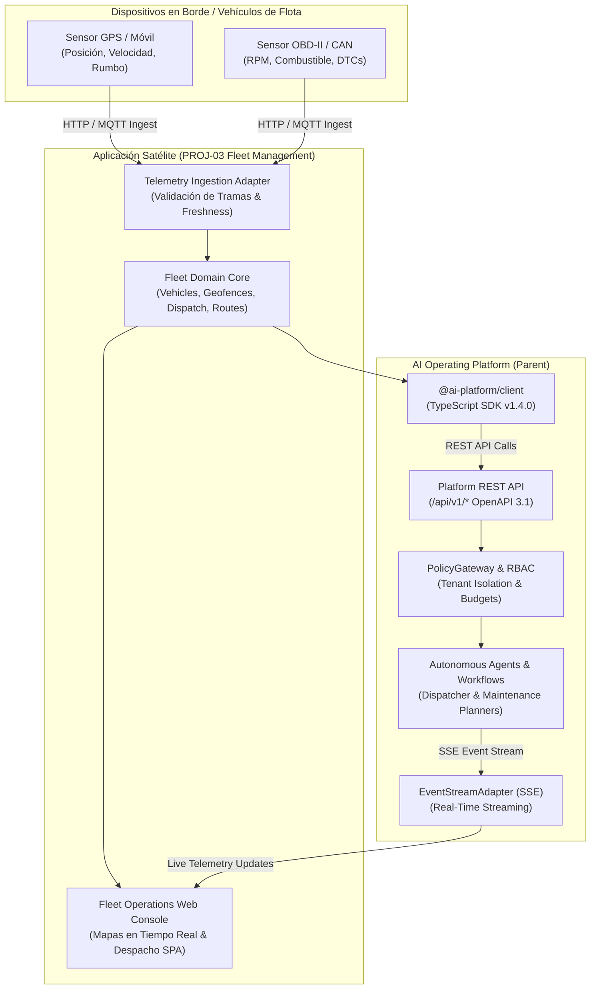
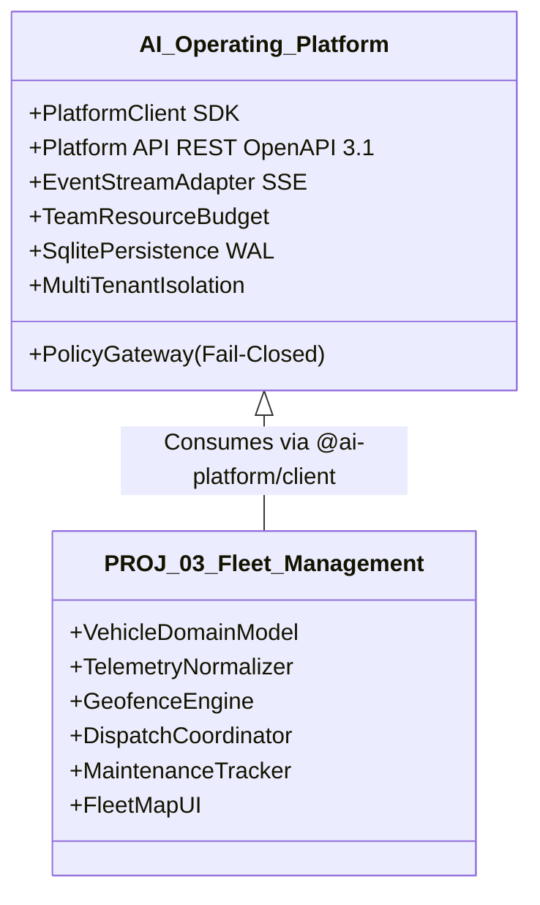
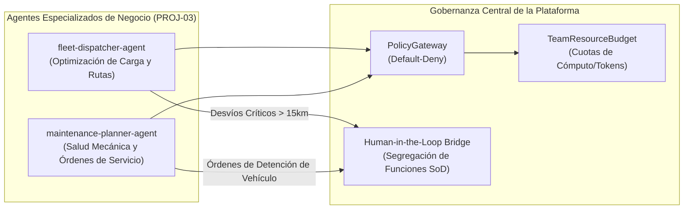

# Carta Constitutiva del Producto (Product Charter) — PROJ-03: Fleet Management & Logistics

> **Identificador Oficial de Proyecto:** `PROJ-03-FLEET`  
> **Nombre Funcional del Producto:** *Fleet Management & Logistics* (Gestor Inteligente de Flotas y Optimización Logística)  
> **Repositorio Previsto:** `fleet-management` (Aplicación Satélite Externa)  
> **Rol Arquitectural:** Aplicación Satélite Consumidora de la **AI Operating Platform**  
> **Línea Base del Sistema:** v1.4.0 Baseline  
> **Fecha de Formalización:** 2026-10-05  
> **Iniciativa Canónica:** `AOP-FLEET-LOGISTICS`  
> **Línea Estratégica:** Línea B — Expansión del Portafolio Satélite  

---

## 1. Visión y Propuesta de Valor

### 1.1. Visión del Producto
Convertirse en la solución satélite de referencia para la **gestión telemática de flotas comerciales, despacho inteligente de mercancías, optimización dinámica de rutas y mantenimiento preventivo asistido por IA**, operando como una aplicación satélite desacoplada que consume la potencia cognitiva, los contratos de orquestación y la seguridad perimétrica de la **AI Operating Platform**.

### 1.2. El Problema que Resuelve
1. **Ineficiencia Crítica en Despachos y Rutas:** La asignación manual de entregas y el cálculo estático de rutas provocan kilómetros en vacío, demoras en entregas y sobrecostos considerables de combustible.
2. **Mantenimiento Reactivo y Averías Imprevistas:** Las fallas mecánicas sin preaviso causan detenciones costosas de vehículos en servicio; la mantención tradicional por calendario ignora el desgaste real, las horas de motor y los códigos de diagnóstico (DTC) de la computadora vehicular.
3. **Falta de Visibilidad en Tiempo Real y Desconexión de Datos:** Dispersión entre hojas de ruta físicas, conductores en ruta y operadores centrales, impidiendo reaccionar ágilmente ante desvíos de ruta, salidas de zona autorizada (*geofencing*) o emergencias.
4. **Riesgos de Seguridad y Exfiltración de Geolocalización:** La información de ubicación en vivo y rutas de vehículos de transporte comercial es altamente sensible y vulnerable si no cuenta con aislamiento estricto multi-tenant y cifrado perimétrico.

### 1.3. Propuesta de Valor Diferencial
1. **Despacho Autónomo Asistido por Agentes (`fleet-dispatcher-agent`):** Asignación continua de órdenes de carga considerando capacidad volumétrica, peso, ventanas de entrega y ubicación más cercana, con supervisión humana (*Human-in-the-Loop*).
2. **Mantenimiento Preventivo Basado en Evidencia (`maintenance-planner-agent`):** Detección temprana de anomalías en telemetría vehicular real (odometría, temperaturas, voltajes, códigos OBD-II) con cero alucinación y recomendación fundamentada de órdenes de taller.
3. **Geofencing Determinista y Alertas en Tiempo Real:** Detección matemática en $O(1)$ de cruce de polígonos y radios circulares autorizados, notificando en milisegundos mediante streaming reactivo Server-Sent Events (SSE).
4. **Aislamiento Multi-Tenant y Seguridad Empresarial:** Garantía criptográfica de que cada flota comercial opera en un silo estricto, sin fugas de datos entre competidores y con estricto apego a *default-deny*.

---

## 2. Usuarios Objetivo y Personas

| Rol / Persona | Responsabilidad Principal | Necesidad Operacional Crítica | Interfaz de Interacción |
| :--- | :--- | :--- | :--- |
| **Director de Operaciones / Fleet Manager** | Gestión integral del portafolio vehicular, control de costos de combustible y KPIs de puntualidad. | Tableros consolidados de disponibilidad, reportes de flota y cumplimiento de presupuestos. | Consola Web Ejecutiva de Flota |
| **Despachador Logístico** | Asignación diaria de hojas de ruta, seguimiento de vehículos en tránsito y atención de excepciones. | Alertas reactivas de desvío, estimación precisa de llegada (ETA) y reasignación de órdenes. | Panel de Control de Despacho y Mapas |
| **Jefe de Taller / Mantenimiento** | Salud mecánica de la flota, programación de servicios y gestión de repuestos compatibles. | Historial de fallas DTC, desgaste acumulado de odómetro y alertas tempranas de batería/refrigerante. | Módulo de Salud Vehicular y Mantenimiento |
| **Conductor de Flota** | Ejecución de la ruta en calle, registro de entregas y confirmación de recepción. | Hoja de ruta secuencial clara, indicaciones de parada y reporte ágil de incidentes. | Aplicación Móvil / Web Móvil Conductor |

---

## 3. Alcance Funcional del Producto

### 3.1. Lo que el Producto INCLUYE (In Scope)
* **Ingesta y Normalización Telemática Multi-Fuente:**
  - Recepción de tramas estándar (`TelemetrySnapshot`) desde dispositivos móviles o pasarelas telemáticas OBD-II/GPS comerciales.
  - Validación *fail-closed* de coordenadas geográficas (WGS 84), velocidad monotónica, timestamps en UTC y descarte de datos corruptos o fuera de orden.
* **Modelo y Catálogo de Activos Vehiculares:**
  - Registro de vehículos (marca, modelo, año, placa, VIN evaluado, tipo de combustible, capacidad de carga útil en kg y volumen en $m^3$).
  - Ciclo de vida operacional: `PROVISIONING` -> `ACTIVE` <-> `IN_TRANSIT` <-> `IN_MAINTENANCE` -> `DECOMMISSIONED`.
* **Motor Determinista de Geofencing y Zonas:**
  - Definición de zonas circulares (centro lat/lon + radio metros) y poligonales (vértices convexos/cóncavos).
  - Emisión de eventos reactivos `fleet.geofence.entered` y `fleet.geofence.exited`.
* **Despacho y Optimización de Rutas:**
  - Agrupación de órdenes de despacho (`DispatchJob`) en rutas secuenciadas con ventanas de tiempo (Time Windows).
  - Cálculo de distancias y tiempos de viaje con estimación de llegada (ETA) desacoplada de proveedores propietarios de mapas.
* **Diagnósticos y Mantenimiento Predictivo:**
  - Ingesta de códigos de diagnóstico de motor (DTC - Diagnostic Trouble Codes).
  - Seguimiento monotónico de odómetro acumulado y horas de motor para calendarización predictiva de revisiones.
* **Consola Web de Operaciones (Satélite):**
  - Vista cartográfica interactiva con renderizado reactivo sin fugas y 0 `.innerHTML`.
  - Panel lateral de alertas, telemetría del vehículo seleccionado y estado de despacho.
* **Streaming de Eventos en Tiempo Real (SSE):**
  - Recepción de cambios de estado y telemetría a través del bus de eventos de la plataforma central (`EventStreamAdapter`).

### 3.2. Lo que el Producto NO INCLUYE (Out of Scope)
* **Control Físico o Remoto de Vehículos (Drive-by-Wire):** Queda terminantemente prohibido cualquier mecanismo de aceleración, frenado o bloqueo de motor en la nube por razones estrictas de seguridad humana y automotriz. El sistema es de **información, supervisión y despacho**.
* **Fabricación de Hardware Telemático Propio:** La plataforma y el satélite son agnósticos al hardware; consumen estándares abiertos JSON/REST/MQTT sobre sensores de mercado.
* **Evasión de Regulaciones de Tránsito o Sobrecarga:** El sistema no calcula rutas que violen restricciones de peso de puentes o normativas laborales de horas máximas de conducción continua.

---

## 4. Separación Arquitectónica: Plataforma vs Aplicación Satélite

Siguiendo el principio fundamental de la **AI Operating Platform**:
$$\text{Core Engine} \neq \text{Platform Product} \neq \text{Satellite Applications}$$

### Invariantes de No-Contaminación:
1. **El Core Engine no conoce la palabra "Fleet":** Ni `src/domain/task/`, ni `src/domain/workflow/`, ni `src/infrastructure/persistence/` contienen conceptos como "camión", "odómetro" o "latitud".
2. **Consumo Exclusivo por Contratos Públicos:** Toda interacción entre `fleet-management` y la plataforma se realiza mediante `@ai-platform/client` utilizando endpoints REST `/api/v1/*` y canales SSE `/api/v1/events/stream`.
3. **Aislamiento Multi-Tenant Estricto:** Cada inquilino logístico (`tenant-logistics-corp`) opera en un espacio cerrado de datos; el despachador de una empresa jamás tiene visibilidad de las flotas de otra.

---

## 5. Matriz de Capacidades: Aplicación vs Plataforma

| Capacidad | ¿Específica de Aplicación (`PROJ-03`)? | ¿Capacidad de Plataforma (`Parent`)? | Justificación Arquitectónica |
| :--- | :--- | :--- | :--- |
| **`fleet.telemetry`** | **SÍ (Específica)** | NO (Candidata Futura) | La semántica de sensores vehiculares (odómetro, DTCs, combustible) es dominio de negocio automotriz/flota. La plataforma provee el transporte genérico de eventos (`EventStreamAdapter`). |
| **`route.optimization`** | **SÍ (Específica)** | NO | Los algoritmos de ruteo con ventanas horarias y capacidad de carga pertenecen al dominio logístico de `PROJ-03`. La plataforma provee los agentes y presupuestos de cómputo. |
| **`maintenance.predictive`** | **SÍ (Específica)** | NO | Las reglas de desgaste vehicular y lectura de códigos de falla pertenecen a la flota. La plataforma provee la orquestación en DAG y evaluación de políticas. |
| **`dispatch.agent`** | **SÍ (Específica)** | NO | El rol de despachador es un agente especializado de negocio configurado en la aplicación satélite. La plataforma provee el runtime multi-agente y SoD. |
| **`tasks.create` / `tasks.read`** | NO | **SÍ (Plataforma)** | Capacidad central de despacho asíncrono y seguimiento de estado de tareas en el Core Engine. |
| **`events.stream`** | NO | **SÍ (Plataforma)** | Streaming reactivo perimétrico SSE multi-tenant con `Last-Event-ID`. |
| **`security.policy`** | NO | **SÍ (Plataforma)** | Evaluación estricta de políticas de acceso, default-deny y control de presupuestos operacionales. |

---

## 6. Agentes Autónomos del Ecosistema de Flota

### 6.1. `fleet-dispatcher-agent`
* **Propósito:** Analizar la bolsa de órdenes de entrega pendientes y generar propuestas óptimas de asignación a vehículos disponibles, minimizando distancia total y respetando capacidades de carga.
* **Inputs:** Lista de órdenes `DispatchJob`, ubicación actual de vehículos `TelemetrySnapshot`, estado de carga y ventanas de servicio.
* **Outputs:** Propuesta estructurada de `RoutePlan` con paradas secuenciadas y estimaciones de arribo (ETA).
* **Restricción de Política:** No puede alterar unilateralmente una ruta en tránsito si la desviación excede 15 km o el costo proyectado supera el margen presupuestario sin aprobación del despachador humano (*HITL*).

### 6.2. `maintenance-planner-agent`
* **Propósito:** Evaluar continuamente la odometría acumulada, horas de motor y alertas diagnósticas (DTCs) para proyectar necesidades de servicio preventivo antes de fallas críticas.
* **Inputs:** Serie temporal de telemetría del vehículo, kilometraje de última mantención, catálogo de intervalos de servicio y alertas OBD-II activas.
* **Outputs:** Recomendación formal de mantenimiento con nivel de severidad (`LOW`, `MEDIUM`, `HIGH`, `CRITICAL`), fecha sugerida y lista preliminar de piezas compatibles (interoperable con `PROJ-02 Spare Parts`).
* **Restricción de Política:** Una orden de detención o baja técnica temporal de un vehículo requiere confirmación explícita del Jefe de Taller (*Segregación de Funciones / SoD*).

---

## 7. Criterios de Éxito del MVP (Minimum Viable Product)

1. **Ingesta Confiable en Borde:** Procesamiento de tramas telemáticas en menos de 50 ms por evento en el adaptador satélite, con descarte *fail-closed* del 100% de tramas con coordenadas imposibles o timestamps alterados.
2. **Cero Fugas Multi-Tenant:** Aislamiento criptográfico y perimétrico absoluto entre cuentas corporativas de transporte (0 cruce de coordenadas o identificadores de vehículos).
3. **Despacho Eficiente y Asistido:** Generación determinista de hojas de ruta secuenciadas en menos de 2.0 segundos para flotas de hasta 50 vehículos simultáneos.
4. **Alerta Temprana de Mantenimiento:** Detección y emisión reactiva vía SSE de códigos de falla DTC críticos en menos de 500 ms tras la ingesta del paquete telemático.
5. **Calidad y Certificación:** Aprobación del 100% de las pruebas automatizadas del arnés de certificación de la AI Operating Platform (`runReferenceAppCertification`).

---

## 8. Riesgos y Mitigaciones Técnicas

| Riesgo Identificado | Severidad | Mitigación Técnica en Arquitectura |
| :--- | :--- | :--- |
| **Pérdida de conectividad celular en carretera** | ALTA | El sensor/móvil almacena tramas localmente (*store-and-forward*); el adaptador de ingesta procesa tramas acumuladas respetando monotonicidad temporal y deduplicando por `snapshotId`. |
| **Inyección de coordenadas falsas o suplantación (GPS Spoofing)** | MEDIA | Validación cinemática estricta: rechazo inmediato si el vector de desplazamiento entre dos tramas consecutivas implica velocidades superiores a 200 km/h. |
| **Sobrecarga de almacenamiento por telemetría masiva** | ALTA | Arquitectura de retención en niveles: datos brutos 1 Hz retenidos por 30 días; resúmenes horarios y odometría acumulada persistidos a largo plazo. |
| **Fallas mecánicas ocultas por lectura no estándar de OBD-II** | MEDIA | Adopción exclusiva de códigos estándar SAE J1979 / ISO 15031 para el MVP, reportando códigos propietarios no reconocidos bajo categoría genérica `UNKNOWN_DIAGNOSTIC_CODE`. |
