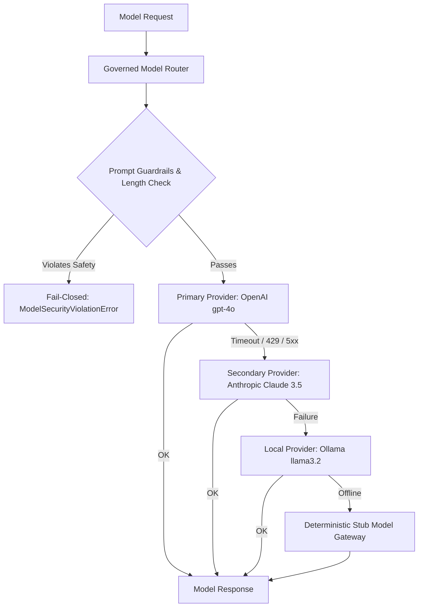

# REAL AI PROVIDERS & GOVERNED MODEL ROUTING

## 1. Visión General y Propósito

La AI Operating Platform v1.1 integra adaptadores de modelos de Inteligencia Artificial de producción (**OpenAI**, **Anthropic**, **Ollama**) bajo una arquitectura de enrutamiento gobernado fail-closed:

$$\text{CORE ENGINE} \neq \text{PLATFORM PRODUCT} \neq \text{APPLICATIONS} \neq \text{AI PROVIDERS}$$

### Invariantes de Seguridad y Autoridad
1. **Model Authority Invariant**: El modelo de lenguaje nunca ostenta autoridad de decisión en el sistema. Es un ejecutor computacional que propone planes o contenido estructurado. La autorización y las políticas de seguridad residen exclusivamente en el núcleo de la plataforma.
2. **Fail-Closed Routing**: Ante fallos de proveedor (Rate Limits 429, Service Outages 503, Timeouts), el enrutador conmuta determinísticamente a través de la cadena de fallback (Secundario -> Local Ollama -> Deterministic Stub).
3. **Secret Scrubbing & Prompt Defense**: Sanitización automática de credenciales en trazas y bloqueo preventivo de inyecciones de prompt.

---

## 2. Arquitectura de Proveedores

| Proveedor | Modelos Soportados | Modos de Conexión | Capacidades |
| :--- | :--- | :--- | :--- |
| **OpenAI** | `gpt-4o`, `gpt-4o-mini` | HTTPS Bearer Token (`/v1/chat/completions`) | Text, Structured JSON, Tool Calling, Vision |
| **Anthropic** | `claude-3-5-sonnet`, `claude-3-haiku` | HTTPS x-api-key (`/v1/messages`) | Text, Structured JSON, Tool Calling, Vision |
| **Ollama** | `llama3.2`, `mistral`, `deepseek-r1` | HTTP Localhost (`/api/chat`) | Text, Local Privacy, JSON Output |
| **Stub** | `stub-model` | In-Memory Deterministic Engine | Text, Autonomous Plan Stubs, CI Testing |

---

## 3. Matriz de Failover y Gobernanza

