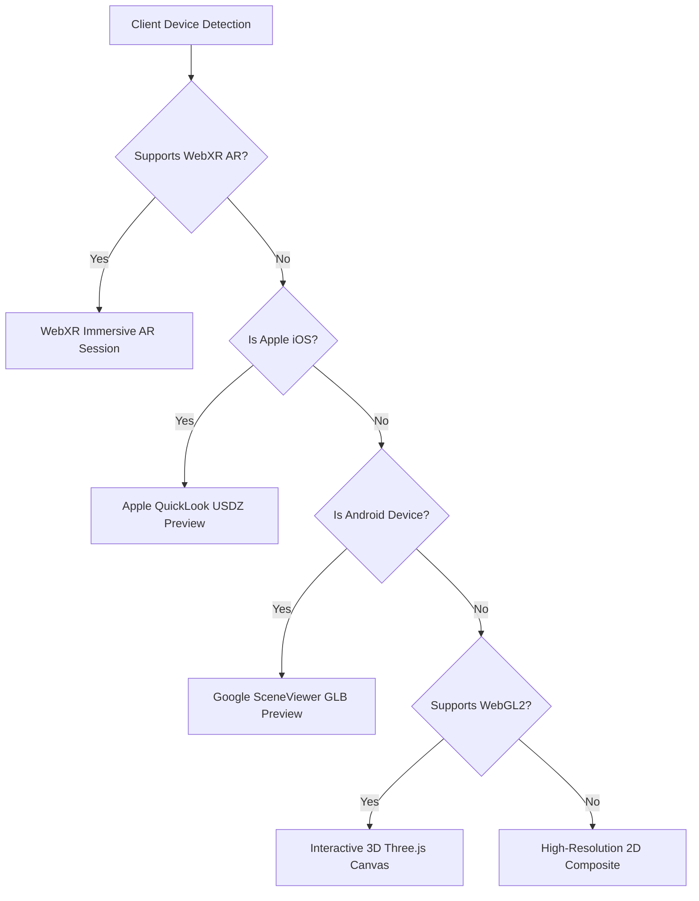

# REAL AR / 3D MEDIA PIPELINE & VIRTUAL TRY-ON

## 1. Visión General

El pipeline de Realidad Aumentada (AR) y Fitting 3D de la AI Operating Platform habilita experiencias de comercio inmersivo para aplicaciones externas como **Tentaciones AI Commerce**:

$$\text{Tentaciones Application} \longrightarrow \text{Platform AR API} \longrightarrow \text{3D/AR Media Engine}$$

---

## 2. Estándar de Nomenclatura URN de Assets AR

Todos los assets 3D se registran bajo el estándar formal:
```text
urn:tentaciones:ar:<category>:<slug>@<semver>
```

Ejemplos:
- `urn:tentaciones:ar:apparel:silk-evening-dress@1.0.0`
- `urn:tentaciones:ar:footwear:leather-derby-black@1.0.0`
- `urn:tentaciones:ar:eyewear:aviator-gold@1.0.0`

---

## 3. Presets Anatómicos y Algoritmo de Fitting

| Preset | Altura (cm) | Pecho/Busto (cm) | Cintura (cm) | Caderas (cm) | Pierna (cm) | Hombros (cm) |
| :--- | :--- | :--- | :--- | :--- | :--- | :--- |
| **Nova** (Athletic) | 172 | 88 | 68 | 94 | 80 | 39 |
| **Sora** (Slender) | 168 | 84 | 64 | 90 | 78 | 37 |
| **Mateo** (Structured) | 182 | 102 | 84 | 100 | 84 | 46 |

---

## 4. Matriz de Detección de Dispositivos WebXR


