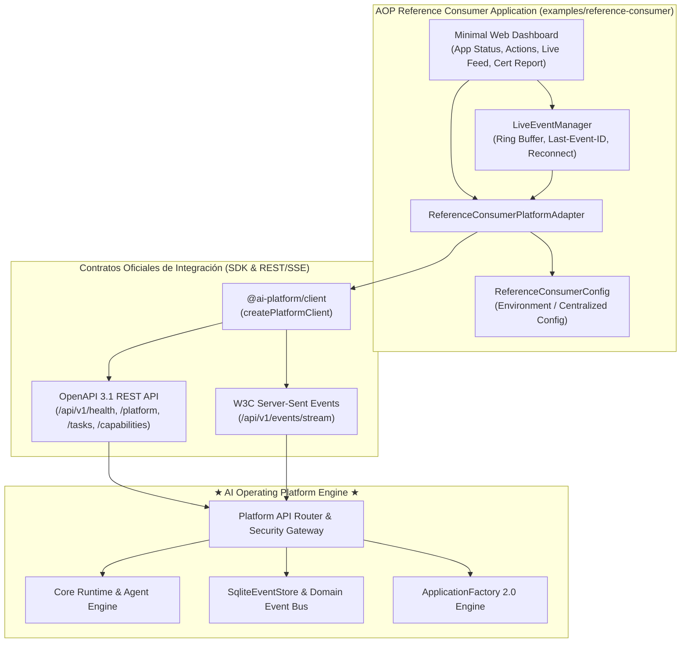

# Guía y Certificación de la Aplicación de Referencia (AOP Reference Consumer)

**AI Operating Platform — Reference Consumer Application & Certificación de Integración de Producto**

---

## 1. Visión General y Propósito

La **AOP Reference Consumer Application** (`reference-consumer`) es la aplicación canónica de referencia diseñada para demostrar y certificar la integración de aplicaciones satélites externas con la **AI Operating Platform (AOP)** como un **producto consumible (*Platform as a Product*)**.



### Reglas Arquitectónicas Fundamentales
1. **Frontera de Aislamiento Estricta**: La Reference Application vive fuera del Core Engine y consume la plataforma **única y exclusivamente** a través de `@ai-platform/client`, la API REST y el canal SSE.
2. **Cero Importaciones del Servidor**: No importa clases internas de `src/platform/api/platform-service.ts`, ni accede directamente a bases de datos SQLite (`.db`), ni manipula el bus de eventos en memoria sin pasar por los contratos de red.
3. **Cero Secretos Expuestos**: La configuración no persiste claves privadas ni tokens Bearer en código fuente, HTML o bundles estáticos.
4. **Gobierno de Capacidades**: Consume únicamente capacidades catalogadas (`PLATFORM_CAPABILITY_CATALOG`) otorgadas por el plan de derechos del tenant (`BUSINESS`).

---

## 2. Manifiesto Oficial de la Aplicación (`application.json`)

```json
{
  "applicationId": "reference-consumer",
  "name": "AOP Reference Consumer Application",
  "version": "1.0.0",
  "runtime": "node",
  "capabilities": [
    "product.discovery",
    "report.generate",
    "automation.execute"
  ],
  "requiredFeatures": [],
  "tenantRequirements": {
    "minPlan": "BUSINESS",
    "requiredCapabilities": [
      "product.discovery",
      "report.generate",
      "automation.execute"
    ]
  },
  "minimumPlatformVersion": "1.4.0",
  "environment": "development"
}
```

---

## 3. Matriz de Alineación SDK / REST / OpenAPI

Todas las operaciones ejecutadas por la Reference Application se corresponden biyectivamente (1:1) con el contrato OpenAPI 3.1:

| Capacidad / Dimensión | Método SDK (`@ai-platform/client`) | Ruta REST Oficial | OpenAPI `operationId` | Característica en Reference App |
| :--- | :--- | :--- | :--- | :--- |
| **Health & Conectividad** | `client.connect()` / `client.health.get()` | `GET /api/v1/health` | `getHealth` | Estado de liveness y readiness del backend |
| **Metadatos de Plataforma** | `client.getPlatformInfo()` | `GET /api/v1/platform` | `getPlatformMetadata` | Compatibilidad de versión (`>= 1.4.0`) y entorno |
| **Catálogo de Capacidades** | `client.capabilities.list()` | `GET /api/v1/capabilities` | `listCapabilities` | Descubrimiento de capacidades y auditoría de permisos |
| **Ejecución de Tareas AI** | `client.createTask()` | `POST /api/v1/tasks` | `createTask` | Despacho de tareas con `traceId` y `idempotencyKey` |
| **Operaciones Autónomas** | `client.operations.create()` | `POST /api/v1/operations` | `createOperation` | Disparo de automatizaciones asíncronas |
| **Streaming Reactivo SSE** | `client.events.stream()` | `GET /api/v1/events/stream` | `streamEvents` | Ingesta en tiempo real con `Last-Event-ID` y reconexión |

---

## 4. Matriz y Evaluación de Certificación (9 Dimensiones)

El módulo `src/certification.ts` y la suite de pruebas `tests/contract/reference-consumer-certification.test.ts` evalúan rigurosamente las 9 dimensiones de integración de la plataforma:

```text
REFERENCE APPLICATION CERTIFICATION
-----------------------------------
Identity       PASS
Authentication PASS
Authorization  PASS
Capabilities   PASS
Health         PASS
Version        PASS
Observability  PASS
OpenAPI        PASS
SSE            PASS
```

### Desglose de Criterios:
1. **Identity (`PASS`)**: Validación del identificador formal (`applicationId`) y aislamiento del ámbito de tenant (`tenantId`).
2. **Authentication (`PASS`)**: Establecimiento exitoso del `SecurityContext` mediante cabeceras autorizadas (`X-API-Key` / `Authorization`).
3. **Authorization (`PASS`)**: Verificación de derechos y mitigación de accesos cross-tenant.
4. **Capabilities (`PASS`)**: Resolución y mapeo de las 3 capacidades requeridas en el catálogo oficial de la plataforma.
5. **Health (`PASS`)**: Comprobación del estado `HEALTHY` de la plataforma y sus subsistemas.
6. **Version (`PASS`)**: Validación de que el runtime de la plataforma cumple con el requisito mínimo (`v1.4.0+`).
7. **Observability (`PASS`)**: Propagación bidireccional de `traceId`, `requestId` y `correlationId` en tareas creadas.
8. **OpenAPI (`PASS`)**: Conformidad estructural 1:1 con las especificaciones y esquemas OpenAPI 3.1.
9. **SSE (`PASS`)**: Handshake `text/event-stream`, recepción de eventos de dominio, latidos (*heartbeats*) y reconexión con `Last-Event-ID`.

---

## 5. Instrucciones de Ejecución y Verificación

### Generación con `create-aop-app`:
```powershell
npm run create-aop-app -- init reference-consumer \
  --name "AOP Reference Consumer Application" \
  --tenant "tenant-reference-corp" \
  --plan "BUSINESS" \
  --template "generic-ai-app" \
  --capabilities "product.discovery,report.generate,automation.execute" \
  --min-platform-version "1.4.0" \
  --output "examples/reference-consumer" \
  --force
```

### Verificación con el arnés `doctor`:
```powershell
npm run create-aop-app -- doctor examples/reference-consumer/application.json
```

### Inspección Visual en el Navegador:
Con el servidor de plataforma iniciado (`npm start`), abra:
```powershell
Start-Process "http://127.0.0.1:3000/reference-app"
```
o acceda al panel integrado en el Web Control Plane.
