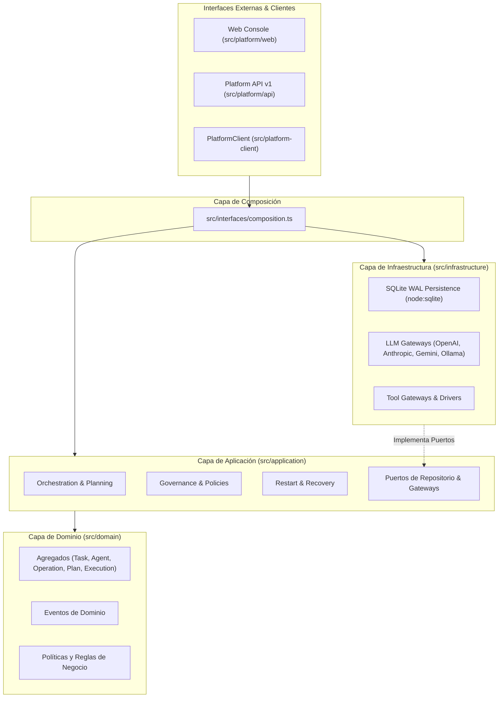

# Mapa Físico y Arquitectónico del Repositorio (Repository Map)

Este documento detalla la estructura física de directorios, la organización de capas arquitectónicas y las responsabilidades de cada módulo del repositorio central **AI Operating Platform** (`ai-operating-platform`).

---

## 1. Estructura General del Repositorio

```text
ai-operating-platform/
├── docs/                        # Documentación técnica canónica y registros arquitectónicos
│   ├── decisions/               # Registro de Decisiones Arquitectónicas (ADR 0001 - 0061)
│   ├── LIBRO_OFICIAL_...        # Libro Maestro de Especificación y Estado de la Plataforma
│   ├── PROJECT_NOMENCLATURE.md  # Nomenclatura oficial y mapa conceptual
│   ├── REPOSITORY_MAP.md        # Este documento (mapa físico y de capas)
│   ├── PERSISTENCE_ARCHITECTURE.md # Arquitectura de persistencia SQLite WAL y rehidratación
│   ├── SCRIPTS_CATALOG.md       # Catálogo de scripts operacionales y de soporte
│   ├── TEST_ARCHITECTURE.md     # Catálogo y arquitectura de la suite de pruebas
│   ├── OFFICIAL_DOCUMENTATION_INDEX.md # Índice maestro de toda la documentación
│   └── SOURCE_OF_TRUTH.md       # Política de jerarquía de verdad
├── dist/                        # Salida de compilación TypeScript (artefactos ESM generados)
├── scripts/                     # Automatizaciones de construcción, pruebas, verificación y sincronización
├── src/                         # Código fuente TypeScript del núcleo y plataforma
│   ├── application/             # Capa de Aplicación (Casos de uso, orquestación, puertos)
│   ├── domain/                  # Capa de Dominio puro (Entidades, agregados, eventos, reglas)
│   ├── infrastructure/          # Capa de Infraestructura (SQLite, Gateways LLM/Tools, IO)
│   ├── interfaces/              # Contratos de interfaz y composición de dependencias
│   ├── platform/                # Servidor HTTP, API v1, Control Center y Web Console
│   └── platform-client/         # SDK de integración para aplicaciones satélites
├── tests/                       # Suites de pruebas automatizadas (Unit, Integration, E2E)
│   ├── unit/                    # 74 suites de pruebas unitarias y de integración
│   └── fixtures/                # Datos de prueba y stubs de configuración
├── package.json                 # Manifiesto npm con scripts y dependencias mínimas
├── tsconfig.json                # Configuración del compilador TypeScript (ES2022, NodeNext)
├── README.md                    # Descripción general, badges y guía rápida
└── ROADMAP.md                   # Resumen del roadmap de versiones y capacidades
```

---

## 2. Desglose de Capas en `src/`

La plataforma implementa los principios de **Arquitectura Hexagonal (Ports & Adapters)** y **Clean Architecture**, asegurando que el núcleo de dominio no tenga dependencias directas de librerías de infraestructura, frameworks externos ni motores de base de datos.



---

### 2.1 Capa de Dominio (`src/domain/`)
Contiene los modelos de negocio puros, agregados invariantes, objetos de valor y eventos. **Cero dependencias externas.**

* `src/domain/task/`: Entidad `Task`, estados (`CREATED`, `QUEUED`, `RUNNING`, `COMPLETED`, `FAILED`, `CANCELLED`), presupuestos y validaciones de ciclo de vida.
* `src/domain/execution/`: Entidad `Execution`, seguimiento de ejecuciones atómicas vinculadas a tareas.
* `src/domain/agent/`: Entidad `Agent`, perfil de agente, alcance de memoria y configuración de herramientas.
* `src/domain/operation/`: Agregado `Operation`, control de planes autónomos y consumo de presupuestos.
* `src/domain/orchestration/`: Modelos de planes (`Plan`), pasos (`PlanStep`) y observaciones (`Observation`).
* `src/domain/organization/`: Modelo de organizaciones virtuales, equipos, roles y asignación de presupuestos.
* `src/domain/events/`: Tipos de eventos de dominio (`DomainEvent`) y definiciones canónicas.
* `src/domain/policy/`: Reglas de gobernanza de seguridad, listas blancas y validadores de políticas.
* `src/domain/memory/`: Entidades de memoria de corto y largo plazo con aislamiento por ámbito.
* `src/domain/device/`: Modelos de integración con dispositivos periféricos (e.g., impresoras empresariales).
* `src/domain/application/`: Modelos de registro de aplicaciones satélites y aislamiento multitenant.

---

### 2.2 Capa de Aplicación (`src/application/`)
Orquesta el flujo de datos entre el dominio y el mundo exterior a través de casos de uso y puertos.

* `src/application/ports/`: Interfaces TypeScript que definen los contratos para repositorios, pasarelas y servicios externos:
  * `task-repository.ts`, `execution-repository.ts`, `agent-repository.ts`, `operation-repository.ts`.
  * `event-store.ts`, `event-publisher.ts`, `model-gateway.ts`, `tool-gateway.ts`, `memory-gateway.ts`.
* `src/application/orchestration/`: `SequentialOrchestrator`, `PlanExecutionEngine`, `PlanValidator`.
* `src/application/recovery/`: `RestartRecoveryService` (recuperación de operaciones huérfanas tras reinicios).
* `src/application/organization/`: `OrganizationService`, `TeamResourceBudgetEnforcementService`.
* `src/application/governance/`: Servicios de gobernanza de flujos de trabajo, políticas y roles.
* `src/application/agent/`: Coordinadores multi-agente y gestión del ciclo de vida de agentes.
* `src/application/tools/`: Despachador seguro de invocación de herramientas y validación de esquemas.

---

### 2.3 Capa de Infraestructura (`src/infrastructure/`)
Implementaciones concretas de los puertos de aplicación.

* `src/infrastructure/persistence/sqlite/`:
  * `sqlite-database.ts`: Manejador de conexión `node:sqlite` con modo WAL y transacción atómica.
  * `sqlite-schema.ts`: Esquemas DDL v1, v2, v3 y funciones de migración transaccionales.
  * `sqlite-*-repository.ts`: Repositorios concretos para tareas, ejecuciones, agentes, operaciones, eventos, organizaciones y presupuestos.
  * `sqlite-mapper.ts`: Mapeo bidireccional entre filas relacionales y agregados de dominio con rehidratación inmutable (`Object.freeze`).
  * `sqlite-transaction-runner.ts`: Utilidad para envolver múltiples operaciones en transacciones atómicas `BEGIN IMMEDIATE`.
* `src/infrastructure/persistence/in-memory/`: Repositorios en memoria para entornos de testing y desarrollo rápido.
* `src/infrastructure/model/`: Adaptadores concretos para proveedores LLM (`openai/`, `anthropic/`, `gemini/`, `ollama/`, `stub/`).
* `src/infrastructure/tools/`: Implementación de adaptadores de herramientas (archivos, procesos shell, HTTP, impresión).
* `src/infrastructure/security/`: Generación y verificación de tokens JWT, cifrado y hash seguro.

---

### 2.4 Capa de Interfaces y Composición (`src/interfaces/`)
* `src/interfaces/composition.ts`: Contenedor canónico de inyección de dependencias (`DependencyContainer`). Ensambla la plataforma con persistencia SQLite o In-Memory según la configuración.
* `src/interfaces/http-router.ts`: Enrutador HTTP nativo con soporte de middleware, autenticación y manejo tipado de errores.

---

### 2.5 Capa de Plataforma (`src/platform/`)
* `src/platform/server.ts`: Punto de entrada del servidor de plataforma (`PlatformServer`), maneja arranque, puertos HTTP, SSE y apagado grácil (`SIGTERM`/`SIGINT`).
* `src/platform/api/`: Controladores de endpoints REST v1 (`/api/v1/tasks`, `/api/v1/agents`, `/api/v1/operations`, `/api/v1/health`, etc.).
* `src/platform/product/`: Control Center y Dashboard Runtime para telemetría y métricas operacionales.
* `src/platform/web/`: Consola de administración Web SPA (HTML5/CSS3/JavaScript vanilla, renderizado seguro sin `.innerHTML`, soporte bilingüe `es-419`/`en`).

---

### 2.6 Cliente de Plataforma (`src/platform-client/`)
* `src/platform-client/index.ts`: SDK tipado y ligero (`PlatformClient`) que permite a las aplicaciones satélites interactuar con la plataforma vía HTTP/SSE de manera limpia y tipada.
