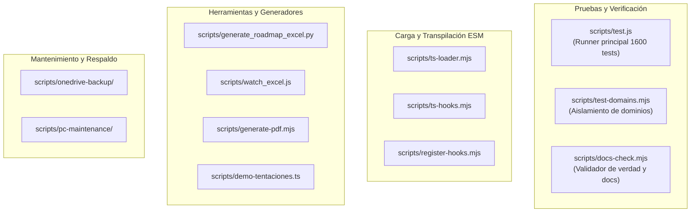

# Catálogo de Scripts y Automatizaciones (Scripts Catalog)

Este documento describe todas las utilidades, herramientas de compilación, ejecutores de pruebas y scripts de soporte disponibles en el repositorio **AI Operating Platform**.

---

## 1. Comandos Principales de `package.json`

| Comando | Comando Subyacente | Propósito y Comportamiento |
| :--- | :--- | :--- |
| `npm run build` | `tsc` | Compila todo el código TypeScript de `src/` hacia `dist/` usando la configuración de `tsconfig.json`. |
| `npm test` | `node scripts/test.js` | Ejecuta las 74 suites de pruebas (1600 tests) con transpilación TypeScript al vuelo y reporte detallado. |
| `npm run docs:check` | `node scripts/docs-check.mjs` | Valida la consistencia de versiones, conteos de tests, integridad de ADRs y hashes de documentos canónicos. |
| `npm run excel:sync` | `python scripts/generate_roadmap_excel.py` | Sincroniza y genera la hoja de cálculo de seguimiento del roadmap (`AI_Operating_Platform_Roadmap.xlsx`). |
| `npm run check` | `npm run build && npm test && npm run docs:check` | Flujo de integración continuo local completo (build + test + docs check). |
| `npm start` | `npm run build && node dist/src/platform/server.js` | Compila e inicializa el servidor nativo de la plataforma en producción. |

---

## 2. Inventario de Scripts en `scripts/`

---

### 2.1 Ejecutores y Validadores

#### `scripts/test.js`
* **Propósito:** Ejecutor de pruebas ligero que descubre automáticamente todos los archivos `*.test.ts` en `tests/`, inyecta los ganchos de carga de TypeScript (`ts-loader.mjs` / `tsx`), mide el tiempo de ejecución y valida los 1600 casos de prueba.
* **Uso:** `node scripts/test.js` o `npm test`.

#### `scripts/docs-check.mjs`
* **Propósito:** Herramienta de auditoría estricta de la política de fuente de verdad. Verifica:
  1. Consistencia de la versión `PLATFORM_VERSION` (1.4.0) en `version.ts`, `package.json`, `README.md` y `ROADMAP.md`.
  2. Existencia de los 17 documentos canónicos requeridos e igualdad de hash SHA-256 del Libro Oficial.
  3. Coincidencia exacta del número de pruebas documentadas (1600).
  4. Trazabilidad de los 61 ADRs en `docs/decisions/`.
  5. Ausencia de `.innerHTML` inseguro en `src/platform/web/app.js`.
* **Uso:** `node scripts/docs-check.mjs` o `npm run docs:check`.

#### `scripts/test-domains.mjs`
* **Propósito:** Valida que las capas de dominio no contengan dependencias circulares ni importaciones indebidas de infraestructura.
* **Uso:** `node scripts/test-domains.mjs`.

---

### 2.2 Sincronización y Documentación

#### `scripts/generate_roadmap_excel.py`
* **Propósito:** Genera el archivo Excel `AI_Operating_Platform_Roadmap.xlsx` a partir de `docs/ROADMAP_MASTER.md` aplicando estilos corporativos y formato condicional.
* **Requisitos:** Python 3 con `openpyxl`.
* **Uso:** `python scripts/generate_roadmap_excel.py` o `npm run excel:sync`.

#### `scripts/watch_excel.js`
* **Propósito:** Monitoriza modificaciones en los documentos de roadmap para re-generar automáticamente el Excel de seguimiento en tiempo real.
* **Uso:** `node scripts/watch_excel.js`.

#### `scripts/generate-pdf.mjs`
* **Propósito:** Genera versiones imprimibles o exportaciones PDF de la documentación técnica oficial y libros de arquitectura.
* **Uso:** `node scripts/generate-pdf.mjs`.

---

### 2.3 Ganchos de Carga TypeScript (Runtime Loaders)

* `scripts/ts-loader.mjs`: Loader custom ESM para resolución y transpilación transparente de módulos TypeScript en Node.js sin necesidad de paso previo de build durante pruebas.
* `scripts/ts-hooks.mjs` / `scripts/register-hooks.mjs`: Registradores de ganchos del ciclo de vida del módulo en tiempo de ejecución.

---

### 2.4 Demostraciones y Mantenimiento

* `scripts/demo-tentaciones.ts`: Script de prueba de concepto que instancia el `PlatformClient`, crea una tarea de recomendación de productos de moda e interactúa con el adaptador de Tentaciones.
* `scripts/onedrive-backup/`: Scripts PowerShell/Bash para copias de seguridad de bases de datos locales `platform.db` y artefactos.
* `scripts/pc-maintenance/`: Rutinas de limpieza de caché y optimización de entorno de desarrollo local.
