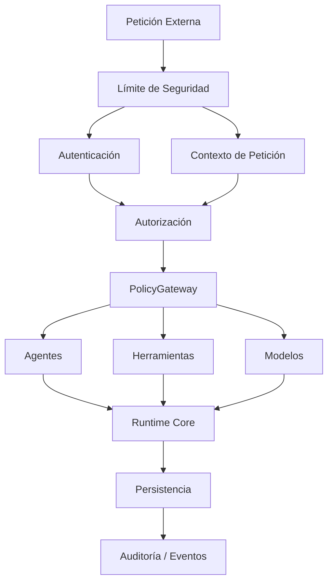

# Arquitectura de Seguridad v0.1 — AI Operating Platform

## 1. Resumen Ejecutivo y Metas de Seguridad

La AI Operating Platform gestiona cargas de trabajo autónomas y multi-agente ejecutando llamadas a modelos privilegiadas, mutaciones de datos e invocaciones de herramientas. La meta de seguridad principal es:

> **Nunca confíes en un agente, herramienta, modelo, petición o proveedor externo meramente porque exista dentro de la plataforma.**

La seguridad no es una envoltura externa o middleware superficial; es una **propiedad transversal del Motor Core**, gobernada por políticas de ejecución fail-closed, identidad explícita del principal, contextos delimitados y logs de auditoría inmutables.



---

## 2. Límites de Confianza

La plataforma establece ocho límites de confianza explícitos:

| Límite | Origen $\rightarrow$ Destino | Entidad Confiable | Entrada / Entidad No Confiable | Requisito de Validación y Autorización |
|---|---|---|---|---|
| **Límite A** | Cliente Externo $\rightarrow$ API de Plataforma | Platform API Gateway | Red externa, headers del cliente, payloads en bruto | Autenticación, limitación de tasa, validación de petición, aislamiento de tenant |
| **Límite B** | API de Plataforma $\rightarrow$ Runtime Core | Runtime del Motor Core | Parámetros del payload de API, entrada del usuario | Validación de límites de parámetros, propagación de SecurityContext |
| **Límite C** | Planner $\rightarrow$ Agentes | Planner Core | Planes generados por LLM, destinos propuestos por el agente | Validación de esquema del plan, lista blanca de agentes, validación de roles, chequeo de estado activo |
| **Límite D** | Agente $\rightarrow$ Herramienta | Dispatcher / PolicyGateway | Argumentos de herramienta generados por el agente, peticiones de ejecución | Evaluación de PolicyGateway, chequeo de permiso de herramienta, validación de esquema |
| **Límite E** | Agente $\rightarrow$ Modelo | ModelGateway | Entradas de mensajes/prompts del agente, respuestas del proveedor externo | Lista blanca de proveedores, autorización de modelo, límites de presupuesto de tokens |
| **Límite F** | Agente $\rightarrow$ Memoria | MemoryService / Policy | Peticiones de lectura/escritura del agente | Propiedad del scope (`memoryScope`), sanitización del payload delimitada |
| **Límite G** | Runtime Core $\rightarrow$ Persistencia | TransactionRunner / SQLite | Mutaciones en vuelo | Concurrencia optimista (OCC), verificación de restricciones de esquema |
| **Límite H** | Plataforma $\rightarrow$ Proveedor Externo | Model Adapters | APIs de LLM de terceros, herramientas externas | Aislamiento de secretos, sanitización de respuesta, aplicación de tiempo de espera |

---

## 3. Principal y Modelo de Identidad

Cada operación dentro de la plataforma se ejecuta bajo un `Principal` explícito:

```typescript
export type PrincipalType = "HUMAN" | "SERVICE" | "AGENT" | "TOOL" | "SYSTEM";

export interface Principal {
  readonly id: string;
  readonly type: PrincipalType;
  readonly name: string;
  readonly roles: readonly string[];
  readonly permissions: readonly string[];
  readonly tenantId?: string;
  readonly metadata: Readonly<Record<string, unknown>>;
}
```

### Tipos de Identidad:
1. **HUMAN**: Usuario final u operador interactuando vía UI o API.
2. **SERVICE**: Servicio externo o cliente de automatización en segundo plano.
3. **AGENT**: Agente autónomo o especializado ejecutándose dentro de un scope designado.
4. **TOOL**: Capacidad ejecutable interna o registrada.
5. **SYSTEM**: Runtime de la plataforma base ejecutando tareas de mantenimiento, reconciliación o arranque.

---

## 4. Autenticación vs Autorización vs Políticas

La plataforma desacopla estrictamente la verificación de identidad del chequeo de permisos y reglas contextuales:

```text
Autenticación
    ↓ "¿Quién eres?" (Verifica credenciales, emite SecurityContext)
Autorización
    ↓ "¿Qué tienes permitido hacer?" (Chequea roles y permisos)
Política
    ↓ "¿Bajo qué condiciones específicas?" (Evalúa contexto dinámico, riesgo, rol del agente, límites de origen/destino)
```

**Invariante Fundamental**: `authenticated !== authorized`. Un principal autenticado posee cero permisos implícitos.

---

## 5. Invariantes de Seguridad

La plataforma aplica 15 invariantes arquitectónicos de seguridad:

1. **Sin Acceso No Autenticado**: Ningún principal no autenticado puede acceder a operaciones protegidas de la plataforma.
2. **AuthN $\neq$ AuthZ**: La autenticación no implica autorización.
3. **Autorización Explícita**: Toda operación privilegiada requiere autorización explícita.
4. **Sin Autoescalada de Privilegios**: Los agentes no pueden elevar sus propios privilegios o modificar sus permisos.
5. **Sin Generación Arbitraria de Agentes**: Los agentes no pueden generar o coordinar agentes privilegiados arbitrariamente.
6. **Autorización de Herramientas**: Las herramientas requieren autorización explícita y coincidencia de capacidades antes de la invocación.
7. **Autorización de Modelos**: Los modelos y proveedores requieren autorización explícita.
8. **Propiedad de la Memoria**: El acceso a la memoria debe respetar la propiedad y el `memoryScope` designado.
9. **Transferencia de Contexto Explícita**: El contexto entre agentes debe ser transferido explícitamente a través de transiciones de entrega (handoffs) delimitadas.
10. **Seguridad Observable**: Todas las decisiones de seguridad (permitir y denegar) deben ser observables a través de Eventos de Dominio.
11. **Fail-Closed**: Las fallas de seguridad y errores de evaluación deben cerrarse por defecto (denegar acceso).
12. **Cero Fugas de Secretos**: Los eventos de seguridad y logs de auditoría nunca deben exponer material secreto o credenciales.
13. **Metadatos Delimitados**: Los metadatos de seguridad no deben convertirse en un canal no controlado de exfiltración de datos.
14. **Autorización Pre-Ejecución**: La autorización debe ocurrir antes de la ejecución, nunca después.
15. **Comportamiento de Agente No Confiable**: La aplicación de seguridad no debe depender de que un agente se comporte honestamente.

---

## 6. Modelos de Seguridad de Subsistemas

### 6.1 Seguridad del Agente
- Los agentes se declaran en el `AgentRegistry` con capacidades fijas y `memoryScope`.
- Los agentes no pueden registrar dinámicamente herramientas o expandir sus modelos permitidos.
- La ejecución de pasos en la coordinación multi-agente requiere la evaluación de Políticas antes de cada transición.

### 6.2 Seguridad de Herramientas y Clasificación de Riesgos
Las herramientas se clasifican por nivel de riesgo:
- **LOW**: Operaciones de solo lectura y determinísticas sin efectos secundarios (ej., calculadora, analizador de fechas).
- **MEDIUM**: Mutaciones de estado persistente dentro del almacenamiento de la plataforma (ej., escritura de memoria, actualización de estado de tareas).
- **HIGH**: Llamadas a redes externas, operaciones del sistema de archivos, ejecución de código o acciones financieras/administrativas.
- **CRITICAL**: Operaciones de sistema destructivas, modificaciones de esquema o rotación de claves que requieren aprobación humana explícita.

### 6.3 Seguridad de Modelos y Proveedores
- `ModelGateway` enruta las peticiones solo a proveedores registrados y autorizados (`openai`, `anthropic`, `ollama`).
- Los payloads están limitados a través de `BoundedDataLimits`.
- Las claves de API se inyectan mediante el entorno/adaptadores y nunca se exponen a los agentes o se almacenan en contextos de tareas.

### 6.4 Seguridad de Memoria y Contexto
- `MemoryService` aísla los registros por `memoryScope` (`agent-${id}` o `tenant-${id}`).
- La memoria es un estado retenido estrictamente, nunca un canal de comunicación entre agentes sin control.
- Las transferencias entre agentes requieren payloads explícitos, inmutables y delimitados de `AgentHandoff`.

---

## 7. Gestión y Sanitización de Secretos

La plataforma implementa la redacción automática de secretos basada en patrones en `BoundedDataLimits` (`sanitizeBoundedValue`):
- Las claves que coinciden con `/authorization|api[_-]?key|token|secret|password|cookie|credential|header|env|private[_-]?key/i` se redactan automáticamente a `"[redacted]"`.
- Los datos sensibles se sanitizan antes de ingresar a:
  - Eventos de Dominio / EventStore
  - TaskContext
  - Payloads de AgentHandoff
  - Trazas de diagnóstico
  - Mensajes de error y payloads de fallos

---

## 8. Motor de Decisión Fail-Closed

Todas las evaluaciones de seguridad siguen reglas determinísticas fail-closed:
```text
Petición / Payload Ausente       ──► DENEGAR (SECURITY_INVALID_REQUEST)
SecurityContext Ausente          ──► DENEGAR (SECURITY_CONTEXT_MISSING)
Principal No Autenticado         ──► DENEGAR (SECURITY_UNAUTHENTICATED)
Permiso Requerido Ausente        ──► DENEGAR (SECURITY_PERMISSION_DENIED)
Cadena de Permiso Inválida       ──► DENEGAR (SECURITY_PERMISSION_UNKNOWN)
Violación de Scope Cruzado       ──► DENEGAR (SECURITY_CROSS_AGENT_VIOLATION)
Excepción / Error de Evaluador   ──► DENEGAR (POLICY_EVALUATION_FAILED)
```

---

## 9. Estado de Implementación y Roadmap

| Capacidad | Estado |
|---|---|
| Contratos y Tipos de Seguridad de Dominio (`Principal`, `SecurityContext`, `TrustBoundary`) | **IMPLEMENTADO** |
| 15 Invariantes de Seguridad Formalizadas | **IMPLEMENTADO** |
| Motor de Autorización Fail-Closed (`evaluateFailClosedAuthorization`) | **IMPLEMENTADO** |
| Punto de Decisión Centralizado de PolicyGateway | **IMPLEMENTADO** |
| Sanitización de Secretos y Contextos Delimitados | **IMPLEMENTADO** |
| Servicio de Identidad y Autenticación (API Key, Scaffolding Bearer JWT) | **IMPLEMENTADO** |
| Control de Acceso Basado en Roles (RBAC) de Grano Fino y Evaluador de Autorización | **IMPLEMENTADO** |
| Límites de Seguridad de Subsistemas (Agente / Herramienta / Modelo / Memoria / Delegación) | **IMPLEMENTADO** |
| Verificación de Controles de Seguridad y Mitigación de Amenazas | **IMPLEMENTADO** |
| Proxy Firewall de Salida de Red en Hardware y Atestación TEE/TPM | **INFRAESTRUCTURA FUTURA** |

## 10. Límite de Seguridad de la API de Plataforma y Producción (Fase 14)

La superficie HTTP `/api/v1` establece el límite listo para producción entre las aplicaciones externas (ej. el adaptador de la plataforma Tentaciones, frontends web, scripts de integración) y el Core de la AI Operating Platform.

```text
Petición HTTP (Headers: Authorization / X-API-Key / Idempotency-Key)
    │
    ▼
[Límite A: Capa HTTP]
  1. Validación de Método, URL, Path-Traversal y Content-Type
  2. AuthenticationService: Resuelve el Principal verificado (API Key / Bearer)
  3. Construcción de SecurityContext: Limita Principal, Roles y Tenant
    │
    ▼
[Middleware de Autorización RBAC]
  4. Evalúa la acción requerida (public.read, agent.read, task.create, task.read, task.cancel)
  5. Deniega por fail-closed roles faltantes o insuficientes
    │
    ▼
[Límite B: Ejecución de Plataforma Core]
  6. Vinculación Automática de Identidad: Identidad del llamador y tenant derivados estrictamente del SecurityContext
  7. Aislamiento de Tenant: Filtrado multi-tenant en consultas y mutaciones de Tareas
  8. Salida Sanitizada: Proyecciones de plataforma ocultan instrucciones internas y credenciales
```

### Garantías Clave de Producción:
- **Aislamiento de Tenant**: Tareas y eventos no pueden ser accedidos a través de los límites del tenant; consultas no autenticadas o de tenant foráneo devuelven respuestas seguras `404 Not Found` para prevenir la enumeración de IDs.
- **Integridad de Identidad**: `callerId` y `tenantId` en los payloads de las tareas son sellados directamente por el servidor a partir del contexto de seguridad verificado; el spoofing del cliente en el JSON del payload se ignora.
- **Protección Fail-Closed**: Claves/tokens de API inactivos, expirados, revocados o malformados se rechazan con respuestas estándar `401 Unauthorized` / `403 Forbidden`.
