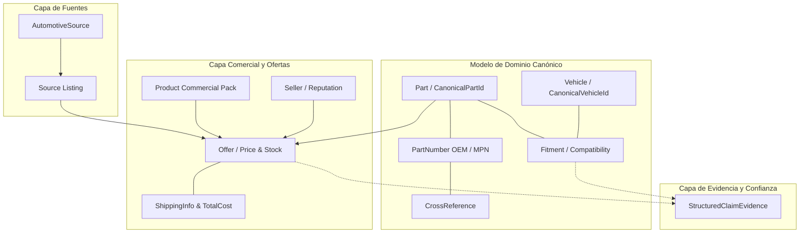

# Canonical Domain Model — Spare Parts Search & Comparison
## PROJ-02-SPAREPARTS Specification

```text
================================================================================
AI OPERATING PLATFORM — PROJ-02 DOMAIN SPECIFICATION
================================================================================
Módulo:         PROJ-02-SPAREPARTS (Spare Parts Search & Comparison)
Iniciativa:     AOP-SPAREPARTS-SEARCH (Fase 143)
Responsabilidad:Modelo de dominio canónico para repuestos, compatibilidad y ofertas
Estado:         DONE (Verificado con 19 tests unitarios dedicados, 1688 total)
Alineación:     Application Integration Guide (docs/APPLICATION_INTEGRATION_GUIDE.md)
                Agent Operating Protocol (docs/AGENT_OPERATING_PROTOCOL.md)
================================================================================
```

---

## 1. Visión General y Separación de Fronteras

El dominio de **Spare Parts Search & Comparison** establece un lenguaje ubicuo estricto para catalogar, normalizar, cruzar y comparar repuestos automotrices entre múltiples tiendas sin acoplarse a formatos propietarios ni colapsar dimensiones ontológicamente distintas.



### Invariantes de Separación Ontológica:
1. $\text{Part Identity} \neq \text{Product Packaging} \neq \text{Offer} \neq \text{Listing} \neq \text{Seller}$.
2. $\text{Source Reliability (Trust Rating)} \neq \text{Fitment Confidence} \neq \text{Seller Reputation} \neq \text{Product Rating}$.
3. $\text{Base Price} + \text{Shipping} + \text{Taxes} = \text{Total Cost}$ (los componentes nunca se sobreescriben ni se descarta su trazabilidad individual).
4. $\text{Fitment Status} \in \{\text{EXACT, COMPATIBLE, POTENTIAL, INCOMPATIBLE, CONFLICT, UNKNOWN}\}$. Una inferencia de IA nunca se disfraza de evidencia OEM.

---

## 2. Bounded Contexts y Entidades de Dominio

### 2.1 Vehicle Domain (`src/domain/spareparts/vehicle.ts`)
- **`VehicleSpecification`**: Representa marca, modelo, año, generación, motor, código de motor, transmisión, tipo de tracción y mercado geográfico.
- **`VehicleProfile`**: Agregado canónico con identificadores únicos (`CANONICAL`, `VIN`, `OEM_CODE`, `CATALOG_ID`, `KBA`).
- **Normalización**: `normalizeVehicleMake()` y `normalizeVehicleModel()` procesan variaciones textuales y alias (ej. *"TOYOTA MOTOR CORP"* $\rightarrow$ *"Toyota"*, *"COROLLA SEDAN (E170)"* $\rightarrow$ *"Corolla"*).
- **Identificador Canónico**: Formato determinista `veh:<make>:<model>:<year>[:<generation>][:<engine>][:<market>]` (ej. `veh:toyota:corolla:2018:e170:1.8:cl`).

### 2.2 Part Number Domain (`src/domain/spareparts/part-number.ts`)
- **`PartNumberType`**: `OEM`, `MPN`, `SKU`, `EAN`, `GTIN`, `UPC`, `CATALOG_NUMBER`, `MANUFACTURER_PART_NUMBER`, `EXTERNAL_PART_NUMBER`, `UNKNOWN`.
- **`PartNumber`**: Preserva `rawValue` original y calcula `normalizedValue` libre de guiones, espacios, barras y prefijos de marcas (`normalizePartNumber()`).
- **Equivalencia Determinista**: `arePartNumbersEquivalent()` evalúa igualdad estructural entre códigos.

### 2.3 Part Domain (`src/domain/spareparts/part.ts`)
- **`Part`**: Agregado que representa la pieza técnica independiente de la tienda.
- **`PartCategory`**: Taxonomía jerárquica (`ENGINE`, `BRAKING`, `SUSPENSION`, `STEERING`, `TRANSMISSION`, `ELECTRICAL`, `COOLING`, `FUEL`, `EXHAUST`, `BODY`, `INTERIOR`, `LIGHTING`, `FILTERS`, `LUBRICANTS`, `MAINTENANCE`, `ACCESSORIES`, `WHEELS`, `TIRES`, `OTHER`).
- **`Condition`**: `NEW`, `USED`, `REFURBISHED`, `REMANUFACTURED`, `UNKNOWN`.
- **`Position`**: `FRONT`, `REAR`, `LEFT`, `RIGHT`, `FRONT_LEFT`, `FRONT_RIGHT`, `REAR_LEFT`, `REAR_RIGHT`, `CENTER`, `UPPER`, `LOWER`, `INTERNAL`, `EXTERNAL`, `NOT_APPLICABLE`, `UNKNOWN`.
- **Separación Fabricante vs Marca**: `Manufacturer` (fabricante industrial, e.g. *Robert Bosch GmbH*) vs `Brand` (marca comercial, e.g. *Bosch*).
- **Identificador Canónico**: `part:<brand>:<normalized-part-number>` (ej. `part:bosch:0446502220`).

### 2.4 Cross-Reference Domain (`src/domain/spareparts/cross-reference.ts`)
- **`CrossReference`**: Vínculo entre números de pieza con tipo de relación explícito:
  - `EXACT`, `EQUIVALENT`, `REPLACEMENT`, `SUPERSEDES`, `CROSS_REFERENCE`, `COMPATIBLE`, `POTENTIAL_MATCH`, `UNKNOWN`.
- Dirección de equivalencia (`BIDIRECTIONAL`, `DIRECT`, `REVERSE`) y puntaje de confianza numérico $\in [0.0, 1.0]$.

### 2.5 Fitment Domain (`src/domain/spareparts/fitment.ts`)
- **`Fitment`**: Relación entre `Part` y `VehicleProfile`.
- **`FitmentRule`**: Regla paramétrica de compatibilidad (rango de años `yearFrom`-`yearTo`, códigos de motor, tracción).
- **`FitmentEvidenceProvenance`**: `OEM_CATALOG`, `MANUFACTURER_SPEC`, `DISTRIBUTOR_MATRIX`, `RETAILER_LISTING`, `MARKETPLACE_CLAIM`, `AGENT_INFERENCE`, `USER_REPORT`.
- **Modelo de Conflicto (`CONFLICT`)**: Cuando dos fuentes fidedignas entregan afirmaciones contradictorias, el sistema no vota por mayoría; preserva ambas afirmaciones en `evidenceClaims` y `conflictingEvidence`, marcando el estado como `CONFLICT`.

### 2.6 Commerce & Offer Domain (`src/domain/spareparts/product-offer.ts`)
- **`Product`**: Presentación comercial del repuesto (ej. caja de 4 pastillas, bidón de 1L).
- **`Listing`**: Registro crudo extraído de la fuente externa con URL y título original.
- **`Seller` & `SellerReputation`**: Identidad del vendedor, ubicación, tasa de reseñas positivas y volumen.
- **`ProductRating`**: Calificación del producto por parte de usuarios finales (desacoplada de la reputación del vendedor).
- **`Price` & `TotalCost`**: Monto, moneda, tipo (`LIST_PRICE`, `SALE_PRICE`, etc.), desglose de impuestos y fletes estimados.
- **`Availability`**: Estado de inventario (`IN_STOCK`, `LOW_STOCK`, `OUT_OF_STOCK`, `PREORDER`, `AVAILABLE_ON_REQUEST`, `UNKNOWN`) y tiempo de entrega.
- **`Offer`**: Oferta normalizada y comparable que reúne la pieza, producto, vendedor, precio y disponibilidad.
- **Identificador Canónico**: `off:<sourceId>:<sourceListingId>[:<sellerId>]`.

### 2.7 Search Query Domain (`src/domain/spareparts/search-query.ts`)
- **`SparePartsSearchQuery`**: Contrato tipado para consultas de búsqueda que acepta entradas estructuradas o términos en lenguaje natural en español.
- **`NormalizedSearchInput`**: Normalización previa de marcas, modelos y números de pieza para el enrutamiento a agentes de búsqueda.
- **`SearchCriteria`**: Filtros obligatorios, preferidos y sugerencias de ranking (priorizar stock local, precio más bajo, reputación mínima).

---

## 3. Matriz de Invariantes y Reglas de Integridad

| Entidad | Invariante Obligatorio | Manejo de Violación |
| :--- | :--- | :--- |
| **`PartNumber`** | Valor no vacío, normalización alfanumérica y confianza $\in [0, 1]$. | `PartNumberValidationError` fail-closed |
| **`VehicleProfile`** | Marca y modelo obligatorios, año $1900 \le \text{year} \le 2100$. | `VehicleValidationError` fail-closed |
| **`Part`** | Nombre obligatorio, categoría válida dentro de taxonomía, marca no vacía. | `PartValidationError` fail-closed |
| **`Fitment`** | Requiere referencias a pieza y vehículo válidos, procedencia obligatoria. | `FitmentValidationError` fail-closed |
| **`Price`** | Monto $\ge 0$, moneda ISO/estándar no vacía, tipo de precio válido. | `CommerceValidationError` fail-closed |
| **`Seller`** | Calificación $0 \le \text{rating} \le \text{maxRating}$, conteo de reseñas $\ge 0$. | `CommerceValidationError` fail-closed |
| **`Offer`** | Requiere pieza, fuente, vendedor, listing, precio y disponibilidad. | `CommerceValidationError` fail-closed |

---

## 4. Trazabilidad de Pruebas Automatizadas

El modelo de dominio canónico está respaldado por la suite [`tests/unit/spareparts-domain-model.test.ts`](../tests/unit/spareparts-domain-model.test.ts) que cubre 19 pruebas de integración y bordes de dominio:

```text
✔ Vehicle Domain: normalización de marcas y modelos
✔ Vehicle Domain: generación determinista de canonicalVehicleId
✔ Vehicle Domain: validación de años y obligatoriedad de campos
✔ Part Number Domain: normalización con descarte de puntuación y prefijos
✔ Part Number Domain: equivalencia entre variantes de formateo
✔ Part Domain: agregados con separación estricta de Manufacturer vs Brand
✔ Part Domain: validación de categorías y condiciones
✔ Cross-Reference Domain: creación de enlaces cruzados OEM/Aftermarket
✔ Fitment Domain: evaluación determinista de reglas paramétricas
✔ Fitment Domain: separación de FitmentStatus y FitmentConfidence
✔ Fitment Domain: soporte y preservación de estado CONFLICT
✔ Commerce Domain: validación de precios no negativos y monedas
✔ Commerce Domain: separación de SellerReputation y ProductRating
✔ Commerce Domain: agregados Offer con trazabilidad completa
✔ Search Query Domain: normalización y extracción de términos en lenguaje natural
```
