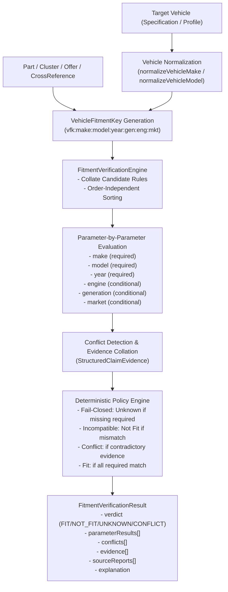

# Especificación Técnica: Motor Determinista de Verificación de Compatibilidad (Deterministic Fitment Verification Engine)

> **Documento Técnico Oficial — AI Operating Platform**  
> **Área:** Applications / PROJ-02-SPAREPARTS (Spare Parts Search & Comparison)  
> **Fase:** 146 — Deterministic Fitment Verification Engine  
> **Estado:** VIGENTE / CERTIFICADO  
> **Última Actualización:** 2026-09-24  

---

## 1. Misión y Propósito

El **Motor Determinista de Verificación de Compatibilidad** (*Fitment Verification Engine*) de `PROJ-02-SPAREPARTS` resuelve el problema más crítico en el comercio automotriz: determinar de forma inequívoca, paramétrica y auditable si una pieza de repuesto es compatible con un vehículo específico.

### Principio Rector
> **Verificación explicable y fail-closed:**  
> Ninguna decisión de compatibilidad se delega a modelos de lenguaje (LLM), similitud textual ni heurísticas estocásticas. Toda compatibilidad exige correspondencia parámetro por parámetro contra reglas estructuradas y evidencia documental. La ausencia de datos obligatorios jamás produce `FIT` (deriva en `UNKNOWN`), y cualquier contradicción entre fuentes confiables se aísla de inmediato como `CONFLICT`.

---

## 2. Taxonomía de Veredictos y Estados de Parámetros

### 2.1. Veredictos Finales (`FitmentVerdict`)
- **`FIT`**: Todos los parámetros requeridos del vehículo concuerdan con al menos una regla de compatibilidad válida y no existen contradicciones documentales.
- **`NOT_FIT`**: Al menos un parámetro obligatorio contradice explícitamente las reglas de compatibilidad de la pieza (e.g. año fuera de rango, motor incompatible, carrocería distinta).
- **`UNKNOWN`**: Faltan datos críticos para asegurar compatibilidad de forma confiable (e.g. el vehículo no especifica variante de motor y la pieza restringe a una motorización específica). Comportamiento *fail-closed*.
- **`CONFLICT`**: Existen afirmaciones contradictorias entre fuentes confiables o evidencias incompatibles que no pueden resolverse determinísticamente sin arbitraje humano o catálogo OEM adicional.

### 2.2. Estado por Parámetro (`FitmentParameterStatus`)
- **`MATCH`**: El valor del parámetro del vehículo cumple la condición de la regla.
- **`MISMATCH`**: El valor del parámetro contradice la regla.
- **`UNKNOWN`**: El valor no fue provisto en el vehículo o la regla no define el parámetro.
- **`NOT_APPLICABLE`**: El parámetro no aplica para la categoría de la pieza o tipo de vehículo.

---

## 3. Pipeline de Verificación Paramétrica



---

## 4. Identidad de Compatibilidad: `VehicleFitmentKey`

Para evitar colisiones entre variantes del mismo modelo, la identidad de compatibilidad utiliza la clave canónica:

```text
vfk:<normalized-make>:<normalized-model>:<year>[:<generation>][:<engine>][:<market>]
```

Ejemplos:
- `vfk:toyota:corolla:2018:e170:1.8l:cl`
- `vfk:toyota:corolla:2022:e210:2.0l:us`

Esto asegura que un Toyota Corolla 2019 de generación E170 jamás colisione con un Corolla 2019 de generación E210 (año de transición).

---

## 5. Invariantes de Calidad Enterprise

1. **Determinismo:** Permutaciones en el orden de las reglas de entrada, fuentes o evidencias producen exactamente el mismo resultado y la misma explicación.
2. **Idempotencia:** Evaluaciones repetidas de la misma tupla generan resultados idénticos sin duplicar registros de evidencia ni conflictos.
3. **Preservación Ininterrumpida de Evidencia:** Todo claim documental (`StructuredClaimEvidence`) proveniente de catálogos OEM, distribuidores o marketplaces se conserva íntegro en `FitmentVerificationResult.evidence`.
4. **Protección Fail-Closed:**
   - La falta de reglas para una pieza resulta en `UNKNOWN`.
   - La falta de motor en el vehículo ante una pieza con restricción de motor resulta en `UNKNOWN`.
   - Dos fuentes con afirmaciones opuestas resultan en `CONFLICT`.
5. **No inferencia por similitud:** Títulos similares, descripciones comerciales o coincidencias léxicas jamás son utilizadas para deducir compatibilidad.

---

## 6. Cobertura de Pruebas Automatizadas

La suite `tests/unit/fitment-verification-engine.test.ts` certifica los 12 escenarios requeridos:

| # | Escenario Evaluado | Veredicto Esperado | Resultado |
| :-: | :--- | :-: | :-: |
| 1 | Todos los parámetros obligatorios coinciden con las reglas OEM | `FIT` | `PASS` |
| 2 | Restricción obligatoria contradicha (año fuera de rango) | `NOT_FIT` | `PASS` |
| 3 | Parámetro crítico ausente en vehículo ante pieza específica (fail-closed) | `UNKNOWN` | `PASS` |
| 4 | Afirmaciones contradictorias entre fuentes confiables | `CONFLICT` | `PASS` |
| 5 | Diferenciación de motor en mismo modelo y año (1.8L vs 2.0L) | `FIT` / `NOT_FIT` | `PASS` |
| 6 | Diferenciación de generación en año de transición (E170 vs E210) | `FIT` / `NOT_FIT` | `PASS` |
| 7 | Restricción regional de mercado (Chile / LATAM vs US) | `FIT` / `NOT_FIT` | `PASS` |
| 8 | Verificación compatible sobre pieza Aftermarket con cross-reference | `FIT` | `PASS` |
| 9 | Preservación íntegra de claims de evidencia estructurada | N/A | `PASS` |
| 10 | Independencia del orden de entrada de reglas | Idéntico | `PASS` |
| 11 | Idempotencia operacional | Idéntico | `PASS` |
| 12 | Protección contra falsos positivos ante ausencia total de reglas | `UNKNOWN` | `PASS` |

---

## 7. Trazabilidad con la Plataforma Principal

- **Iniciativa:** `AOP-SPAREPARTS-SEARCH`
- **Fase del Plan Maestro:** Fase 146 (`docs/MASTER_WORK_PLAN.md`)
- **Dependencia Satisfecha:** Fase 145 (*Normalization, Deduplication & Cross-Reference Engine*)
