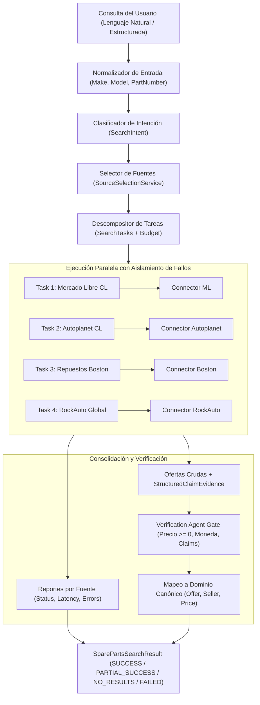

# Multi-Source Automotive Search & Specialized Agent Routing
## PROJ-02-SPAREPARTS Specification

```text
================================================================================
AI OPERATING PLATFORM — PROJ-02 MULTI-SOURCE SEARCH SPECIFICATION
================================================================================
Módulo:         PROJ-02-SPAREPARTS (Spare Parts Search & Comparison)
Iniciativa:     AOP-SPAREPARTS-SEARCH (Fase 144)
Responsabilidad:Motor de búsqueda multi-fuente paralelo, selección y aislamiento de fallos
Estado:         DONE (Verificado con 10 tests dedicados, 1698 tests totales PASS)
Alineación:     Application Integration Guide (docs/APPLICATION_INTEGRATION_GUIDE.md)
                Agent Operating Protocol (docs/AGENT_OPERATING_PROTOCOL.md)
================================================================================
```

---

## 1. Visión General del Pipeline de Búsqueda

El motor de **Búsqueda Multi-Fuente Automotriz** orquesta la adquisición paralela y observable de ofertas de repuestos distribuidas en múltiples fuentes comerciales y catálogos técnicos.



---

## 2. Clasificación de Intenciones y Descomposición (`SearchIntent`)

El sistema analiza determinísticamente la consulta para identificar la intención primaria y secundarias:

| Intención | Condición de Activación | Acciones y Capacidades Clave |
| :--- | :--- | :--- |
| **`OEM_LOOKUP`** | Número OEM detectado o prefijo *"OEM"* | `searchByOemNumber`, búsqueda de diagramas de despiece |
| **`PART_NUMBER_LOOKUP`** | Número de parte o MPN identificado | `searchByPartNumber`, normalización de código |
| **`VEHICLE_FITMENT_SEARCH`** | Marca, modelo o año del vehículo provistos | `searchByVehicle`, validación de matriz de compatibilidad |
| **`PRICE_DISCOVERY`** | Términos de cotización, rango de precios o precios baratos | `getPrice`, obtención de desglose de costos |
| **`ALTERNATIVE_PART_SEARCH`** | Solicitud de alternativas o equivalencias | `getCrossReferences`, búsqueda aftermarket |

---

## 3. Selección y Exclusión de Fuentes (`SourceSelectionService`)

La selección de fuentes no es aleatoria ni envía la consulta a ciegas a todas las fuentes del catálogo. Cada selección o exclusión queda formalmente explicada:

### Criterios de Selección:
1. **Región Geográfica**: Fuentes que cubren explícitamente el mercado objetivo (ej. Chile `CL`) o tienen cobertura `GLOBAL`.
2. **Cobertura de Marca**: Fuentes que atienden la marca del vehículo (ej. *Toyota, Chevrolet, Hyundai*) o catálogo `ALL`.
3. **Capacidades Técnicas**: Disponibilidad de búsqueda por número de parte, compatibilidad o precios en vivo.
4. **Puntaje de Confianza**: Fiabilidad de la fuente ($\ge 0.60$ por defecto).

### Razones de Exclusión Trazables:
- `WRONG_REGION`: La fuente no tiene despacho ni catálogo para la región de la consulta.
- `NO_RELEVANT_COVERAGE`: La fuente no atiende la marca o categoría solicitada.
- `NOT_SUPPORTED_CAPABILITY`: La fuente carece de capacidades críticas (ej. catálogo puro sin precios).
- `DISABLED` / `SOURCE_UNAVAILABLE`: Fuente administrativamente inhabilitada o caída.
- `POLICY_RESTRICTED`: Restricciones legales o técnicas en la política de acceso.

---

## 4. Aislamiento de Fallos y Ejecución Paralela

El sistema ejecuta las consultas en paralelo utilizando `Promise.all` y `Promise.race` con temporizadores individuales (`timeoutMs`):

$$\text{Fallo de 1 Fuente} \centernot\implies \text{Fallo Global de la Consulta}$$

### Estados de Ejecución Global:
- **`SUCCESS`**: Todas las fuentes consultadas respondieron exitosamente con ofertas.
- **`PARTIAL_SUCCESS`**: Una o más fuentes fallaron (ej. `TIMEOUT`, `RATE_LIMITED`, `BLOCKED`), pero al menos una fuente completó su búsqueda y aportó ofertas válidas.
- **`NO_RESULTS`**: Todas las fuentes respondieron exitosamente pero no existen ofertas para los términos.
- **`FAILED`**: Todas las fuentes fallaron o se agotó el presupuesto global.

---

## 5. Captura de Evidencia y Agente de Verificación

1. **Structured Claim Evidence**: Cada conector emite afirmaciones trazables con URL de origen, dominio, fecha/hora, declaración textual y grado de certeza numérico.
2. **Verification Agent Gate**:
   - Descarta ofertas con precios negativos o sin moneda declarada.
   - Valida que las fuentes externas respeten el contrato canónico sin inyectar campos arbitrarios.
   - Asocia la reputación del vendedor y la identidad de la tienda sin colapsar dimensiones.

---

## 6. Presupuesto y Gobernanza de Consulta (`SearchBudget`)

El sistema impone límites estrictos para evitar explosiones combinatorias o sobrecargas en fuentes externas:

```typescript
export interface SearchBudget {
  readonly maxSources: number;      // 6 fuentes concurrentes max
  readonly maxRequests: number;     // 12 requests max por búsqueda
  readonly maxAgentSteps: number;    // 8 pasos de orquestación max
  readonly maxHandoffs: number;      // 4 transferencias de contexto max
  readonly maxDurationMs: number;    // 10,000 ms límite global
}
```

---

## 7. Pruebas Automatizadas

La capacidad de búsqueda multi-fuente se encuentra respaldada por la suite [`tests/unit/multi-source-search-orchestrator.test.ts`](../tests/unit/multi-source-search-orchestrator.test.ts):
- Clasificación de intenciones y descomposición en tareas priorizadas.
- Selección multicriterio y trazabilidad de razones de exclusión.
- Búsqueda paralela exitosa con ofertas y evidencias canónicas.
- Aislamiento de fallos y resolución de estado `PARTIAL_SUCCESS`.
- Manejo determinista de `NO_RESULTS` y `FAILED`.
- Aplicación de límites de presupuesto y timeouts.
