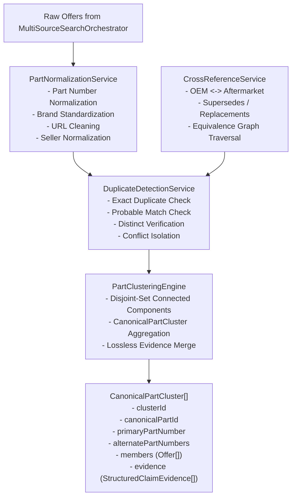

# Especificación Técnica: Normalización, Deduplicación y Cross-Reference Engine

> **Documento Técnico Oficial — AI Operating Platform**  
> **Área:** Applications / PROJ-02-SPAREPARTS (Spare Parts Search & Comparison)  
> **Fase:** 145 — Normalization, Deduplication & Cross-Reference Engine  
> **Estado:** VIGENTE / CERTIFICADO  
> **Última Actualización:** 2026-09-24  

---

## 1. Misión y Propósito

El motor de **Normalización, Deduplicación y Cross-Reference** de `PROJ-02-SPAREPARTS` resuelve el problema crítico de inconsistencia, fragmentación de catálogos y duplicidad de ofertas que surge al agregar datos de repuestos automotrices desde múltiples fuentes independientes (marketplaces, desarmadurías, distribuidores mayoristas, catálogos OEM).

Este subsistema opera bajo una premisa fundamental:
> **Decisiones deterministas, explicables y seguras frente a falsos positivos:**  
> Ninguna decisión de equivalencia o fusión de entidades se delega a modelos heurísticos o estocásticos de lenguaje (LLM). Toda unificación exige correspondencia exacta de identificadores normalizados o enlaces explícitos y verificados de referencia cruzada (OEM <-> Aftermarket) con evidencia estructurada.

---

## 2. Principios de Diseño Arquitectónico

1. **Conservación de Datos Crudos (Lossless Raw Attributes):**  
   Todo número de pieza, título de publicación, precio y URL preserva su forma original cruda (`rawValue`, `rawTitle`, `rawPrice`, `sourceListingId`) junto con su forma canónica normalizada.
2. **Política Conservadora de Fusión (Fail-Closed Deduplication):**  
   Ante la menor ambigüedad o falta de prueba documental, dos ofertas se mantienen separadas como entidades distintas (`DISTINCT`) o no resueltas (`UNRESOLVED`), evitando uniones erróneas que inducirían a comprar repuestos incompatibles.
3. **Independencia del Orden (Order Independence):**  
   El orden en que las ofertas ingresan al motor no afecta los clusters resultantes. Los arreglos se ordenan deterministamente por identificadores canónicos antes de procesar el grafo de componentes conexos.
4. **Idempotencia (Idempotent Execution):**  
   Reagrupar las ofertas de un cluster ya existente genera exactamente el mismo grafo y los mismos identificadores de cluster.
5. **Preservación Ininterrumpida de Evidencia (StructuredClaimEvidence):**  
   Las afirmaciones de compatibilidad, procedencia y confianza se agregan acumulativamente en los clusters sin pérdida de trazabilidad.

---

## 3. Componentes del Subsistema

### 3.1. `PartNormalizationService`
Ubicación: `src/application/spareparts/part-normalization-service.ts`

- **Normalización de Números de Pieza:** Remueve guiones, espacios, puntos, barras y prefijos de marcas reconocidas (`normalizePartNumber`), transformando por ejemplo `"04465-02220"` en `"0446502220"`, reteniendo el texto original intacto en `rawValue`.
- **Estandarización de Marcas:** Asocia nombres comerciales y acrónimos a marcas oficiales canónicas con su respectivo nivel de mercado (`OEM_GENUINE`, `PREMIUM_AFTERMARKET`, `STANDARD_AFTERMARKET`), e.g., `"vw"` -> `"Volkswagen"` (`OEM_GENUINE`), `"mann"` -> `"Mann-Filter"` (`PREMIUM_AFTERMARKET`).
- **Limpieza de URLs:** Elimina parámetros de tracking y marketing (`utm_*`, `gclid`, `fbclid`, `ref`) sin alterar el path del recurso.
- **Normalización de Proveedores:** Remueve sufijos legales o de marketplace (`SpA`, `S.A.`, `Ltda`, `Oficial`, `Store`) para estabilizar identidades de vendedores.

### 3.2. `DuplicateDetectionService`
Ubicación: `src/application/spareparts/duplicate-detection-service.ts`

Evalúa dos ofertas `Offer` y emite una clasificación determinista:
- **`EXACT_DUPLICATE`:** Mismo `canonicalOfferId`, misma publicación de origen en la misma fuente, o mismo `canonicalPartId` con marca y número de pieza equivalentes.
- **`PROBABLE_MATCH`:** Relación de referencia cruzada con confianza moderada (`POTENTIAL_MATCH` o `COMPATIBLE`) que amerita advertencia o confirmación adicional.
- **`DISTINCT`:** Números de pieza confirmados como diferentes, o cadenas idénticas que pertenecen a fabricantes incompatibles (e.g. Bosch 12345 vs Denso 12345).
- **`CONFLICT` / `UNRESOLVED`:** Señales contradictorias o información insuficiente para emitir juicio.

### 3.3. `CrossReferenceService`
Ubicación: `src/application/spareparts/cross-reference-service.ts`

- Administra el grafo de equivalencias y reemplazos entre códigos OEM y números de pieza de fabricantes aftermarket (`BOSCH`, `BREMBO`, `VALEO`, `MANN-FILTER`).
- Provee resolución de componentes conexos (`resolveEquivalentPartNumbers`) transitando relaciones de alta confianza (`EXACT`, `EQUIVALENT`, `SUPERSEDES`).

### 3.4. `PartClusteringEngine`
Ubicación: `src/application/spareparts/part-clustering-engine.ts`

- Orquesta el agrupamiento determinista de un conjunto arbitrario de ofertas mediante el algoritmo Disjoint-Set (Union-Find) con resolución de raíces deterministas por índice.
- Produce agregados inmutables `CanonicalPartCluster` que contienen:
  - `clusterId`: Identificador único determinista `cluster:<canonicalPartId>`.
  - `primaryPartNumber`: Número de pieza principal representativo.
  - `alternatePartNumbers`: Lista consolidada de códigos alternativos o aftermarket asociados.
  - `members`: Lista de ofertas comerciales agrupadas en el cluster.
  - `crossReferences`: Referencias cruzadas validadas que fundamentaron la unión.
  - `evidence`: Evidencias estructuradas consolidadas de todas las ofertas miembro.

---

## 4. Clasificación y Casos de Prueba Verificados

La suite de pruebas automatizadas en `tests/unit/normalization-deduplication-crossref.test.ts` certifica los 11 escenarios clave:

1. **Detección de Duplicados Exactos:** Idéntico número de pieza normalizado y marca compatible entre dos fuentes distintas (`autoplanet_cl` y `mercadolibre_cl`).
2. **Variaciones de Formato en OEM:** Normalización uniforme de `"90915-YZZD1"`, `"90915YZZD1"` y `" 90915 YZZD1 "` preservando sus valores originales crudos.
3. **Probable Match:** Relaciones no confirmadas o comunitarias (`POTENTIAL_MATCH`) clasificadas con confianza reducida sin fusión forzada.
4. **Piezas Distintas:** Números de pieza diferentes verificados se mantienen separados (`DISTINCT`).
5. **Resolución de Referencias Cruzadas OEM <-> Aftermarket:** Correspondencia probada entre OEM Toyota `04465-02220` y equivalentes Brembo `P83082` y Bosch `0986494657`.
6. **Representación de Conflictos:** Bloqueo de colisiones cuando el mismo número de catálogo existe en fabricantes completamente distintos.
7. **Preservación Ininterrumpida de Evidencia:** Todas las instancias de `StructuredClaimEvidence` de las fuentes se conservan íntegras en el cluster.
8. **Independencia del Orden:** Permutaciones aleatorias del arreglo de ofertas producen exactamente el mismo grafo y los mismos clusters.
9. **Idempotencia:** Re-agrupar los miembros de clusters existentes genera resultados idénticos.
10. **Protección Contra Falsos Positivos:** Ofertas con títulos similares o mismo vehículo pero números de pieza incompatibles jamás se fusionan.
11. **Casos Borde de Normalización:** Limpieza de parámetros de URLs, normalización de marcas y remoción de sufijos en nombres de vendedores.

---

## 5. Trazabilidad con la Plataforma Principal

- **Iniciativa:** `AOP-SPAREPARTS-SEARCH`
- **Fase del Plan Maestro:** Fase 145 (`docs/MASTER_WORK_PLAN.md`)
- **Regla de Oro de Integración:** Cero mutación destructiva de datos y fail-closed frente a incertidumbre en compatibilidad automotriz.
