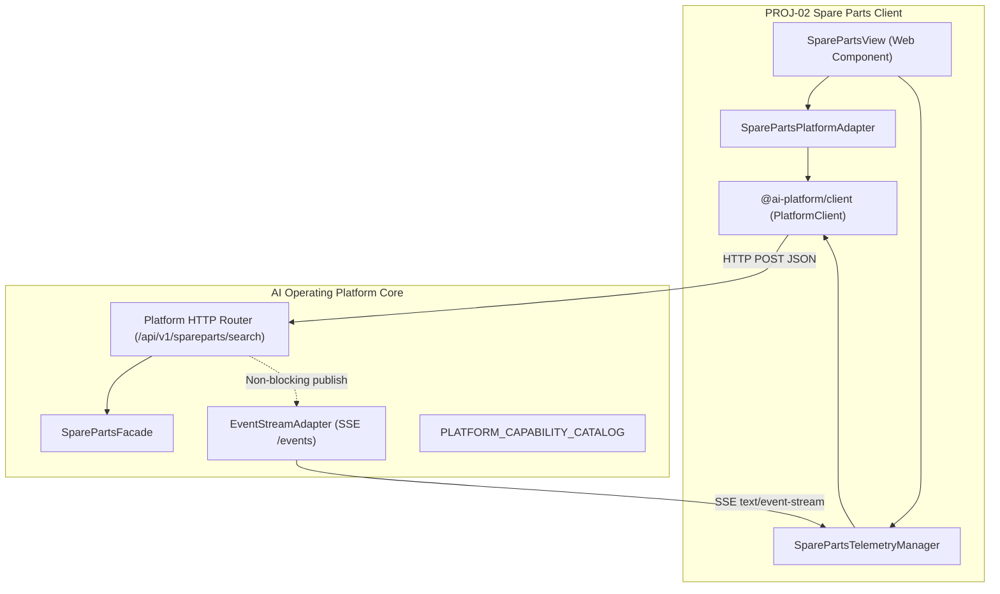

# Integración Profunda de Aplicación Satélite y Telemetría SSE: PROJ-02 Spare Parts

> **Documento Técnico Oficial — AI Operating Platform**  
> **Área:** Applications / PROJ-02-SPAREPARTS (Spare Parts Search & Comparison)  
> **Fase:** 149 — Integración Profunda con AI Operating Platform (Satellite Adapter & Reactive SSE Telemetry)  
> **Estado:** VIGENTE / CERTIFICADO  
> **Última Actualización:** 2026-09-25  

---

## 1. Misión y Propósito

El subsistema de **Integración Profunda de Plataforma** de `PROJ-02-SPAREPARTS` formaliza y certifica el vínculo arquitectónico entre el producto satélite automotriz y la **AI Operating Platform**, rigiéndose estrictamente por la *Application Integration Guide* (`docs/APPLICATION_INTEGRATION_GUIDE.md`).

Provee una capa de mediación desacoplada basada en el cliente canónico `@ai-platform/client`, incorporando:
1. **Cliente Satélite Especializado (`SparePartsPlatformAdapter`)**: Gestión de llamadas tipadas a la plataforma, propagación de contexto de trazabilidad e inquilinaje, fail-closed por timeout y resiliencia ante contingencias.
2. **Telemetría Operacional Reactiva (`SparePartsTelemetryManager`)**: Canalización en tiempo real de eventos de dominio mediante Server-Sent Events (SSE), reconexión determinista con backoff exponencial, deduplicación de eventos y seguimiento monotónico de `Last-Event-ID`.
3. **Emisión de Eventos en Router HTTP**: Emisión de eventos de ciclo de vida (`spareparts.search.started`, `spareparts.source.completed`, `spareparts.search.completed`, `spareparts.search.failed`) sin impacto en la latencia ni ruta crítica de búsqueda.
4. **Catálogo de Capacidades**: Registro formal de `spareparts.search` en `PLATFORM_CAPABILITY_CATALOG`.
5. **Observabilidad Reactiva en UX Web**: Indicador de estado de conexión (`CONNECTED`, `CONNECTING`, `DEGRADED`, `DISCONNECTED`) y feed en vivo en `SparePartsView` bajo la regla de **0 `.innerHTML`**.

---

## 2. Invariantes Arquitectónicas y de Seguridad

Conforme al contrato sagrado de integración de satélites:

1. **Aislamiento Absoluto de Importaciones Internas**:
   - El código satélite frontend/cliente consume exclusivamente `@ai-platform/client` o HTTP/SSE nativos. Cero importaciones hacia el núcleo interno de la plataforma (`src/domain/agent`, `src/platform/api`, etc.).
2. **Cero Secretos en el Cliente (Zero Client-Side Secrets)**:
   - La aplicación satélite web opera sin llaves maestras de API ni secretos de plataforma incrustados en código de cliente.
3. **Propagación Monotónica de Trazabilidad e Inquilinaje**:
   - Cada solicitud transmite obligatoriamente headers de correlación: `X-Trace-Id`, `X-Request-Id`, `X-Tenant-Id` y `X-Application-Id` (`spare-parts-store`).
4. **Resiliencia y Degradación Elegante (Partial Failure Separation)**:
   - Las fallas en el stream de telemetría SSE nunca degradan ni bloquean las búsquedas ni comparaciones de repuestos.
5. **Deduplicación Determinista de Eventos**:
   - Los eventos duplicados retransmitidos por desconexión de red se descartan deterministamente evaluando `id`, `eventId` o un hash canónico de `eventType + traceId + occurredAt`.
6. **Seguridad DOM Absoluta (0 `.innerHTML`)**:
   - Ningún evento de telemetría inyecta HTML sin sanitizar; todo renderizado se efectúa mediante APIs seguras W3C (`createElement`, `textContent`).

---

## 3. Arquitectura del Sistema de Integración

---

## 4. Componentes Principales

### 4.1. `SparePartsPlatformAdapter`
Ubicado en `src/application/spareparts/spare-parts-platform-adapter.ts`.
- Configuración canónica: `baseUrl`, `apiPrefix` (`/api/v1`), `applicationId` (`spare-parts-store`), `tenantId` (`tenant-enterprise-01`), `timeoutMs` (10000ms), `autoReconnect` (true).
- Método `searchAndCompare(request, callerContext)`: Ejecuta búsqueda orquestada transmitiendo headers RFC y contexto estructurado.
- Clasificación de errores en `PlatformClientError`:
  - `SEARCH_TIMEOUT` (HTTP 408) ante demoras que superen `timeoutMs`.
  - `PLATFORM_UNAVAILABLE` (HTTP 503) ante cortes de red o plataforma caída.
  - Códigos específicos aguas abajo (`TENANT_QUOTA_EXCEEDED`, `VALIDATION_ERROR`).
- Método `checkHealth()`: Evalúa conectividad general (`ONLINE`, `DEGRADED`, `OFFLINE`).

### 4.2. `SparePartsTelemetryManager`
- Administra el ciclo de vida del stream SSE operacional.
- Monitorea estados de conexión: `DISCONNECTED`, `CONNECTING`, `CONNECTED`, `RECONNECTING`, `DEGRADED`, `ERROR`.
- Algoritmo de reconexión: Backoff exponencial con factor 1.5 y límite de reintentos (`maxReconnectRetries`).
- Tracking de secuencia monotónico: Registra `lastEventId` para soporte de reconciliación histórica transparente.

### 4.3. Eventos de Telemetría Soportados

| Evento | Origen | Descripción |
| :--- | :--- | :--- |
| `spareparts.search.started` | HTTP Router | Se inicia la orquestación de búsqueda de repuestos con query y vehículo. |
| `spareparts.source.completed` | HTTP Router | Un conector individual (e.g. Autoplanet, RepuestosCenter) finalizó su búsqueda. |
| `spareparts.search.completed` | HTTP Router | Búsqueda y comparación completada con total de ofertas y clusters agrupados. |
| `spareparts.search.failed` | HTTP Router | Error fatal durante la búsqueda de repuestos. |

---

## 5. Pruebas y Validación

La verificación del subsistema se consolidó en `tests/unit/spare-parts-platform-integration.test.ts` con 10 pruebas automatizadas:
1. Inicialización del adaptador con valores por defecto e invariantes tipadas.
2. Transmisión obligatoria de headers de trazabilidad (`x-trace-id`, `x-request-id`, `x-tenant-id`, `x-application-id`).
3. Fail-closed ante timeout mapeado a `SEARCH_TIMEOUT` y HTTP 408.
4. Clasificación determinista de errores en `PlatformClientError`.
5. Reporte de salud `checkHealth()` (`ONLINE`, `DEGRADED`, `OFFLINE`).
6. Deduplicación de eventos y control monotónico de `Last-Event-ID`.
7. Resiliencia y aislamiento: búsqueda exitosa aún con telemetría en estado `DEGRADED` o desconectada.
8. Emisión extremo a extremo de telemetría SSE en `POST /spareparts/search`.
9. Reactividad en `SparePartsView` preservando 0 `.innerHTML`.
10. Auditoría de pureza absoluta: Cero mutaciones peligrosas en todo el árbol web.
