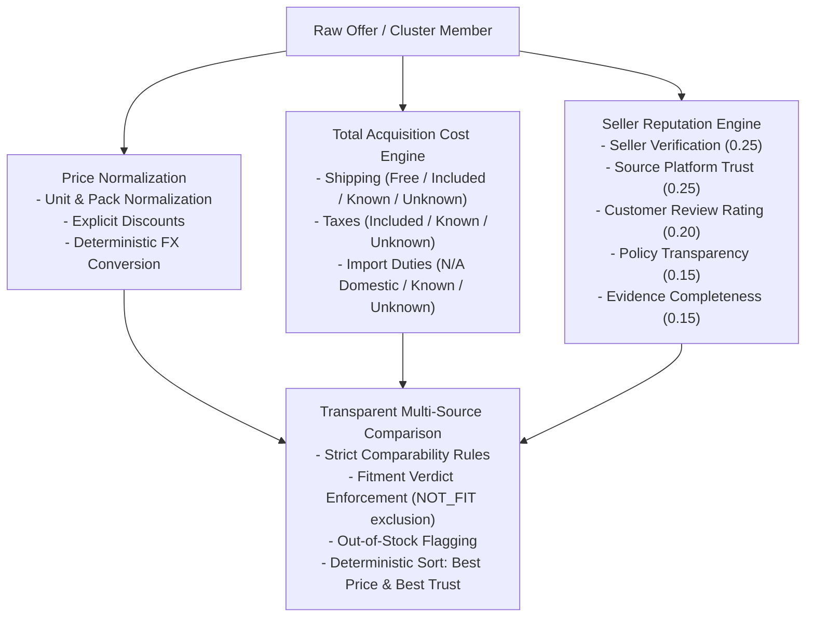

# Especificación Técnica: Inteligencia de Precios, Reputación y Costo Total (Price Intelligence, Reputation & Total Cost Engine)

> **Documento Técnico Oficial — AI Operating Platform**  
> **Área:** Applications / PROJ-02-SPAREPARTS (Spare Parts Search & Comparison)  
> **Fase:** 147 — Price Intelligence, Reputation & Total Cost Engine  
> **Estado:** VIGENTE / CERTIFICADO  
> **Última Actualización:** 2026-09-24  

---

## 1. Misión y Propósito

El motor de **Inteligencia de Precios, Reputación y Costo Total** de `PROJ-02-SPAREPARTS` proporciona una capa analítica determinista, transparente y auditable para normalizar precios, calcular el costo total de adquisición (*Total Landed Cost*), evaluar la confiabilidad de los vendedores (*SellerTrustScore*) y permitir comparaciones multi-fuente rigurosas.

### Principio Fundamental: `UNKNOWN ≠ 0`
> La ausencia de información de costos (como envío no cotizado, impuestos no desglosados o aranceles de importación pendientes) **jamás se reemplaza por cero**. Un costo desconocido deriva de forma estricta en `TOTAL_UNKNOWN` o `TOTAL_PARTIAL`, impidiendo que ofertas incompletas parezcan artificialmente más baratas que ofertas transparentes con costos incluidos.

---

## 2. Componentes del Subsistema



---

## 3. Modelo de Costo Total de Adquisición (`TotalAcquisitionCost`)

El costo total se descompone de forma estructurada y auditable:

```text
Total Acquisition Cost = Base Price + Shipping + Taxes + Import Fees - Discounts
```

### Estados de Componentes (`CostComponentStatus`)
- **`INCLUDED`**: El costo ya está incorporado en el precio de lista.
- **`FREE`**: El servicio es explícitamente gratuito con respaldo documental.
- **`KNOWN_AMOUNT`**: Se conoce el importe exacto y la moneda.
- **`UNKNOWN`**: El costo no fue informado por la fuente (no se computa como 0).
- **`NOT_APPLICABLE`**: El rubro no aplica (e.g. aranceles de importación en compras locales).

### Estados de Completitud (`CostCompletenessStatus`)
- **`TOTAL_KNOWN`**: Todos los rubros están determinados; el total final es un valor numérico seguro.
- **`TOTAL_UNKNOWN`**: Falta al menos un componente obligatorio de costo; `totalAmount` permanece `undefined` (fail-closed) para evitar engaño al consumidor.

---

## 4. Evaluación de Confianza del Vendedor (`SellerTrustScore`)

El algoritmo de reputación calcula una ponderación determinista en escala `0.0` a `1.0` basada en señales objetivas del dominio:

| Factor | Ponderación | Criterio de Evaluación |
| :--- | :---: | :--- |
| **`SELLER_VERIFICATION`** | 25% | Estado de verificación oficial del vendedor en la fuente o registro de plataforma. |
| **`SOURCE_RELIABILITY`** | 25% | Confiabilidad de la plataforma de origen (`AutomotiveSource.trustRating.sourceReliability`). |
| **`CUSTOMER_RATING`** | 20% | Puntuación normalizada de reseñas de compradores y volumen de opiniones. |
| **`POLICY_TRANSPARENCY`** | 15% | Existencia y claridad de garantía comercial (meses) y política de devoluciones (días). |
| **`EVIDENCE_COMPLETENESS`** | 15% | Calidad y exhaustividad de los claims de evidencia estructurada (`StructuredClaimEvidence`). |

### Separación entre Confianza de Fuente y de Vendedor
El modelo distingue inequívocamente `sourceTrust` de `sellerTrust`. Un vendedor nuevo o no verificado en una plataforma confiable (e.g. MercadoLibre) recibe una penalización en su score directo sin alterar la reputación de la plataforma de origen.

---

## 5. Comparador Multi-Fuente Transparente (`TransparentPriceComparison`)

El comparador evalúa todas las ofertas asociadas a un `CanonicalPartCluster` aplicando reglas estrictas de comparabilidad:

1. **Incompatibilidad de Vehículo:** Ofertas marcadas con `NOT_FIT` por el motor de compatibilidad de la Fase 146 son marcadas como no comparables con motivo explícito.
2. **Quiebre de Stock:** Ofertas en estado `OUT_OF_STOCK` se mantienen en la lista pero se excluyen de los cálculos de mejor precio disponible.
3. **Conversión FX Determinista:** Monedas internacionales (USD, EUR) se normalizan a la moneda de comparación (e.g. CLP) usando proveedores deterministas con registro del rate y timestamp.
4. **Normalización por Cantidad:** Paquetes (e.g. pack de 4 bujías) se normalizan al precio unitario para comparar contra unidades sueltas de forma equivalente.
5. **Selección de Mejores Ofertas:**
   - `bestPriceOfferId`: Oferta con menor costo total cerrado y conocido (`TOTAL_KNOWN`).
   - `bestTrustOfferId`: Oferta con mayor score de confianza del vendedor.
   - `bestOverallOfferId`: Oferta con el balance óptimo entre precio total y confiabilidad.

---

## 6. Cobertura de Pruebas Automatizadas

La suite `tests/unit/price-intelligence.test.ts` certifica los 14 escenarios clave:

| # | Escenario Evaluado | Resultado |
| :-: | :--- | :-: |
| 1 | Costo total conocido en moneda doméstica (CLP) con desglose auditado | `PASS` |
| 2 | Envío incluido/gratuito computado sin recargos | `PASS` |
| 3 | Envío no informado (`UNKNOWN`) no se suma como 0 y deja total en `TOTAL_UNKNOWN` | `PASS` |
| 4 | Impuestos no declarados fallan-cerrado sin asumir 0 | `PASS` |
| 5 | Costos de importación transfronteriza pendientes marcados como `UNKNOWN` | `PASS` |
| 6 | Normalización de moneda USD a CLP con trazabilidad de tasa de cambio | `PASS` |
| 7 | Tasa FX no disponible lanza error explícito en lugar de asumir paridad 1:1 | `PASS` |
| 8 | Normalización de precio por unidad en base a tamaño de empaque (*pack size*) | `PASS` |
| 9 | Descuentos explícitos deducidos con cálculo porcentual | `PASS` |
| 10 | Evaluación explicable y ponderada de componentes de `SellerTrustScore` | `PASS` |
| 11 | Separación estricta entre confiabilidad de plataforma y de vendedor | `PASS` |
| 12 | Comparación multi-fuente con exclusión de ofertas agotadas | `PASS` |
| 13 | Idempotencia y determinismo en comparaciones repetidas | `PASS` |
| 14 | Integración con compatibilidad: pieza incompatible (`NOT_FIT`) marcada como no comparable | `PASS` |

---

## 7. Trazabilidad con el Plan Maestro

- **Iniciativa:** `AOP-SPAREPARTS-SEARCH`
- **Fase del Plan Maestro:** Fase 147 (`docs/MASTER_WORK_PLAN.md`)
- **Dependencias Integradas:** Fase 144 (Búsqueda Multi-Fuente), Fase 145 (Clusters y Normalización), Fase 146 (Compatibilidad de Fitment).
