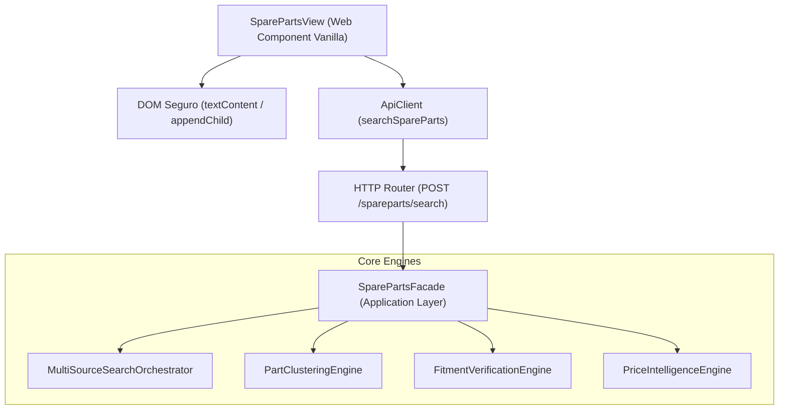

# Especificación Técnica: UX Web, Filtros y Comparador Lado a Lado (Spare Parts Web UX)

> **Documento Técnico Oficial — AI Operating Platform**  
> **Área:** Applications / PROJ-02-SPAREPARTS (Spare Parts Search & Comparison)  
> **Fase:** 148 — UX Web: Búsqueda, Filtros y Comparador Lado a Lado  
> **Estado:** VIGENTE / CERTIFICADO  
> **Última Actualización:** 2026-09-24  

---

## 1. Misión y Propósito

El subsistema de **UX Web, Filtros Reactivos y Comparador Lado a Lado** de `PROJ-02-SPAREPARTS` proporciona la interfaz de usuario de consulta, navegación de catálogo, verificación de compatibilidad y contraste comparativo de repuestos automotrices.

La arquitectura web opera bajo el principio de **seguridad estricta (0 `.innerHTML`)**, reactividad determinista en cliente y orquestación unificada a través de una fachada de aplicación (`SparePartsFacade`) expuesta mediante la API REST de la plataforma.

---

## 2. Invariantes de Seguridad y Diseño

1. **Seguridad contra Inyección XSS (Cero `.innerHTML`)**:
   - Todo el árbol DOM se construye y actualiza mediante APIs seguras del estándar W3C: `document.createElement()`, `element.textContent`, `element.setAttribute()`, `element.classList` y `element.append()`.
   - Queda terminantemente prohibido el uso de `innerHTML`, `outerHTML`, `insertAdjacentHTML` o `eval` en `src/platform/web/`.
2. **Preservación de Verdad (`UNKNOWN ≠ 0`)**:
   - En ofertas donde el flete o impuestos son desconocidos, la interfaz muestra explícitamente `Costo total no determinado (envío/impuestos no informados)` con etiqueta `TOTAL_UNKNOWN`, impidiendo calcular totales fraudulentos.
3. **Fail-Closed en Incompatibilidad**:
   - Repuestos con veredicto de ajuste vehicular `NOT_FIT` se marcan visualmente con alerta de incompatibilidad y quedan inhabilitados para selección en la tabla comparativa lado a lado.
4. **Límite de Comparación Lado a Lado**:
   - Se admite la selección concurrente de un máximo de 4 ofertas activas para contraste simultáneo de atributos técnicos, flete, reputación y costo total.

---

## 3. Arquitectura del Componente Web



---

## 4. Estructura de Componentes y Vistas

### 4.1. Selector de Vehículo (`Vehicle Context Bar`)
- Entrada estructurada para `make`, `model`, `year`, `generation` y `engine`.
- Botones de selección rápida (*Quick Presets*) para vehículos de alta circulación:
  - *Toyota Corolla 2020 1.8L (E210)*
  - *Nissan Versa 2021 1.6L*
  - *Hyundai Tucson 2019 2.0L*
  - *Chevrolet Sail 2018 1.5L*

### 4.2. Barra de Búsqueda y Telemetría Multi-Fuente
- Búsqueda por SKU, MPN, número de parte OEM o texto descriptivo.
- Chips de estado por conector de fuente indicando latencia, estado (`SUCCESS`, `ERROR`, `TIMEOUT`) y volumen de ofertas encontradas.

### 4.3. Filtros Reactivos en Sidebar
- Rango de precio deslizante.
- Filtro por Veredicto de Compatibilidad (`FIT`, `UNKNOWN`, `NOT_FIT`).
- Filtro por Confianza mínima del Vendedor (`0.0` a `1.0`).
- Checkbox de solo ofertas en stock inmediato.

### 4.4. Tarjetas de Ofertas por Cluster Canónico
- Distinción visual para mejor precio (`Mejor Precio`), vendedor más confiable (`Más Confiable`) y oferta recomendada (`Recomendado`).
- Botón interactivo para añadir/quitar del comparador lado a lado.

### 4.5. Tabla Comparativa Lado a Lado (*Side-by-Side Modal / Drawer*)
- Comparación en cuadrícula de hasta 4 ofertas seleccionadas.
- Filas de atributos: Marca, Número de Parte, Vendedor, Reputación, Veredicto de Ajuste, Flete, Impuestos, Garantía, Política de Devolución y Costo Total Desglosado.

---

## 5. Endpoints de la Plataforma

| Método | Ruta | Permiso Requerido | Descripción |
| :--- | :--- | :--- | :--- |
| `POST` | `/spareparts/search` | `tool.invoke` | Orquesta búsqueda multi-fuente, clustering, verificación de fitment y evaluación de precios. |

### Ejemplo de Payload de Búsqueda
```json
{
  "query": "04465-02220",
  "vehicle": {
    "make": "Toyota",
    "model": "Corolla",
    "year": 2020,
    "engine": "1.8L 2ZR-FAE"
  },
  "options": {
    "comparisonCurrency": "CLP",
    "targetDestinationCountry": "CL"
  }
}
```

---

## 6. Verificación y Cobertura Automatizada

El subsistema se encuentra cubierto por la suite `tests/unit/spare-parts-web-ux.test.ts` con 9 escenarios clave:
1. **Auditoría de Seguridad**: Verificación de 0 asignaciones `.innerHTML` en todo el directorio web.
2. **Fachada de Aplicación**: Ejecución punta a punta de búsqueda, clustering, fitment y pricing.
3. **Invariante de Verdad**: Derivación rigurosa de costos no informados como `TOTAL_UNKNOWN`.
4. **Fitment Fail-Closed**: Incompatibilidad vehicular excluye ofertas de la tabla comparativa.
5. **Filtrado Reactivo**: Evaluación en memoria de filtros por precio, compatibilidad, confianza y stock.
6. **Componente UI**: Renderizado inicial con barra de búsqueda, selector vehicular y estado vacío.
7. **Presets de Vehículo**: Carga instantánea de vehículo objetivo desde botones de preset.
8. **Límite de Comparación**: Control de selección de máximo 4 ofertas simultáneas y deselección.
9. **Mitigación XSS**: Sanitización automática de títulos y nombres maliciosos usando `textContent`.
