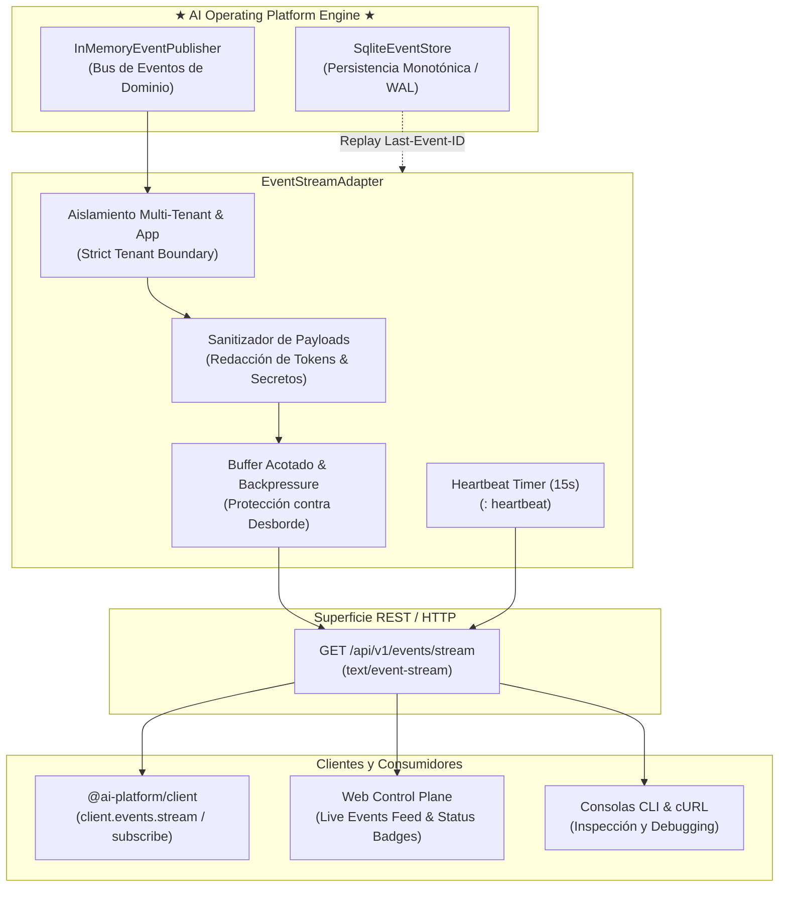

# Guía Oficial de Streaming de Eventos en Tiempo Real (Server-Sent Events — SSE)

**AI Operating Platform — Arquitectura Reactiva de Eventos Operacionales y Observabilidad en Vivo**

---

## 1. Visión General y Misión

La **AI Operating Platform (AOP)** implementa una infraestructura reactiva de transmisión de eventos en tiempo real basada en el estándar **Server-Sent Events (SSE)** (RFC 8895 / WHATWG HTML Living Standard).



### Objetivos Clave
1. **Baja Latencia y Cero Polling**: Transmisión instantánea de cambios de estado (`task.created`, `task.completed`, `execution.started`, `agent.activated`, `workflow.advanced`, etc.).
2. **Aislamiento Estricto Multi-Tenant y Multi-Aplicación**: Los tenants y aplicaciones reciben única y exclusivamente eventos de su propio ámbito (`tenantId`, `applicationId`).
3. **Reconexión y Replay Determinista (`Last-Event-ID`)**: Al reconectarse tras una caída de red, el cliente envía la cabecera `Last-Event-ID: <seq>` y el `SqliteEventStore` reproduce los eventos históricos perdidos.
4. **Seguridad y Sanitización Activa**: Redacción automática de claves API, tokens Bearer, contraseñas y secretos en los payloads antes de salir al cliente.
5. **Estabilidad Operacional**: Latido continuo (*heartbeat*) cada 15s para evitar desconexiones por timeout de proxies, limpieza exhaustiva de sockets cerrados y límites de concurrencia.

---

## 2. Especificación del Protocolo y Cabeceras

### Endpoint Oficial
```http
GET /api/v1/events/stream HTTP/1.1
Host: 127.0.0.1:3000
Accept: text/event-stream
X-API-Key: aop_live_...
Last-Event-ID: 1042
```

### Parámetros Soportados (Query & Headers)
| Parámetro | Tipo | Ubicación | Descripción |
|---|---|---|---|
| `Last-Event-ID` | Integer | Header / Query (`lastEventId`) | Secuencia a partir de la cual reproducir eventos históricos. |
| `tenantId` | String | Query / Header (`X-Tenant-Id`) | Filtro de tenant (reconciliado contra credencial autenticada). |
| `applicationId` | String | Query / Header (`X-Application-Id`) | Filtro por aplicación satélite registrada. |
| `agentId` | String | Query | Filtro por agente ejecutor específico. |
| `executionId` | String | Query | Filtro por ID de ejecución. |
| `traceId` | String | Query | Filtro por correlación de traza distribuida. |
| `eventType` | String | Query | Filtro por tipo de evento de dominio (`task.*`, `workflow.*`, etc.). |
| `apiKey` / `token` | String | Query / Header | Credenciales para clientes de navegador que no pueden inyectar cabeceras en `EventSource`. |

### Cabeceras de Respuesta SSE
```http
HTTP/1.1 200 OK
Content-Type: text/event-stream; charset=utf-8
Cache-Control: no-cache, no-transform, no-store
Connection: keep-alive
X-Accel-Buffering: no
Access-Control-Allow-Origin: *
```

### Formato de Chunks
```text
: stream connected (sse-1727136000000-abc1234)

: heartbeat

id: 1043
event: task.created
data: {"sequenceNumber":1043,"eventId":"evt-001","eventType":"task.created","aggregateId":"task-101","traceId":"trace-999","occurredAt":"2026-09-23T20:00:00.000Z","payload":{"tenantId":"tenant-alpha","title":"Análisis de Inventario"},"replayed":false}

```

---

## 3. Integración con el SDK Oficial (`@ai-platform/client`)

El SDK incluye métodos tipados de primer nivel para suscribirse al stream:

```typescript
import { createPlatformClient } from "@ai-platform/client";

const client = createPlatformClient({
  baseUrl: "http://127.0.0.1:3000",
  apiKey: "aop_live_production_key",
  tenantId: "tenant-ecommerce",
  applicationId: "app-tentaciones",
});

// Suscripción reactiva con soporte Last-Event-ID
const subscription = client.events.stream(
  {
    eventType: "task.completed",
    lastEventId: 450, // Replay a partir de evento 450
  },
  {
    onOpen: () => {
      console.log("Conexión SSE establecida con éxito.");
    },
    onEvent: ({ id, event, data }) => {
      console.log(`[${id}] Evento recibido: ${event}`, data);
    },
    onError: (err) => {
      console.error("Error en el canal de eventos:", err);
    },
  }
);

// Para cerrar el stream y liberar recursos:
subscription.close();
```

---

## 4. Consumo Directo en el Navegador (Web Control Plane)

```javascript
const eventSource = new EventSource("/api/v1/events/stream?apiKey=aop_live_key&tenantId=tenant-default");

eventSource.onopen = () => {
  document.getElementById("sse-badge").textContent = "LIVE";
  document.getElementById("sse-badge").className = "badge badge-success";
};

eventSource.onmessage = (e) => {
  const eventData = JSON.parse(e.data);
  renderLiveEventInFeed(eventData);
};

eventSource.onerror = () => {
  document.getElementById("sse-badge").textContent = "RECONNECTING";
  document.getElementById("sse-badge").className = "badge badge-warning";
};
```

---

## 5. Pruebas y Validación de Contratos

La infraestructura de streaming dispone de validación formal en dos niveles:
* **Pruebas de Contrato (`tests/contract/sse-event-stream.test.ts`)**: Validación de sanitización, formato SSE, heartbeats, límites de concurrencia y replay de eventos.
* **Pruebas de Integración End-to-End (`tests/integration/sse-event-stream.test.ts`)**: Servidor HTTP en vivo, handshake real, publicación a través del bus de eventos, reconciliación de tenants y cierre de sockets.
