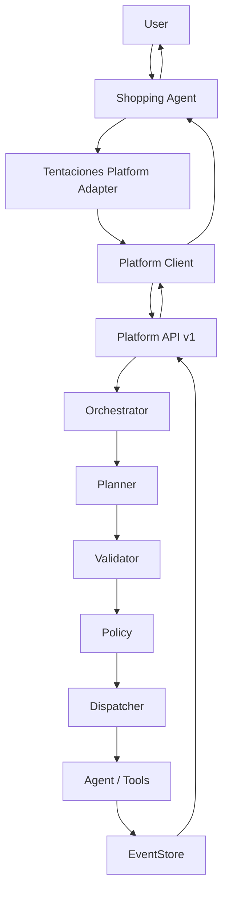

# Tentaciones AI Commerce Integration

This repository contains the platform-side application adapter contract. The
Tentaciones storefront remains an external application and must depend only on
`src/platform-client`, never on Core Engine modules.



## Adapter contract

`TentacionesPlatformAdapter` exposes `createTask`, `executeTask`,
`getExecution`, `getExecutionEvents`, and `getHealth`. Product discovery is
identified as `tentaciones` / `product.discovery` / `shopping-agent`, with the
real application version supplied by the storefront at composition time.

The first deterministic use case is:

```ts
const result = await adapter.discoverProducts(
  "Quiero unas zapatillas negras para correr"
);
```

The result exposes only `taskId`, `executionId`, `traceId`, status, result, and
structured error data. Coordinator, planner, tool registry, provider, and
EventStore objects are never returned.

## Fallback and health

`getHealth` delegates to `platform.health.get()` and does not duplicate
platform health logic. If the API is unavailable, product discovery returns
`PLATFORM_UNAVAILABLE` with `TRADITIONAL_COMMERCE` fallback. The adapter never
fabricates an AI result; the storefront can continue its normal product
browsing and commerce flows.

## Testing

The adapter tests use an in-memory public-client double. They do not require a
LLM provider, Internet access, credentials, or an external API.
