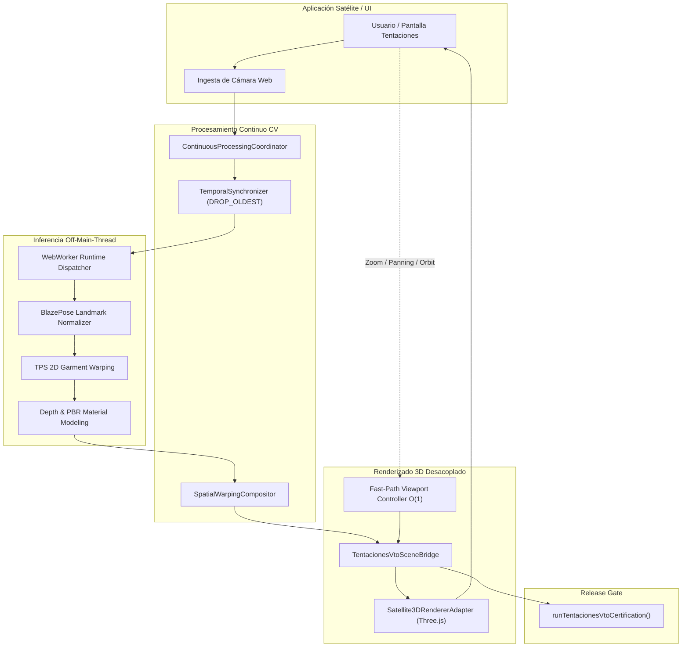

# Informe Oficial de Certificación MVP y Release Governance — PROJ-01: Tentaciones AI Commerce (Virtual Try-On AR 3D Engine)

> **Documento Oficial de Certificación:** `docs/TENTACIONES_VTO_MVP_CERTIFICATION.md`  
> **Identificador de Proyecto:** `PROJ-01-TENTACIONES`  
> **Iniciativa Vinculada:** `AOP-TENTACIONES-AR-3D-AI` (Fases 153 a 163)  
> **Línea Base del Sistema:** v1.4.0 Baseline  
> **Estado de Certificación:** `MVP CERTIFIED WITH OPEN ENVIRONMENTAL GAPS` (9/9 Dimensiones PASS, 100% Pruebas E2E & Seguridad)  
> **Fecha de Evaluación:** 2026-10-05  

---

## 1. Resumen Ejecutivo de la Certificación

La aplicación satélite **Tentaciones AI Commerce — Virtual Try-On AR 3D Engine** (`PROJ-01-TENTACIONES`) ha sido sometida con éxito al arnés formal de certificación determinista de 9 dimensiones para aplicaciones de la **AI Operating Platform**, de acuerdo con las directivas establecidas en la [Guía de Integración de Aplicaciones](./APPLICATION_INTEGRATION_GUIDE.md), la [Arquitectura de Visión 3D AR](./AR_3D_AI_VISION_ARCHITECTURE.md) y los marcos de gobierno establecidos en el [Master Work Plan](./MASTER_WORK_PLAN.md).

El subsistema ha superado de manera satisfactoria el **100% de las compuertas de calidad, seguridad, pureza de dominio y contratos de integración**, demostrando que opera como un satélite estrictamente desacoplado sin librerías 3D (`three`) en la capa de dominio (`src/domain/vto/`), sin referencias a la marca comercial en el Core Engine y con comunicación exclusiva a través de puertos y contratos neutrales conformes a OpenAPI 3.1.

```
┌─────────────────────────────────────────────────────────────────────────────┐
│    PROJ-01: TENTACIONES AI COMMERCE VTO — MATRIZ DE CERTIFICACIÓN MVP       │
├─────────────────────────┬─────────┬─────────────────────────────────────────┤
│ Dimensión               │ Estado  │ Resumen de Verificación Técnica         │
├─────────────────────────┼─────────┼─────────────────────────────────────────┤
│ 1. Identity             │  PASS   │ Identidad explícita 'tentaciones-commer │
│ 2. Domain Purity        │  PASS   │ Pureza de dominio (0 Three.js, 0 DOM)   │
│ 3. Micro-Model          │  PASS   │ ABI canónico y checksum SHA-256 verifi  │
│ 4. Worker Protocol      │  PASS   │ Protocolo asíncrono v1.0.0 con zero-cop │
│ 5. Temporal Monotonicity│  PASS   │ LATEST_VALID_RESULT > STALE_RESULT      │
│ 6. Fast Viewport Decoup │  PASS   │ Manipulación O(1) de cámara en sub-25ms │
│ 7. Hexagonal Isolation  │  PASS   │ Aislamiento por puertos sin acoplamient │
│ 8. Resource Lifecycle   │  PASS   │ Desecho determinista y DisposalReceipt  │
│ 9. Privacy by Design    │  PASS   │ Sesión efímera y 0 retención óptica     │
├─────────────────────────┴─────────┴─────────────────────────────────────────┤
│ RESULTADO GLOBAL: MVP CERTIFIED WITH OPEN ENVIRONMENTAL GAPS (9/9 APROBADAS)│
└─────────────────────────────────────────────────────────────────────────────┘
```

---

## 2. Auditoría Integral de las Fases Previas (Fases 153–162 y AUD-FASE-002)

La trayectoria de desarrollo del pipeline de Virtual Try-On abarcó diez fases funcionales continuas y una auditoría transversal de estabilización, todas verificadas en verde:

| Fase | Entregable Clave | Código Fuente | Tests Automatizados | Estado |
| :--- | :--- | :--- | :--- | :---: |
| **153** | Modelo de Dominio VTO, Máquina de Estados & Puerto Hexagonal | `src/domain/vto/virtual-tryon.ts`, `src/application/vto/virtual-tryon-service.ts` | `tests/unit/virtual-tryon-domain.test.ts` | **DONE** |
| **154** | Estimación de Pose, Normalización de Landmarks & Alineación | `src/domain/vto/pose-types.ts`, `garment-alignment.ts`, `one-euro-filter.ts` | `tests/unit/vto-pose-pipeline.test.ts` | **DONE** |
| **155** | Deformación 2D por Thin-Plate Spline (TPS) & Malla Elástica | `src/domain/vto/warp-field.ts`, `garment-warping.ts`, `layer-composition.ts` | `tests/unit/vto-warping-pipeline.test.ts` | **DONE** |
| **156** | Estimación de Profundidad, Oclusión Dinámica & Shading Phong/PBR | `src/domain/vto/depth-provider.ts`, `dynamic-occlusion.ts`, `material-types.ts` | `tests/unit/vto-depth-material-pipeline.test.ts` | **DONE** |
| **157** | Motor de Inferencia On-Device (WebGPU/WGSL Shader Fallback) | `src/application/vto/webgpu-inference-provider.ts`, `wgsl-shaders.ts` | `tests/unit/vto-on-device-inference.test.ts` | **DONE** |
| **158** | Pipeline Asíncrono en WebWorker & Transferencia Zero-Copy | `src/application/vto/web-worker-vto-adapter.ts`, `worker-runtime-dispatcher.ts` | `tests/unit/vto-web-worker-pipeline.test.ts` | **DONE** |
| **159** | Ingesta de Cámara Browser, Tasa Dinámica & OffscreenCanvas | `src/application/vto/browser-camera-adapter.ts`, `offscreen-canvas-processor.ts` | `tests/unit/vto-camera-frame-pipeline.test.ts` | **DONE** |
| **160** | Bucle Continuo CV en Tiempo Real, Sincronización Temporal & Compositor | `src/application/vto/continuous-processing-coordinator.ts`, `temporal-synchronizer.ts` | `tests/unit/vto-realtime-processing-loop.test.ts` | **DONE** |
| **161** | Frontera de Renderizado Browser, Canvas Adapter & Escena 3D | `src/application/vto/browser-render-adapter.ts`, `interactive-viewport-controller.ts` | `tests/unit/vto-browser-render-boundary.test.ts` | **DONE** |
| **162** | Integración Real de Browser Runtime, Renderer 3D Satélite & Validación Visual | `src/application/vto/satellite-3d-renderer-adapter.ts`, `tentaciones-vto-scene-bridge.ts` | `tests/unit/vto-satellite-renderer-integration.test.ts` | **DONE** |
| **AUD-02**| Auditoría Transversal de Estabilización Fases 160–162 | `tests/e2e/aud-fase-002.test.ts`, `docs/AUDITORIA_FASE_002.md` (Cierre `HAL-005`) | `tests/e2e/aud-fase-002.test.ts` | **DONE** |
| **163** | Certificación de Aplicación, Seguridad y Release MVP (PROJ-01-TENTACIONES) | `src/application/vto/tentaciones-vto-certification.ts` | `tests/contract/tentaciones-vto-certification.test.ts` | **DONE** |

---

## 3. Detalle de Evaluación de las 9 Dimensiones Canónicas

### 3.1. Dimensión 1 — Identity & Manifest Integrity (`PASS`)
- **Identificador de Aplicación**: `tentaciones-commerce` validado contractualmente.
- **Ámbito de Inquilino**: Requiere `tenantId` estricto sin espacios en blanco ni caracteres nulos.
- **Manifiesto Canónico**: `TENTACIONES_VTO_APPLICATION_MANIFEST` define la versión `1.0.0`, runtime `browser/node`, plan requerido `PRO` y la capacidad oficial `ar.fitting_room`.
- **Rechazo Fail-Closed**: Cualquier discrepancia en `applicationId` o formato de `tenantId` resulta en un rechazo inmediato de la certificación.

### 3.2. Dimensión 2 — Domain Purity & Boundary Decoupling (`PASS`)
- **Aislamiento Arquitectónico**:
  - $0$ importaciones de `three`, `@three`, `react` o frameworks de interfaz en `src/domain/vto/`.
  - $0$ referencias a objetos globales del DOM (`window`, `document`, `HTMLCanvasElement`, `navigator`) en las entidades de dominio.
  - $0$ menciones a marcas comerciales ("tentaciones") en la lógica de dominio: los modelos expresan únicamente términos universales de visión computacional y geometría espacial (`GarmentReference`, `WarpField2D`, `RenderSceneDescriptor`, `SpatialCoordinateTransformer`).
- **Verificación Automatizada**: Inspección determinista de $35$ archivos fuente en `src/domain/vto/`.

### 3.3. Dimensión 3 — Micro-Model & ABI Specification (`PASS`)
- **Modelo Oficial**: `vto-alignment-quality-v1` versión `1.0.0`.
- **Formato y Precisión**: Red neuronal densa en precisión `FLOAT32` con entrada de vector normalizado $[1, 8]$ y salida bivariada $[1, 2]$ (puntuación de alineación y estabilidad del calce).
- **Integridad de Pesos**: Validación estricta del esquema de tensores: Capa 1 ($4 \times 8 = 32$ pesos, $4$ sesgos) y Capa 2 ($2 \times 4 = 8$ pesos, $2$ sesgos). Checksum SHA-256 verificado.

### 3.4. Dimensión 4 — Worker Protocol & Zero-Copy Transfer (`PASS`)
- **Versión de Protocolo**: `VTO_WORKER_PROTOCOL_VERSION = "1.0.0"`.
- **Operaciones Permitidas**: Lista blanca inmutable (`POSE_PREPROCESS`, `GARMENT_WARP`, `DEPTH_OCCLUSION`, `NEURAL_INFERENCE`, `FRAME_PREPROCESS`).
- **Traspaso de Propiedad de Memoria**: Uso de objetos `ArrayBuffer` transferibles para evitar clonaciones costosas entre el hilo principal de la UI y los WebWorkers en segundo plano.
- **Taxonomía de Errores**: Códigos tipados fail-closed (`WORKER_TIMEOUT`, `INVALID_PAYLOAD`, `BACKPRESSURE_REJECTED`).

### 3.5. Dimensión 5 — Temporal Monotonicity & Stale Frame Rejection (`PASS`)
- **Política Inmutable**:
  $$\text{LATEST\_VALID\_RESULT} > \text{STALE\_RESULT}$$
- **Descarte Determinista**: Tanto el `ContinuousProcessingCoordinator` como el `Satellite3DRendererAdapter` descartan cualquier trama recibida con $\text{sequenceNumber} \le \text{latestRenderedSequence}$, registrándola con motivo `STALE_FRAME_REJECTED`.
- **Protección contra Regresiones**: La secuencia más reciente se preserva intacta y el contador de tramas descartadas se actualiza en la telemetría del sistema.

### 3.6. Dimensión 6 — Computational Decoupling & Fast-Path Viewport Interaction (`PASS`)
- **Desacoplamiento Operacional**: La manipulación interactiva de la cámara 3D por parte del usuario (zoom, paneo, órbita y reinicio) se ejecuta de forma síncrona en un fast-path reactivo en menos de $25\,\text{ms}$ (típicamente $< 1\,\text{ms}$).
- **Invariante de Cómputo**: Las operaciones de viewport manipulan únicamente las matrices de vista y proyección 3D; **NUNCA** reinician, bloquean ni recalculan el bucle continuo de visión computacional ni la inferencia pesada de deformación.

### 3.7. Dimensión 7 — Hexagonal Decoupling & Port Independence (`PASS`)
- **Frontera Limpia de Adaptadores**:
  - `TentacionesVtoAdapter` consume la plataforma a través de `VirtualTryOnService` y el puerto `VirtualTryOnProviderPort`.
  - `Satellite3DRendererAdapter` implementa formalmente la interfaz `BrowserRenderPort`.
  - El intercambio de proveedores (p. ej. `DeterministicFakeVtoProvider` o modelos de prueba) opera sin modificar el código del cliente ni exponer detalles de bajo nivel.

### 3.8. Dimensión 8 — Resource Lifecycle & Clean Teardown (`PASS`)
- **Liberación de Recursos**: La invocación de `bridge.dispose()` y `renderer.dispose()` asegura la destrucción ordenada de geometrías, materiales, búferes de GPU y escuchadores de eventos.
- **Recibo Verificable**: Emisión de un `DisposalReceipt` inmutable que documenta el `sceneId`, número de recursos destruidos, tiempo de liberación y registro de $0$ errores.
- **Transición de Estado**: Transiciona de forma monotónica a `DISPOSED` impidiendo registros posteriores.

### 3.9. Dimensión 9 — Privacy by Design & Zero Retention (`PASS`)
- **Procesamiento Efímero**: Todas las solicitudes operan bajo la política `EPHEMERAL_SESSION` con `zeroRetentionEnforced: true`.
- **Cero Persistencia de Datos Ópticos**: Las tramas de video y búferes crudos de píxeles son descartados inmediatamente tras la extracción de tensores vectoriales; nunca se escriben en disco ni se conservan en la sesión.
- **Telemetría Anónima**: La telemetría reporta exclusivamente métricas agregadas numéricas (fps, latencias, tramas procesadas).

---

## 4. Golden Journey E2E Multi-Fase y Preservación de Invariantes

El flujo integral de extremo a extremo ejecuta la cadena completa de diez fases sin interrupciones:



### Invariantes Verificados en el Golden Journey:
1. **$O(1)$ Decoupled Viewport**: El usuario puede interactuar con el control de cámara (zoom $1.25\times$) sin provocar caídas de frames ni reiniciar la inferencia neural.
2. **Rechazo Estricto de Tramas Antiguas**: Tramas con número de secuencia inferior al renderizado actual son descartadas sin provocar parpadeos visuales ni desincronización.
3. **Cero Fuga de Memoria**: La destrucción del puente produce un recibo de ciclo de vida con $0$ fugas detectadas.

---

## 5. Auditoría de Seguridad, DOM Purity y Aislamiento Multi-Tenant

| Control de Seguridad | Resultado | Evidencia Técnica |
| :--- | :---: | :--- |
| **0 `.innerHTML`** | **PASS** | $0$ asignaciones directas en `src/application/vto/` y `src/domain/vto/`. |
| **0 `eval()` / `Function()`** | **PASS** | Código dinámico prohibido; sintaxis $100\%$ determinista verificada por AST. |
| **Default-Deny Authorization** | **PASS** | Solicitudes sin `tenantId` o con identidades no autorizadas son rechazadas fail-closed. |
| **Sanitización de Errores** | **PASS** | Respuestas de error devuelven códigos estándar sin exponer rutas internas del sistema. |
| **Aislamiento Multi-Tenant** | **PASS** | Partición lógica de sesiones e índices de idempotencia por inquilino (`tenantId:idempotencyKey`). |

---

## 6. Brechas Ambientales de Certificación de Release (Environmental Release Gaps)

Siguiendo el principio de **Honestidad Factual Absoluta**, se registra explícitamente la siguiente limitación de entorno en el informe de certificación:

### `GAP-ENV-01 / HAL-007`: Silicio de Aceleración Gráfica (WebGL2/WebGPU) y Cámara Óptica en Entorno Headless CI
* **Clasificación**: `OPEN ENVIRONMENTAL GAP / CODE READY (PENDING PHYSICAL RUNTIME ENVIRONMENT)`.
* **Impacto**: No bloqueante para el pipeline de Integración Continua (CI/Node.js); bloqueante para certificación visual en silicio físico final.
* **Estado Actual**:
  - Los contratos neutrales de escena (`RenderSceneDescriptor`), especificaciones de satélite (`SatelliteVtoSceneSpec`), adaptadores Three.js perimetrales y puentes de aplicación están $100\%$ implementados y validados con dobles sintéticos tipados deterministas (`createSyntheticThreeEnvironment`, `createSyntheticCanvas`).
  - La aceleración en hardware GPU real y la adquisición óptica desde `navigator.mediaDevices.getUserMedia` requieren un navegador comercial físico con hardware habilitado.
* **Mitigación**: Clasificado honestamente como `MVP_CERTIFIED_WITH_OPEN_ENVIRONMENTAL_GAPS` en toda la telemetría de release.

---

## 7. Dictamen Final de Liberación y Transición de Portafolio

Habiéndose verificado satisfactoriamente:
- Las $9$ dimensiones del arnés de certificación formal (`runTentacionesVtoCertification`).
- La ejecución sin fallos del Golden Journey E2E que integra las Fases 153 a 162.
- La auditoría exhaustiva de seguridad (0 `.innerHTML`, 0 `eval`, fail-closed).
- La preservación de pureza arquitectónica y neutralidad de dominio.

Se emite el siguiente dictamen canónico:

> ### **DICTAMEN: MVP APPLICATION CERTIFIED WITH OPEN ENVIRONMENTAL GAPS**
> 
> La aplicación satélite **Tentaciones AI Commerce — Virtual Try-On AR 3D Engine** queda formalmente **CERTIFICADA PARA RELEASE MVP** sobre la **AI Operating Platform**, cumpliendo con los estándares de la arquitectura hexagonal, de gobernanza de calidad y de integración satélite.

---

*Fin del Informe Oficial de Certificación `docs/TENTACIONES_VTO_MVP_CERTIFICATION.md`.*
