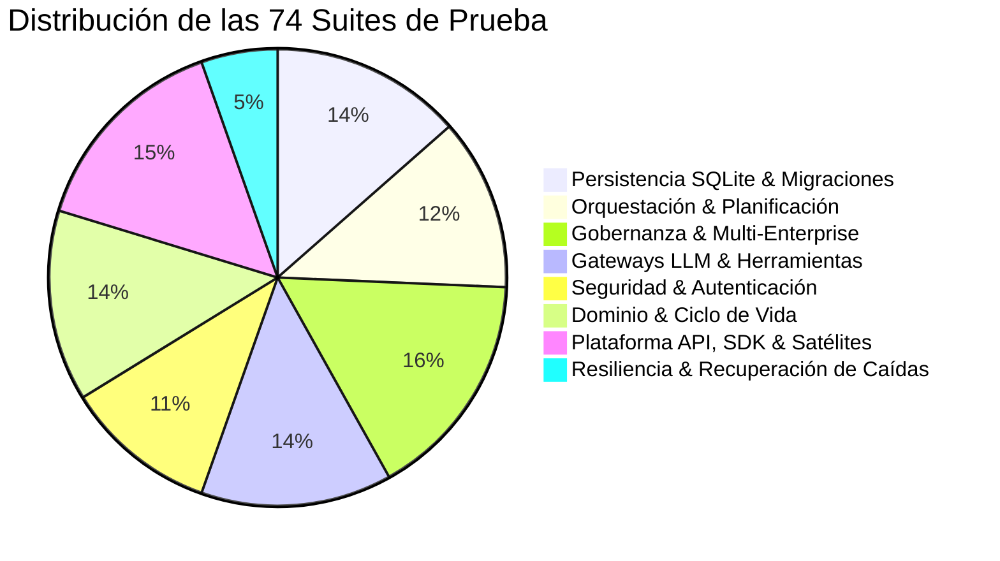

# Arquitectura del Sistema de Pruebas (Test Architecture)

Este documento describe la arquitectura, tipología, cobertura y metodología de la suite de pruebas automatizadas de **AI Operating Platform**, la cual cuenta con **74 suites y 1623 pruebas unitarias, de integración y de contrato**.

---

## 1. Métricas Globales y Estado de Verificación

* **Suites de Pruebas:** 74 suites en `tests/unit/`.
* **Pruebas Totales:** 1623 pruebas automatizadas.
* **Tasa de Aprobación:** 100% (1623 / 1623 PASS).
* **Tiempo Promedio de Ejecución:** ~35-40 segundos.
* **Cobertura Funcional:** Dominio, Persistencia SQLite, Orquestación, Recuperación, Gobernanza, Seguridad, Pasarelas LLM, Developer Platform & SDK y Plataforma API.

---

## 2. Categorización de Suites de Prueba

Las suites de prueba se estructuran en 8 dominios de verificación técnica:

### 2.1 Persistencia SQLite WAL y Migraciones (10 Suites)
Verifican el cumplimiento del motor relacional SQLite, control de concurrencia optimista, esquemas DDL v1/v2/v3 y rehidratación inmutable:
* `sqlite-persistence.test.ts`: Inicialización, pragmas WAL, timeouts y cierres limpios.
* `sqlite-schema-migration.test.ts`: Migraciones atómicas v1 -> v2 -> v3 con rollback ante fallos.
* `sqlite-task-repository.test.ts`: Persistencia y consultas de tareas por estado y agente.
* `sqlite-execution-repository.test.ts`: Registro de ciclos de ejecución.
* `sqlite-agent-repository.test.ts`: Ciclo de vida y versionado OCC de agentes.
* `sqlite-operation-repository.test.ts`: Planes, pasos, observaciones y control de versiones.
* `sqlite-event-store.test.ts`: Almacén inmutable de eventos con secuencia monótona.
* `sqlite-memory-gateway.test.ts`: Almacenamiento duradero de memoria indexado por alcance.
* `sqlite-organization-repository.test.ts`: Persistencia de organizaciones y equipos.
* `sqlite-role-repository.test.ts`: Gestión de roles y permisos persistidos.

### 2.2 Resiliencia y Recuperación ante Caídas (4 Suites)
Garantizan que la plataforma tolere fallos catastróficos y reinicios inesperados sin corrupción de estado:
* `restart-recovery-service.test.ts`: Reconciliación de operaciones `RUNNING`/`QUEUED` tras reinicio forzado.
* `scalability-resilience.test.ts`: Comportamiento bajo contención de recursos y alta concurrencia.
* `runtime-diagnostics.test.ts`: Diagnóstico del estado de la memoria, descriptores de archivo y threads.
* `failure-injection.test.ts`: Inyección de fallas en adaptadores de red y base de datos.

### 2.3 Orquestación, Planificación y Ejecución (9 Suites)
Valida la generación de planes autónomos y su ejecución controlada:
* `sequential-orchestrator.test.ts`: Flujo secuencial de ejecución con evaluación de paradas.
* `plan-execution-engine.test.ts`: Ejecución de planes paso a paso con límite de presupuesto.
* `plan-validator.test.ts`: Validación sintáctica y semántica de planes generados por LLMs.
* `planning-contracts.test.ts`: Cumplimiento de contratos de planificación.
* `llm-planner.test.ts` & `llm-planner-structured.test.ts`: Generación estructurada de pasos vía LLM.
* `mandate-reconciliation.test.ts`: Reconciliación de mandatos operativos.
* `human-oversight.test.ts`: Flujos de aprobación humana interactiva antes de pasos críticos.
* `autonomy-evaluator.test.ts`: Evaluación de niveles de autonomía asignados.

### 2.4 Pasarelas de Modelos LLM y Herramientas (10 Suites)
Asegura la interoperabilidad con proveedores de IA y la ejecución segura de herramientas:
* `model-gateway.test.ts` & `model-gateway-contracts.test.ts`: Contratos y comportamiento de pasarelas LLM.
* `real-ai-providers.test.ts`: Adaptadores para OpenAI, Anthropic y Gemini.
* `ollama-model-gateway.test.ts`: Integración con LLMs locales mediante daemon Ollama.
* `tool-gateway.test.ts`: Invocación controlada de herramientas externas.
* `tool-invocation-runtime.test.ts`: Aislamiento en la ejecución de procesos y validación de entrada/salida.
* `tool-security-boundaries.test.ts`: Listas blancas y restricciones de ruta de archivos.
* `tool-registry-contracts.test.ts` & `tool-registry-dynamic.test.ts`: Registro dinámico y tipado de herramientas.
* `print-operations.test.ts`: Adaptador de dispositivo de impresión y manejo de estados offline.

### 2.5 Gobernanza, Multitenancy y Organizaciones Virtuales (12 Suites)
Verifica las políticas empresariales, asignación de cuotas y aislamiento entre organizaciones:
* `organization-domain.test.ts` & `organization-service.test.ts`: Creación y jerarquías organizacionales.
* `organizational-coordination.test.ts`: Coordinación jerárquica entre agentes de distintos equipos.
* `multi-agent-coordinator.test.ts`: Colaboración distribuida y resolución de dependencias entre agentes.
* `multi-enterprise-operational-runtime.test.ts`: Runtime multitenant con aislamiento estricto.
* `multi-application-isolation.test.ts`: Aislamiento de datos y memoria entre aplicaciones satélites.
* `team-resource-budget.test.ts` & `team-resource-budget-enforcement.test.ts`: Cuotas y límites de consumo de tokens y pasos.
* `portfolio-governance.test.ts`: Supervisión centralizada de aplicaciones del portafolio.
* `workflow-governance.test.ts` & `workflow-verification.test.ts`: Validación de flujos de trabajo predefinidos.
* `solution-factory.test.ts`: Fábrica automatizada de soluciones y plantillas de agente.
* `portfolio-showcase.test.ts`: Verificación de capacidades publicables del portafolio.

### 2.6 Seguridad, Autenticación y Redacción (8 Suites)
Garantiza el cumplimiento de políticas de seguridad y protección de datos:
* `security-boundaries.test.ts` & `security-contracts.test.ts`: Barreras de contención de agentes.
* `security-regression.test.ts`: Prevención de regresiones de vulnerabilidades conocidas.
* `sensitive-data-redactor.test.ts`: Enmascaramiento automático de API keys, contraseñas y PII en logs.
* `jwt-authentication.test.ts`: Emisión, validación y expiración de tokens JWT en la API.
* `saas-security-hardening.test.ts`: Endurecimiento contra inyecciones y ataques de denegación de servicio.
* `saas-control-plane.test.ts`: Gobernanza del plano de control SaaS.
* `saas-productization.test.ts`: Límites comerciales y paquetes de servicio.

### 2.7 Dominio y Entidades Core (10 Suites)
Pruebas de unidad puras sobre agregados y reglas invariantes:
* `task.test.ts`: Transiciones de estado de `Task` y validación de presupuestos.
* `task-context.test.ts`: Contexto de ejecución inmutable y propagación de metadatos.
* `observation.test.ts`: Registro inmutable de resultados de herramientas.
* `memory-service.test.ts`: Gestión de memoria episódica y contextual.
* `in-memory-event-publisher.test.ts`: Publicador síncrono de eventos en memoria.
* `in-memory-operation-repository.test.ts`: Almacenamiento volatil para tests unitarios.

### 2.8 Plataforma API, SDK y Aplicaciones Satélites (11 Suites)
Verifica la capa de servicio HTTP, el SDK `@ai-platform/client`, el generador de aplicaciones y los contratos de integración satélite:
* `platform-client-sdk.test.ts`: Validación del cliente SDK `@ai-platform/client`, reintentos exponenciales en operaciones idempotentes, mapeo de errores `PlatformClientError`, inyección de encabezados de autenticación y herramientas CLI.
* `platform-control-center.test.ts`: Métricas operacionales agregadas en tiempo real.
* `platform-dashboard-runtime.test.ts`: Generación de telemetría para el panel de control.
* `platform-product-architecture.test.ts`: Integración de componentes en el servidor nativo.
* `platform-truth-audit.test.ts`: Auditoría automatizada de veracidad técnica de componentes.
* `tentaciones-live-integration.test.ts`: Contrato de integración en vivo con Tentaciones AI Commerce.
* `tentaciones-product-completion.test.ts`: Casos de uso de recomendación y checkout de Tentaciones.
* `vehicle-parts-reference.test.ts`: Aplicación de referencia de autopartes.
* `product-demo.test.ts`: Ejecución de demostraciones de plataforma.
* `v1-release-gate.test.ts` & `public-release.test.ts`: Criterios de salida de versión y empaquetado.
* `provider-verification.test.ts`: Verificación de compatibilidad con proveedores externos.

---

## 3. Metodología de Ejecución de Pruebas

1. **Aislamiento Total:** Las pruebas de persistencia utilizan bases de datos SQLite en memoria (`:memory:`) o archivos temporales aislados en directorios efímeros con limpieza automática en `afterEach()`.
2. **Determinismo:** Las llamadas a modelos LLM externos están encapsuladas mediante `StubModelGateway` para pruebas unitarias y de integración rápida, evitando costos y latencia de red.
3. **Cero Dependencias de Frameworks de Test Pesados:** Se ejecutan a través de un runner nativo en Node.js (`scripts/test.js`) que aprovecha el compilador nativo para transpilación en caliente.
