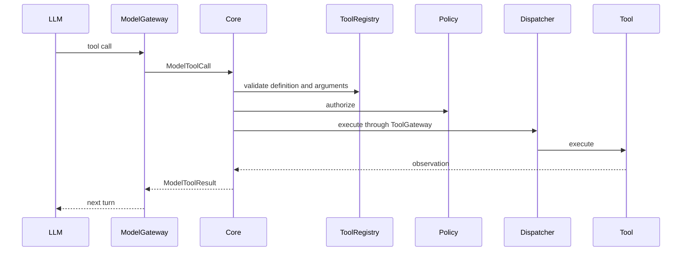

# Real Tool Calling

Tool calling is provider-neutral. A model may propose a `ModelToolCall`, but
the model never receives a registry handle and never executes code.

The existing `RegistryToolGateway` remains the dispatcher and performs
definition, required-field, and primitive-type validation. `AgentExecutionStrategy`
adds the bounded multi-turn loop around it. Tool calls are accepted only when
the agent allow-list and `PolicyGateway` authorize them.

Each call emits requested, authorized/rejected, result, and final-response
events with the existing trace, task, and execution references. Unknown tools,
policy denials, tool failures, and malformed arguments fail through the normal
execution lifecycle rather than executing directly.

The loop has hard limits of 16 calls and 8 rounds. These bounds are deliberate
safe defaults and prevent an unbounded model/provider loop.

The neutral conversation history is translated at the provider boundary:
OpenAI uses an assistant message with `tool_calls` followed by `tool` messages;
Anthropic uses assistant `tool_use` blocks followed by user `tool_result`
blocks; Ollama uses `/api/chat` messages and its function tool format. Core
code does not contain any of those provider-specific names.
