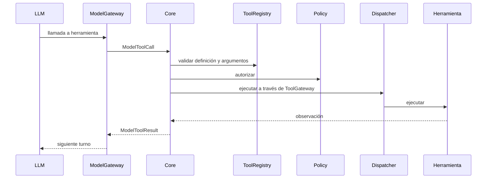

# Llamada a Herramientas Real

La llamada a herramientas (Tool calling) es neutral al proveedor. Un modelo puede proponer una `ModelToolCall`, pero
el modelo nunca recibe un manejador (handle) del registro y nunca ejecuta código.

```mermaid
sequenceDiagram
  participant L as LLM
  participant G as ModelGateway
  participant C as Core
  participant R as ToolRegistry
  participant P as Policy
  participant D as Dispatcher
  participant T as Herramienta
  L->>G: llamada a herramienta
  G->>C: ModelToolCall
  C->>R: validar definición y argumentos
  C->>P: autorizar
  C->>D: ejecutar a través de ToolGateway
  D->>T: ejecutar
  T-->>C: observación
  C-->>G: ModelToolResult
  G-->>L: siguiente turno
```

El actual `RegistryToolGateway` permanece como el despachador (dispatcher) y realiza
la validación de definición, campos requeridos y tipos primitivos. `AgentExecutionStrategy`
añade el ciclo multi-turno delimitado alrededor de él. Las llamadas a herramientas se aceptan solo cuando
la lista blanca (allow-list) del agente y el `PolicyGateway` las autorizan.

Cada llamada emite eventos de solicitada, autorizada/rechazada, resultado y respuesta-final
con las referencias existentes de traza, tarea y ejecución. Herramientas desconocidas,
denegaciones por políticas, fallos de herramientas y argumentos malformados fallan a través del ciclo de vida normal de ejecución en lugar de ejecutarse directamente.

El ciclo tiene límites estrictos de 16 llamadas y 8 rondas. Estos límites son defaults
deliberadamente seguros y previenen un ciclo infinito modelo/proveedor.

El historial neutral de conversación se traduce en la frontera del proveedor:
OpenAI usa un mensaje de asistente con `tool_calls` seguido por mensajes `tool`;
Anthropic usa bloques de asistente `tool_use` seguidos por bloques de usuario `tool_result`;
Ollama usa mensajes `/api/chat` y su formato de herramienta de funciones. El código del
Core no contiene ninguno de esos nombres específicos de proveedor.
