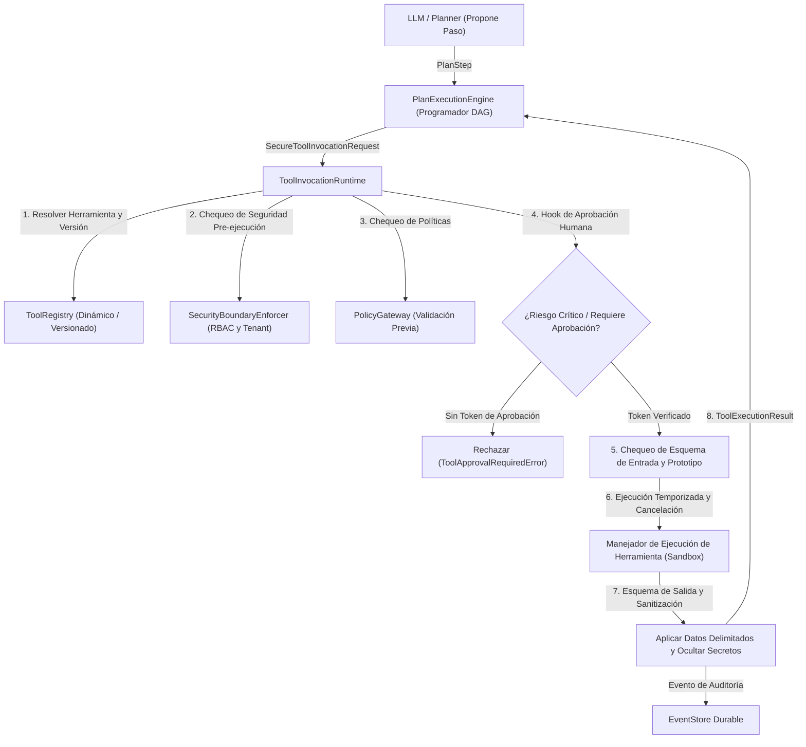

# Registro de Herramientas Dinámico y Runtime de Invocación de Herramientas

## 1. Visión General y Principio Arquitectónico

En la AI Operating Platform, la relación entre los modelos de IA y la ejecución está gobernada por la invariante fundamental:

> **El Modelo PROPONE ──► El Validador VERIFICA ──► La Política AUTORIZA ──► El Runtime EJECUTA**

Los modelos nunca ejecutan herramientas directamente. La ejecución de herramientas es manejada por el `ToolInvocationRuntime` determinístico y delimitado, operando sobre un `ToolRegistry` versionado y aislado.

---

## 2. Registro Dinámico de Herramientas (`ToolRegistry`)

El `InMemoryToolRegistry` proporciona registro dinámico versionado y descubrimiento seguro de herramientas de plataforma.

### Capacidades Clave:
- **Versionado Semántico**: Soporta múltiples versiones por `toolId` (ej., `calculator@1.0.0`, `calculator@2.0.0`). Consultar sin una versión resuelve a la última versión registrada.
- **Protección contra Duplicados**: Registrar de nuevo la misma tupla `(toolId, version)` arroja un error `ToolAlreadyExistsError`.
- **Desregistro Dinámico**: `unregister(toolId, version?)` elimina versiones específicas o todas las versiones de una herramienta.
- **Descubrimiento Público Seguro**: `discoverSafeDefinitions(securityContext)` elimina todos los metadatos sensibles (`apiKey`, `endpoint`, `secrets`, `credentials`) y filtra las definiciones basadas en permisos del llamador y aislamiento de tenant.
- **Validación de Esquema**: Valida las entradas contra definiciones de esquema JSON y rechaza campos extra o que no coinciden en modo fail-closed.

---

## 3. Runtime de Invocación de Herramientas (`ToolInvocationRuntime`)

Toda invocación de herramienta se ejecuta a través de un pipeline seguro de 8 etapas:

1. **Resolución**: Busca la herramienta en el `ToolRegistry` por `toolId` y `version` (opcional). Lanza `ToolNotFoundError` o `ToolVersionNotFoundError` si falta.
2. **Autorización**: Evalúa la identidad del llamador estrictamente desde `SecurityContext` a través de `SecurityBoundaryEnforcer.enforceToolBoundary` (o fallback a RBAC).
3. **Pre-vuelo de Policy Gateway**: Ejecuta la evaluación de política contra restricciones de tenant, límites de operación y niveles de riesgo.
4. **Aprobación Humana (Human-in-the-Loop)**: Las herramientas con `riskLevel: "CRITICAL"` o `requiresApproval: true` requieren un `approvalToken` válido y no vacío. Tokens ausentes desencadenan `ToolApprovalRequiredError` y emiten `tool.approval_required`.
5. **Validación de Entrada y Guardia de Seguridad**:
   - Inspecciona a profundidad las entradas contra polución de prototipos (`__proto__`, `constructor`, `prototype`).
   - Rechaza propiedades de esquema no permitidas y desajustes de tipos.
   - Impone `MAX_TOOL_INPUT_SIZE` (64KB).
6. **Ejecución Delimitada y Cancelación**:
   - Impone tiempos de espera de ejecución por herramienta (por defecto 30s, máximo 300s).
   - Escucha el `CancellationToken` antes de la invocación y durante la ejecución.
7. **Validación de Salida y Sanitización**:
   - Valida las salidas contra su `outputSchema` declarado.
   - Trunca payloads excesivamente grandes (`MAX_TOOL_OUTPUT_SIZE = 1MB`).
   - Congela profundamente (deep freeze) la salida y redacta recursivamente credenciales y tokens.
8. **Rastro de Auditoría**: Emite eventos de dominio estructurados (`tool.invocation.requested`, `tool.authorized`, `tool.rejected`, `tool.execution.timed_out`, `tool.execution.cancelled`).

---

## 4. Motor de Ejecución de Plan (`PlanExecutionEngine`)

El `PlanExecutionEngine` toma un `Plan` validado como DAG y coordina la ejecución secuencial y concurrente de los pasos.

### Garantías de Ejecución:
- **Recorrido Topológico**: Los pasos se ejecutan solo después de que todas las `dependencies` declaradas hayan finalizado con éxito (`COMPLETED`).
- **Propagación de Dependencia de Salida**: Las entradas de los pasos pueden referenciar salidas previas usando expresiones estándar (ej. `_dep_step1.value`), las cuales se resuelven automáticamente a partir de los resultados de los predecesores.
- **Cascada de Fallos**: Cuando un paso falla y tiene `allowPartialBranchFailure: false`, los pasos dependientes subsiguientes se marcan como `SKIPPED` y la ejecución hace transición a `FAILED`.
- **Propagación de Cancelación**: Cuando un `CancellationToken` se cancela, los pasos en curso se abortan y los pasos pendientes se marcan como `CANCELLED`.
