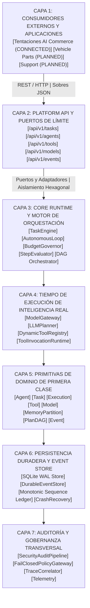

# AI Operating Platform — Mapa Maestro Visual v1

## 1. Resumen Ejecutivo e Invariante Arquitectónica

La **AI Operating Platform** es un tiempo de ejecución operativo autónomo de grado empresarial. Está diseñado alrededor de la separación fundamental de responsabilidades:

$$\text{CORE ENGINE} \neq \text{PLATFORM PRODUCT} \neq \text{APPLICATIONS}$$

El **Mapa Maestro Visual** proporciona una topología de ingeniería completa, de arriba a abajo, de las siete capas arquitectónicas. Muestra sus límites de comunicación y las infografías de activos físicos que documentan la plataforma.

---

## 2. Las 7 Capas Arquitectónicas Canónicas

---

## 3. Estado de Construcción y Verificación de Subsistemas

| Subsistema / Capa | Interfaces Centrales | Estado de Construcción | Verificación |
| :--- | :--- | :--- | :--- |
| **Capa 1: Aplicaciones** | `TentacionesPlatformAdapter`, `PlatformClient` | **HEALTHY / CONNECTED** | Contrato de Cliente REST Completo |
| **Capa 2: Platform API** | `HttpServer`, `PlatformClient`, `Router` | **HEALTHY / ONLINE** | Endpoints 100% Verificados |
| **Capa 3: Core Runtime** | `TaskEngine`, `AutonomousLoop`, `Budget` | **HEALTHY / ONLINE** | Límites de Presupuesto con Fallo Cerrado |
| **Capa 4: Inteligencia** | `ModelGateway`, `LLMPlanner`, `ToolRegistry` | **HEALTHY / ONLINE** | Endurecido contra Adversarios |
| **Capa 5: Modelos de Dominio**| `Agent`, `Task`, `Execution`, `Tool`, `Model` | **HEALTHY / ONLINE** | Transiciones de Estado Inmutables |
| **Capa 6: Persistencia** | `SqliteEventStore`, `CrashRecoveryService` | **HEALTHY / ONLINE** | Rehidratación WAL Verificada |
| **Capa 7: Gobernanza** | `PolicyEvaluator`, `AuditLogger`, `Telemetry` | **HEALTHY / ONLINE** | Correlación Completa de Trazas |

---

## 4. Catálogo de Infografías de Planos Visuales

Los activos de ingeniería de la plataforma incluyen diagramas técnicos de alta resolución ubicados en `src/platform/web/assets/blueprints/`:

1. **`00_mapa_completo_sistema.jpg`** — Mapa Maestro del Sistema y Topología de Interacción de Componentes.
2. **`01_arquitectura_hexagonal.jpg`** — Arquitectura Hexagonal de Puertos y Adaptadores y Reglas de Dependencia.
3. **`02_motor_orquestacion.jpg`** — Bucle de Ejecución Autónoma, Programador de Pasos y Gobernador de Presupuesto.
4. **`03_model_gateway_planner.jpg`** — Protocolo de Pasarela de Modelo, Planificador LLM y Llamada Estructurada a Herramientas.
5. **`04_gobernanza_seguridad.jpg`** — Verificación de Políticas de Fallo Cerrado, Endurecimiento contra Adversarios y Libro Mayor de Auditoría.
6. **`05_event_store_wal.jpg`** — Almacén de Eventos SQLite WAL de Solo Adición con Números de Secuencia Monótonos.
7. **`06_integracion_tentaciones.jpg`** — Integración de Consumidor Externo: Contrato de Tentaciones AI Commerce.

---

## 5. Invariantes de Seguridad y DOM

- **Cero Acoplamiento**: Ningún script de navegador importa primitivas de dominio o bases de datos SQLite directamente.
- **Cero Inyección HTML Cruda**: 0 `innerHTML`, 0 `outerHTML`, 0 `eval`, 0 `document.write`.
- **Transporte Tipado**: Todas las comunicaciones de la API usan sobres estándar `{ success, data, error, traceId }`.
