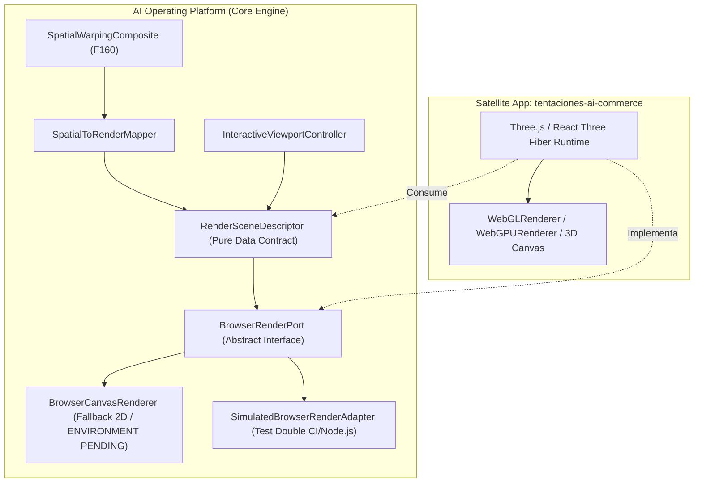
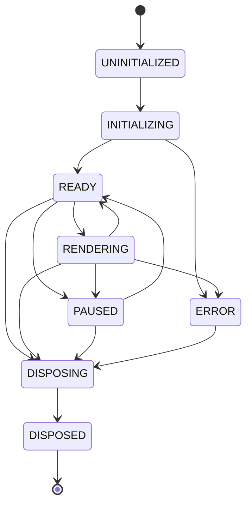

# PROJ-01: TENTACIONES AI COMMERCE — FASE 161

## Browser Render Boundary, Canvas Adapter & Interactive 3D Try-On Scene

```text
================================================================================
AI OPERATING PLATFORM — CANONICAL TECHNICAL REPORT
================================================================================
Fase Funcional:         FASE 161 — PROJ-01 Tentaciones AI Commerce
Componente:             Browser Render Boundary, Canvas Adapter & Interactive 3D Scene
Estado Técnico:         DONE
Estado Operativo:       DONE
Línea de Evidencia:     IMPLEMENTED + SIMULATED VERIFIED (E2..E4)
Estado en Navegador:    ENVIRONMENT PENDING (Hardware WebGL/Canvas físico)
Dependencias 3D:        ZERO RUNTIME DEPENDENCIES en Core Engine (Three.js aislado en satélite)
Fecha:                  2026-10-02
================================================================================
```

---

## 1. Resumen Ejecutivo y Alcance

La **Fase 161** establece formalmente la frontera de renderizado browser (*Browser Render Boundary*), el adaptador de canvas desacoplado y el modelo de escena interactiva 3D para el sistema de prueba virtual (*Virtual Try-On - VTO*) de **PROJ-01: Tentaciones AI Commerce**.

Esta fase toma el resultado espacial neutral producido por el compositor de deformación continua de la Fase 160 (`SpatialWarpingComposite`) y lo traduce en descriptores de escena 3D completamente agnósticos del motor concreto de renderizado (`RenderSceneDescriptor`), habilitando:

1. **Desacoplamiento Estricto**: Cero dependencias de runtime 3D en el núcleo de la plataforma (`ai-operating-platform`). La integración concreta con `Three.js` o motores 3D vive en la aplicación satélite consumidora (`tentaciones-ai-commerce`).
2. **Transformación Determinista de 5 Espacios de Coordenadas**: Desde las coordenadas del sensor de video hasta los píxeles del viewport de pantalla, resolviendo la inversión vertical de WebGL y el espejo de cámara selfie.
3. **Generación Determinista de Geometría de Deformación**: Construcción de mallas triangulares 3D continuas a partir de campos de desplazamiento `WarpField2D` (Fase 155), excluyendo completamente *Thin-Plate Splines (TPS)*.
4. **Interacción de Viewport Aislada en $O(1)$**: Control de cámara (zoom, rotación, paneo, órbita y reset) independiente del pipeline pesado de visión computacional e inferencia.
5. **Máquina de Estados de Ciclo de Vida y Cero Fugas de Memoria**: Control de ciclo de vida con registro y liberación determinista de recursos GPU/Canvas (`DisposalReceipt`).
6. **Protección contra Sobrescritura de Resultados Obsoletos**: Rechazo a nivel del adaptador de render cuando arriban resultados rezagados (`sequenceNumber <= latestRenderedSequenceNumber`).

---

## 2. Política de Dependencias y Frontera Arquitectónica

Siguiendo las directrices canónicas de arquitectura hexagonal y la regla de **cero dependencias de producción externas** en el Core Engine:



### Invariantes de Dependencia:
1. `package.json` de `ai-operating-platform` mantiene **cero** librerías 3D (`three`, `@react-three/fiber`, `babylonjs`, `playcanvas`).
2. `src/domain/vto/` contiene **cero** referencias al DOM (`window`, `document`, `HTMLCanvasElement`), contextos WebGL o Three.js.
3. El Core Engine expone estructuras de datos inmutables y puertos abstractos (`BrowserRenderPort`), permitiendo que cualquier tecnología gráfica consuma la escena sin acoplar el núcleo.

---

## 3. Contratos de Dominio y los 5 Espacios de Coordenadas

El dominio modela con precisión matemática las transiciones entre los 5 espacios espaciales del sistema VTO:

```mermaid
flowchart LR
    S1["1. IMAGE_SPACE\n[0..W, 0..H]\n(Y-down)"] -->|imageToNormalized| S2["2. NORMALIZED_SPACE\n[0.0..1.0, 0.0..1.0]\n(UV canonical)"]
    S2 -->|WarpField2D| S3["3. VTO_SPATIAL_SPACE\n(Continuous Grid Deformation)"]
    S3 -->|normalizedToScene3D\n(Flip Y, Mirror X)| S4["4. SCENE_3D_SPACE\n[-1.0..1.0, -1.0..1.0]\n(Y-up WebGL NDC)"]
    S4 -->|scene3DToViewport| S5["5. VIEWPORT_SCREEN_SPACE\n[0..viewW, 0..viewH]\n(Device Pixels)"]
    S5 -->|viewportToScene3D\n(Unproject)| S4
```

### Características de la Transformación:
* **Inversión del Eje Y**: En coordenadas de imagen y UV, $(0,0)$ se encuentra en la esquina superior izquierda ($Y$ crece hacia abajo). En WebGL y Three.js, el origen está en el centro o la esquina inferior ($Y$ crece hacia arriba). `SpatialCoordinateTransformer.normalizedToScene3D` implementa:
  $$y_{3D} = 1.0 - 2.0 \cdot v$$
* **Espejo de Cámara Selfie**: Invierte el eje horizontal cuando `isMirrored = true`:
  $$x_{3D} = - (2.0 \cdot u - 1.0)$$
* **Desproyección Bidireccional (Unproject)**: Convierte toques o clicks en pantalla de regreso al espacio 3D para selección o raycasting con tolerancia $< 10^{-4}$ píxeles.

---

## 4. Mapeo Espacial a Escena (`SpatialToRenderMapper`)

El componente `SpatialToRenderMapper` transforma un `SpatialWarpingComposite` en un `RenderSceneDescriptor` determinista:

1. **Generación de Mallas Triangulares (`generateDeformedMeshGrid`)**:
   * A partir de un `WarpField2D` de $M \times N$ puntos de control, calcula las coordenadas desplazadas:
     $$u' = u + dx(gx, gy), \quad v' = v + dy(gx, gy)$$
   * Mapea cada punto a `SCENE_3D_SPACE`.
   * Genera $(M-1) \times (N-1) \times 2$ triángulos con $(M-1) \times (N-1) \times 6$ índices en `Uint16Array`.
   * Asigna coordenadas UV canónicas de WebGL ($1.0 - v$).
2. **Capas y Jerarquía de Profundidad Canónica**:
   * `BASE`: Fondo de video/cámara (`FULLSCREEN_QUAD`, Z-index 0).
   * `BODY`: Silueta/segmentación anatómica (Z-index 10).
   * `GARMENT`: Malla deformable de la prenda (`DEFORMED_MESH_GRID`, Z-index 20).
   * `OCCLUSION`: Mapa de oclusión dinámica (Z-index 30, modo `MASKED`).
   * `MATERIAL`: Pistas de apariencia PBR (aspereza, brillo metálico, drapeado, Z-index 40).
   * `FINAL_COMPOSITE`: Resumen de metadatos de ensamblaje (Z-index 50).
3. **Pistas de Iluminación y Cámara**:
   * Parámetros de cámara de perspectiva (FOV 45°, near 0.1, far 100).
   * Pistas de luz ambiental y direccional clave para renderizadores PBR.

---

## 5. Controlador de Viewport Interactivo (`InteractiveViewportController`)

Permite al usuario interactuar en tiempo real con la prenda probada en pantalla:

* **Aislamiento Computacional**: Las modificaciones de zoom, paneo, órbita y rotación se ejecutan en $O(1)$ sin disparar el bucle de visión computacional, los modelos neuronales ni el solver de deformación.
* **Límites de Seguridad (Fail-Closed)**:
  * Zoom acotado en el rango $[0.25\times, 4.0\times]$.
  * Inclinación de órbita (pitch) acotada en $[-45^\circ, +45^\circ]$.
  * Guiñada de órbita (yaw) acotada en $[-90^\circ, +90^\circ]$.
  * Normalización modular de ángulo de rotación $[-180^\circ, +180^\circ]$.
* **Restauración Instantánea (`reset`)**: Restablece el viewport a su captura inicial sin pérdida de estado del composite.

---

## 6. Adaptador Periférico `BrowserCanvasRenderer` y Detección de Capacidades

El adaptador de renderizado `BrowserCanvasRenderer` implementa el puerto `BrowserRenderPort`:

```typescript
export interface BrowserRenderPort {
  initialize(targetCanvas?: unknown): Promise<void>;
  renderScene(scene: RenderSceneDescriptor): Promise<RenderFrameResult>;
  resize(width: number, height: number, devicePixelRatio?: number): void;
  getLifecycleState(): SceneLifecycleState;
  getLatestRenderedSequence(): number;
  dispose(): Promise<DisposalReceipt>;
}
```

### Detección Robusta de Entorno:
* **Navegador con WebGL/WebGL2**: Activa el pipeline de aceleración por hardware (`WEBGL`).
* **Navegador con Canvas 2D / OffscreenCanvas**: Activa el trazado de mallas y cuadrículas en modo vectorial (`CANVAS_2D`).
* **Node.js / CI sin DOM ni Hardware**: Reporta explícitamente el modo `ENVIRONMENT_PENDING`, completando el ciclo de forma segura sin arrojar excepciones.
* **Test Double para CI**: `SimulatedBrowserRenderAdapter` ofrece un doble de pruebas determinista que registra frames renderizados, frames descartados y transiciones de estado para verificación E2E.

---

## 7. Máquina de Estados del Ciclo de Vida y Gestión de Recursos

El ciclo de vida de la escena sigue una máquina de estados finita determinista:



### Propiedad de Liberación (Zero Memory Leaks):
* Todos los recursos asignados (geometrías, texturas, materiales, búferes y viewports) se registran en `SceneLifecycleManager`.
* Al llamar a `disposeAll()` o `dispose()`, se invocan los destructores de recursos, se liberan los contextos y se genera un `DisposalReceipt`:
  * `disposedResourceCount`
  * `totalBytesFreedEst`
  * `durationMs`
  * `errors: readonly string[]`
* El estado `DISPOSED` es **terminal**: cualquier intento posterior de registrar recursos o emitir llamadas de dibujo falla cerrado de forma inmediata.

---

## 8. Protección contra Resultados Obsoletos a Nivel de Render

En un pipeline continuo en tiempo real, las tramas pueden procesarse de forma asíncrona fuera de orden. El puerto de renderizado previene cualquier parpadeo visual (*flicker* o *visual tearing*) aplicando el principio rector:

$$\text{LATEST\_VALID\_RESULT} > \text{STALE\_RESULT}$$

1. El adaptador de render registra internamente `latestRenderedSequenceNumber`.
2. Si se presenta una escena con `sequenceNumber <= latestRenderedSequenceNumber` o `isStale === true`:
   * La trama se descarta inmediatamente antes de emitir llamadas de dibujo.
   * Se retorna `RenderFrameResult` con `rendered: false` y motivo `STALE_FRAME_REJECTED`.
   * Se registra la telemetría de descarte sin bloquear el hilo principal.

---

## 9. Verificación de Pruebas Unitarias y Golden Journey E2E

### Pruebas Unitarias (`tests/unit/vto-browser-render-boundary.test.ts`):
* **17 pruebas unitarias** pasando al 100%:
  1. Transformación de coordenadas de imagen a UV normalizado.
  2. Inversión vertical de eje Y hacia espacio 3D WebGL.
  3. Espejo de cámara selfie.
  4. Proyección y desproyección bidireccional pantalla $\leftrightarrow$ espacio 3D.
  5. Transiciones válidas e inválidas de la máquina de estados de ciclo de vida.
  6. Rechazo de transiciones fuera del estado terminal `DISPOSED`.
  7. Registro, rastreo y cálculo de recibo de liberación de recursos.
  8. Mapeo de composite a descriptor de escena con malla triangular `WarpField2D`.
  9. Detección de tramas obsoletas por número de secuencia.
  10. Acotación de zoom interactivo en $[0.25..4.0]$.
  11. Paneo y traslación del viewport.
  12. Normalización de rotación y acotación de ángulos de órbita.
  13. Reset de viewport al estado inicial.
  14. Notificación reactiva a observadores de interacción en $O(1)$.
  15. Detección de capacidad en Node.js headless (`ENVIRONMENT_PENDING`).
  16. Rechazo de tramas obsoletas en `BrowserCanvasRenderer`.
  17. Registro y simulación controlada de fallos en `SimulatedBrowserRenderAdapter`.

### Golden Journeys E2E (`tests/e2e/vto-render-boundary-golden-journey.test.ts`):
* **4 Golden Journeys** integrales pasando al 100%:
  * **GJ-1: Pipeline Completo**: Adquisición de video (F159) $\to$ Bucle Continuo (F160) $\to$ Compositor Espacial $\to$ Mapeador de Render $\to$ Adaptador de Canvas.
  * **GJ-2: Eliminación de Tramas Rezagadas**: Trama $N=2$ renderizada $\to$ Trama $N=1$ arriba tarde y es rechazada (`STALE_FRAME_REJECTED`) $\to$ Trama $N=3$ es aceptada.
  * **GJ-3: Manipulación de Viewport Interactivo**: Zoom $1.5\times$, paneo $(40, -20)$, órbita y espejo sin re-ejecución del bucle de visión computacional. Desproyección de toque en pantalla con fidelidad milimétrica.
  * **GJ-4: Ciclo de Vida y Liberación Cero-Fugas**: Registro de geometrías, texturas y materiales, transición a `DISPOSED`, ejecución de destructores y recibo verificado con 0 recursos residuales.

---

## 10. Conclusiones y Trazabilidad MWP

La **Fase 161** completa exitosamente la frontera de visualización del sistema VTO de la plataforma, conectando el pipeline de inferencia neuronal y deformación espacial continua con la capa de presentación del navegador bajo estricta gobernanza arquitectónica y preservando la regla de cero dependencias en el Core.

* **Estado de la Fase**: `DONE`
* **Tareas 161.1 a 161.6**: Todas completadas con pruebas automatizadas verdes y evidencia verificable.
* **Integración Satélite**: Lista para ser consumida por el componente de Three.js en el repositorio `johangonzahenri/tentaciones-ai-commerce`.
