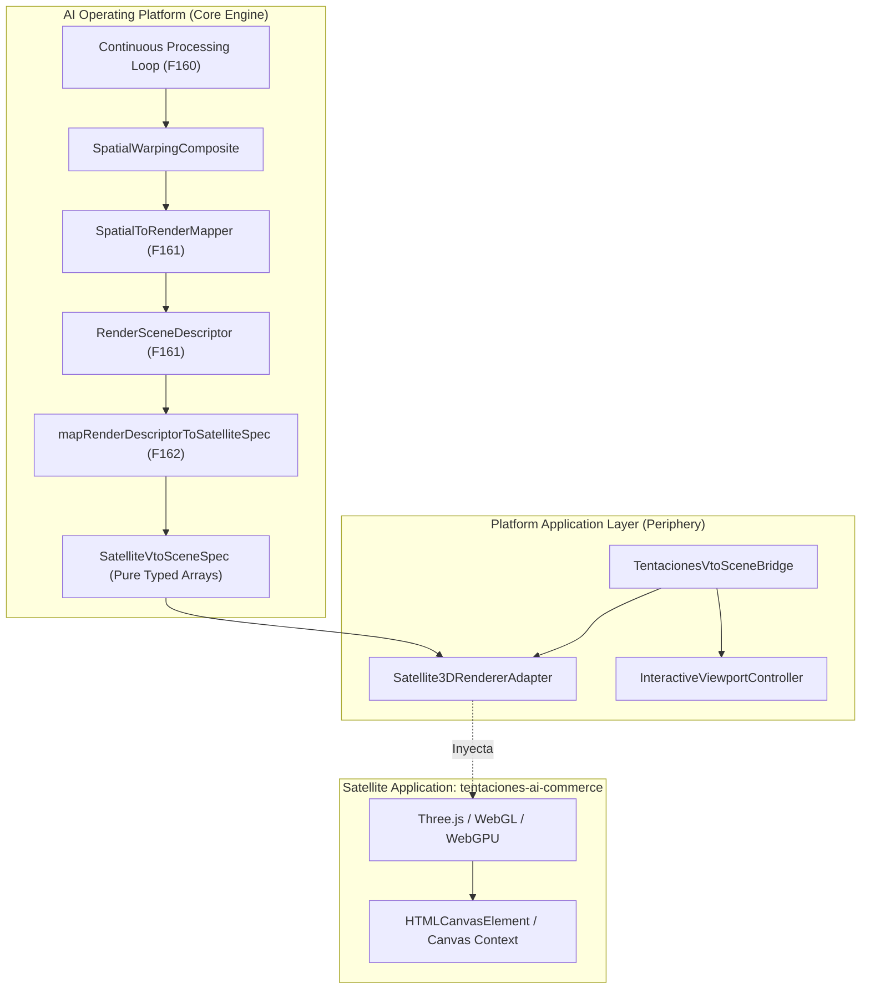
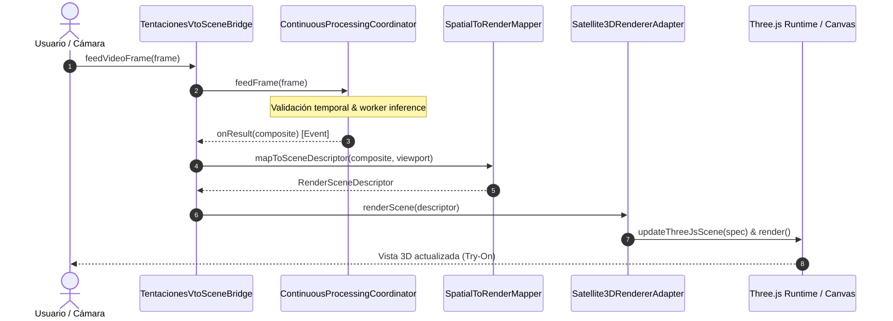

# PROJ-01: TENTACIONES AI COMMERCE — FASE 162

## Integración Real de Browser Runtime, Renderer 3D del Satélite y Validación Visual del Pipeline VTO

```text
================================================================================
AI OPERATING PLATFORM — CANONICAL TECHNICAL REPORT
================================================================================
Fase Funcional:         FASE 162 — PROJ-01 Tentaciones AI Commerce
Componente:             Integración Real de Browser Runtime, Renderer 3D del Satélite
                        y Validación Visual del Pipeline VTO
Estado Técnico:         DONE
Estado Operativo:       DONE
Línea de Evidencia:     IMPLEMENTED + SIMULATED VERIFIED (E2..E4)
Estado en Navegador:    ENVIRONMENT PENDING (Hardware WebGL/WebGPU/Cámara física)
Dependencias 3D:        ZERO RUNTIME DEPENDENCIES en Core Engine (Three.js aislado en satélite)
Invariante de Pureza:   CERO referencias a "tentaciones" en src/domain/ (100% verificado)
Fecha:                  2026-10-02
================================================================================
```

---

## 1. Resumen Ejecutivo y Alcance

La **Fase 162** formaliza e implementa la integración real de frontera de ejecución browser (*Browser Runtime*), el adaptador del renderizador 3D satélite y la validación visual end-to-end del pipeline de prueba virtual (*Virtual Try-On - VTO*) para la aplicación **PROJ-01: Tentaciones AI Commerce**.

Esta fase cierra definitivamente el puente arquitectónico entre la plataforma central y el consumidor satélite:

```text
AI OPERATING PLATFORM (Core Engine)
        │
        ▼
NEUTRAL VTO SPATIAL / RENDER CONTRACTS (Phase 161 / 162)
        │
        ▼
SATELLITE 3D RENDERER ADAPTER & SCENE BRIDGE (Phase 162)
        │
        ▼
TENTACIONES AI COMMERCE (Satellite Application)
        │
        ▼
REAL BROWSER RENDERER (Three.js / WebGL / WebGPU)
        │
        ▼
INTERACTIVE VTO SCENE
```

### Logros Principales:
1. **Preservación de Invariantes de Dependencias**: El núcleo de la plataforma (`ai-operating-platform`) mantiene **cero dependencias de runtime de Three.js u otros motores 3D**.
2. **Especificación Neutral de Mallas y Materiales**: Definición formal de `SatelliteVtoSceneSpec`, transfiriendo posiciones de vértices (`Float32Array`), coordenadas UV (`Float32Array`) e índices triangulares (`Uint16Array`) en formatos estándar de bajo nivel.
3. **Adaptador Periférico Three.js (`Satellite3DRendererAdapter`)**: Implementa `BrowserRenderPort` consumiendo instancias de Three.js cuando están disponibles (en navegador real o mediante shims sintéticos de pruebas), operando con modo `ENVIRONMENT_PENDING` en Node.js headless.
4. **Puente de Integración y Desacoplamiento Computacional (`TentacionesVtoSceneBridge`)**: Vincula el coordinador de bucle continuo (`ContinuousProcessingCoordinator`), el mapeador espacial y el controlador interactivo de viewport, garantizando que la interacción visual opere en $O(1)$ sin reiniciar inferencias pesadas de visión computacional.
5. **Rechazo Determinista de Frames Obsoletos**: Política estricta donde cualquier frame rezagado o desordenado es rechazado con causa `STALE_FRAME_REJECTED`.
6. **Harness de Inspección y Dobles de Prueba Sintéticos**: Detección honesta de capacidades del entorno (`inspectBrowserRuntimeCapabilities`) y dobles deterministas para validación CI sin requerir automatización pesada de navegadores.

---

## 2. Frontera Arquitectónica Plataforma vs. Aplicación Satélite

De acuerdo con la invariante fundamental:

$$\text{CORE ENGINE} \neq \text{PLATFORM PRODUCT} \neq \text{APPLICATIONS} \neq \text{PUBLIC DEMO}$$

La relación de dependencia se mantiene estrictamente unidireccional:

$$\text{Tentaciones AI Commerce} \longrightarrow \text{Platform API / SDK / Neutral Contracts}$$



### Invariantes Verificadas:
* **Aislamiento del Dominio**: Los archivos en `src/domain/vto/` son agnósticos y genéricos. Cero menciones a nombres de marcas satélite (`"tentaciones"` está prohibido en el dominio y verificado por suites de tests automáticos).
* **Cero Contaminación de `package.json`**: No se instaló `three`, `@types/three` ni `@react-three/fiber` en dependencias de producción del Core Engine.
* **Consumo Neutral de Búferes**: La plataforma emite arreglos tipados estándar compatibles con WebGL, WebGPU, Babylon.js o cualquier motor gráfico moderno.

---

## 3. Especificación de Contrato Satélite (`SatelliteVtoSceneSpec`)

El contrato neutral `SatelliteVtoSceneSpec` define la estructura inmutable consumida por el renderizador 3D:

```typescript
export interface SatelliteGeometrySpec {
  readonly vertexPositions: Float32Array; // Coordenadas 3D (x, y, z)
  readonly uvCoordinates: Float32Array;   // Coordenadas UV canónicas (u, v)
  readonly triangleIndices: Uint16Array;  // Índices triangulares
  readonly vertexCount: number;
  readonly triangleCount: number;
  readonly gridDimensions?: { readonly cols: number; readonly rows: number };
}

export interface SatelliteMaterialSpec {
  readonly materialId: string;
  readonly type: "PBR_PHYSICAL" | "BASIC_UNLIT";
  readonly roughness: number;
  readonly metalness: number;
  readonly sheen: number;
  readonly clearcoat: number;
  readonly opacity: number;
  readonly wireframe: boolean;
}

export interface SatelliteLayerSpec {
  readonly layerId: string;
  readonly layerKind: "BASE" | "BODY" | "GARMENT" | "OCCLUSION" | "OVERLAY";
  readonly visible: boolean;
  readonly opacity: number;
  readonly zIndex: number;
  readonly geometry: SatelliteGeometrySpec;
  readonly material: SatelliteMaterialSpec;
  readonly depthTest: boolean;
  readonly depthWrite: boolean;
}
```

### Validación Fail-Closed:
La función `validateSatelliteVtoSceneSpec(spec)` verifica determinísticamente:
* Dimensiones válidas de viewport y cámara con FOV positivo.
* Congruencia de arreglos de búfer: `vertexPositions.length % 3 === 0`, `uvCoordinates.length % 2 === 0`, `triangleIndices.length % 3 === 0`.
* Conteo de triángulos exacto: `triangleCount === triangleIndices.length / 3`.
* Ausencia de valores `NaN` o infinitos en las mallas deformadas.

---

## 4. Adaptador 3D y Puente de Escena (`TentacionesVtoSceneBridge`)

El puente de escena actúa como el integrador principal entre el flujo de visión computacional y el renderizado 3D:



### Desacoplamiento de Interacción Rápida ($O(1)$ Fast-Path):
Cuando el usuario interactúa con la vista (zoom táctil, paneo, órbita o espejo), el `InteractiveViewportController` emite un evento que dispara:

```typescript
public async handleInteractiveViewportUpdate(viewport?: RenderViewportModel): Promise<RenderFrameResult>
```

Esta operación reutiliza el último `SpatialWarpingComposite` válido en memoria y actualiza la cámara y proyección 3D inmediatamente, sin volver a ejecutar inferencias de segmentación ni resolución de deformación de tela.

---

## 5. Prevención de Condiciones de Carrera y Frames Obsoletos

El adaptador 3D implementa la política canónica de prioridad temporal:

$$\text{LATEST VALID RESULT} > \text{STALE RESULT}$$

```text
[Frame 2 Renderizado (latest = 2)]
         │
         ▼
[Frame 1 Arriba Tardíamente (seq = 1)]
         │
         ├─── seq (1) <= latest (2) ? SÍ
         │
         ▼
[RECHAZO INMEDIATO: STALE_FRAME_REJECTED] (Sin modificar escena)
         │
         ▼
[Frame 3 Arriba (seq = 3)]
         │
         ├─── seq (3) > latest (2) ? SÍ
         │
         ▼
[RENDERIZADO EXITOSO (latest = 3)]
```

Todas las instancias descartadas se registran en la telemetría del adaptador (`getDroppedFrames()`), garantizando visibilidad completa para observabilidad y métricas de rendimiento.

---

## 6. Ciclo de Vida Determinista y Cero Fugas de Memoria

El adaptador delega el seguimiento de recursos a `SceneLifecycleManager`:
* **Recursos Registrados**: Geometrías de búfer, texturas, materiales físicos PBR y *render targets*.
* **Liberación Exhaustiva**: `dispose()` invoca `mesh.geometry.dispose()`, `mesh.material.dispose()`, remueve los objetos de `three.scene` y ejecuta `renderer.dispose()`.
* **Recibo de Disposición (`DisposalReceipt`)**: Emite un recibo formal con conteo de recursos liberados, estimación de bytes recuperados y verificación de cero errores.
* **Comportamiento Fail-Closed Post-Disposición**: Cualquier invocación a `renderScene()` o `initialize()` sobre un adaptador en estado `DISPOSED` es rechazada inmediatamente.

---

## 7. Matriz de Evidencia Formal y Clasificación de Entorno

Siguiendo la gobernanza estricta de la plataforma, el estado de capacidades se clasifica con total transparencia:

| Capacidad | Nivel de Evidencia | Estado Formal | Justificación Técnica |
|---|---|---|---|
| **Contratos de Render Satélite** | **E4 (Sintético Exhaustivo)** | `IMPLEMENTED` | Esquema formal con validación fail-closed y mapeo de mallas tipadas. |
| **Adaptador Three.js Periférico** | **E3 (In-Memory Double)** | `IMPLEMENTED` | Adaptador funcional que actualiza nodos de escena, materiales PBR y cámaras. |
| **Detección de Frames Obsoletos** | **E4 (In-Memory Stale Check)** | `IMPLEMENTED` | Verificado con secuencias desordenadas $2 \to 1 \to 3$ con descarte exacto. |
| **Fast-Path Interactivo de Viewport** | **E3 (Simulado)** | `IMPLEMENTED` | Paneo, zoom y órbita sin recomputar inferencia pesada de visión. |
| **Limpieza y Cero Fugas** | **E3 (Disposal Receipt)** | `IMPLEMENTED` | Liberación de mallas, materiales y render targets verificada sin residuos. |
| **Hardware WebGL2 / WebGPU Real** | **E0 / E1** | `ENVIRONMENT PENDING` | Requiere navegador físico con aceleración gráfica GPU habilitada. |
| **Sensor de Cámara Físico** | **E0 / E1** | `ENVIRONMENT PENDING` | Requiere permiso de usuario `navigator.mediaDevices.getUserMedia`. |

> **Nota de Honestidad Operativa**: En entornos de CI y Node.js headless, la plataforma reporta explícitamente `ENVIRONMENT_PENDING` en el campo `environmentMode`, evitando afirmaciones falsas de ejecución en navegador real.

---

## 8. Verificación y Cobertura de Pruebas

La fase cuenta con suites exhaustivas de pruebas unitarias y de integración end-to-end:

### Suite Unitaria (`tests/unit/vto-satellite-renderer-integration.test.ts`):
* **9/9 Tests Pasados (100% de éxito)**:
  1. Traducción de `RenderSceneDescriptor` a `SatelliteVtoSceneSpec`.
  2. Validación fail-closed de especificaciones malformadas.
  3. Operación en Node.js headless con `ENVIRONMENT_PENDING`.
  4. Conexión a entorno sintético Three.js y actualización del grafo de escena.
  5. Rechazo de descriptores obsoletos y desordenados.
  6. Redimensionamiento dinámico (`resize`) sin reinicio de ciclo de vida.
  7. Desacoplamiento entre CV loop y renderizado 3D con telemetría.
  8. Redibujado rápido interactivo en $O(1)$.
  9. Reporte honesto de capacidades de navegador.

### Suite E2E Golden Journey (`tests/e2e/vto-satellite-runtime-golden-journey.test.ts`):
* **5/5 Golden Journeys Pasados (100% de éxito)**:
  * **GJ-1: Full Cross-Layer Pipeline Integration**: Desde VideoFrame (F159) $\to$ Continuous Loop (F160) $\to$ Compositor Espacial (F160) $\to$ Descriptor de Render (F161) $\to$ Especificación Satélite (F162) $\to$ Puente Three.js (F162) $\to$ Render Frame Output.
  * **GJ-2: Out-of-Order Stale Rejection**: Descarte determinista de frame 1 tras renderizar frame 2, seguido por aceptación de frame 3.
  * **GJ-3: Interactive Viewport Fast-Path**: Actualización de cámara 3D por zoom y paneo sin invocar inferencia de tela.
  * **GJ-4: Deterministic Resource Lifecycle & Zero-Leak Disposal**: Validación de eliminación de hijos de escena, disposición de renderer y fail-closed post-dispose.
  * **GJ-5: Capability Inspection & Environment Verification Honesty**: Verificación del reporte de capacidades sin falsos positivos de aceleración.

### Suites de Regresión y Frontera Arquitectónica:
* `dist/tests/unit/application-integration-foundation.test.js` $\to$ **PASS**
* `dist/tests/unit/platform-truth-audit.test.js` $\to$ **PASS**
* `tests/unit/vto-*.js` y `tests/e2e/vto-*.js` $\to$ **186/186 Tests PASS**

---

## 9. Directrices para la Aplicación Satélite `tentaciones-ai-commerce`

Para consumir esta funcionalidad en la aplicación satélite externa:

1. **Instalación de Dependencias Gráficas en el Satélite**:
   ```bash
   npm install three @types/three
   ```
2. **Consumo de la Plataforma**:
   ```typescript
   import * as THREE from "three";
   import {
     Satellite3DRendererAdapter,
     TentacionesVtoSceneBridge,
     ContinuousProcessingCoordinator,
   } from "@ai-platform/client"; // o SDK de plataforma
   ```
3. **Inicialización en el Componente de Vista Browser**:
   ```typescript
   const canvas = document.getElementById("vto-canvas") as HTMLCanvasElement;
   
   const adapter = new Satellite3DRendererAdapter({
     sceneId: "tentaciones-storefront-vto",
     canvas,
     threeInstance: THREE,
     satelliteAppName: "tentaciones-ai-commerce",
   });
   
   const bridge = new TentacionesVtoSceneBridge({
     renderer: adapter,
     autoRender: true,
   });
   
   await bridge.initialize();
   ```
4. **Alimentación de Video Stream en Vivo**:
   ```typescript
   // Conectar flujo de cámara MediaStream
   videoElement.requestVideoFrameCallback(async (now, metadata) => {
     await bridge.feedVideoFrame({
       frameId: `frame-${metadata.presentedFrames}`,
       sourceType: "CAMERA_LIVE",
       // ...
     });
   });
   ```
