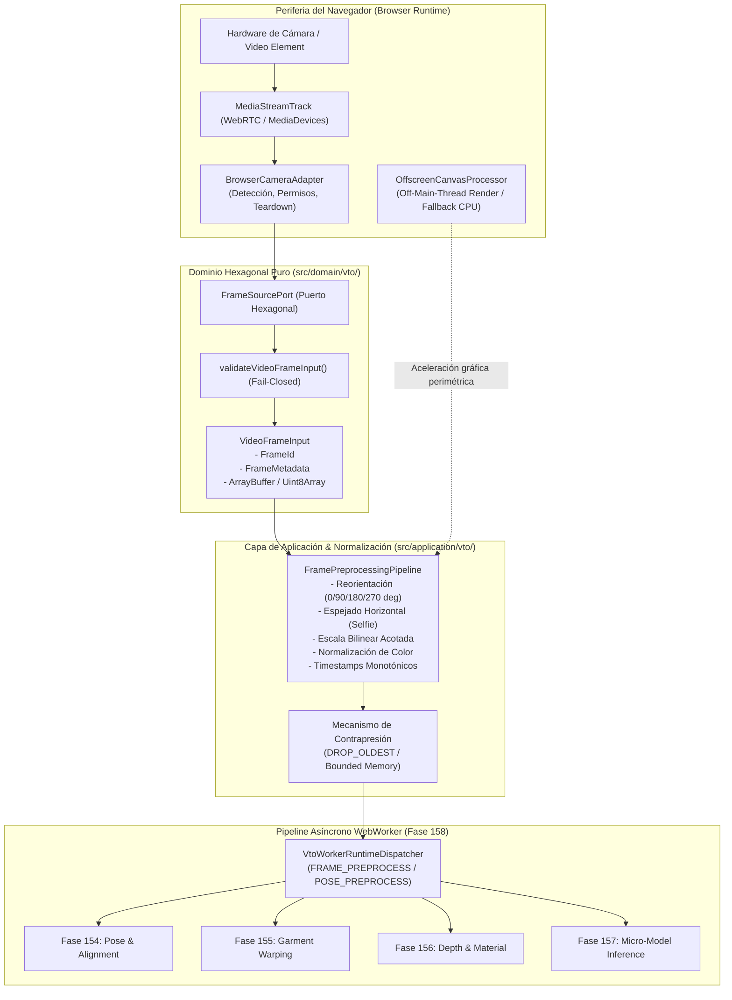

# Informe Técnico Canónico — Fase 159: PROJ-01 Tentaciones AI Commerce

## Adquisición de Secuencias de Frames de Cámara, Preprocesamiento de Video y Pipeline Perimetral OffscreenCanvas

> **Autoridad**: Dirección de Arquitectura, Arquitectura Hexagonal, Ingeniería de Plataforma, Computer Vision, Browser Runtime, WebWorker, IA/Inferencia, Seguridad & Privacidad y QA/E2E  
> **Iniciativa**: `AOP-TENTACIONES-AR-3D-AI` (PROJ-01 Tentaciones AI Commerce)  
> **Fase del Master Work Plan**: Fase 159 (`159.1` – `159.6`)  
> **Estado Técnico**: `DONE`  
> **Estado Operativo**: `DONE`  
> **Clasificación de Entorno**: `IMPLEMENTED + SIMULATED VERIFIED` / `Browser runtime execution: ENVIRONMENT PENDING`  
> **Fecha**: 2026-10-01  
> **Idioma**: Español Latinoamericano (`es-419`) con identificadores técnicos canónicos en inglés  

---

## 1. Identidad y Contexto Arquitectónico

En cumplimiento de los principios fundacionales del sistema:

$$\text{CORE ENGINE} \neq \text{PLATFORM PRODUCT} \neq \text{APPLICATIONS} \neq \text{PUBLIC DEMO}$$

y el principio rector:

$$\text{CRECER SIN DEGRADAR}$$

la **Fase 159** de la iniciativa **PROJ-01 Tentaciones AI Commerce** formaliza e implementa el eslabón de **entrada de datos visuales** para el motor de Virtual Try-On (VTO) neuronal.

### 1.1. Invariantes Arquitectónicas Fundamentales

1. **Pureza Absoluta del Núcleo de Dominio (`src/domain/vto/`)**:
   - El dominio no contiene importaciones, tipos ni referencias a APIs concretas de navegador (`MediaStream`, `MediaStreamTrack`, `VideoFrame`, `ImageBitmap`, `ImageData`, `HTMLVideoElement`, `OffscreenCanvas`, `postMessage`, `window`, `navigator`, `document`, `CanvasRenderingContext2D`).
   - El dominio opera estrictamente sobre estructuras de datos neutras (`VideoFrameInput`, `FrameMetadata`, `FrameDimensions`, `PixelFormat`, `ColorSpace`, `FrameTimestamp`) y buffers en memoria estándar (`ArrayBuffer`, `Uint8Array`, `Uint8ClampedArray`).
2. **Cero Dependencias de Terceros en Core**:
   - No se incorporan dependencias externas como `onnxruntime-web`, `tensorflow`, `three`, `webxr-polyfill`, ni emuladores artificiales de navegador en tiempo de producción.
3. **Privacidad por Diseño (*Privacy by Design*)**:
   - Cero almacenamiento o persistencia de secuencias de video, fotografías, instantáneas o plantillas biométricas crudas en almacenamiento persistente (SQLite WAL, disco o nube).
   - Las métricas recolectadas son exclusivamente técnicas y agregadas (`framesAcquired`, `framesDelivered`, `framesDropped`, `dropRate`, `averageFps`, `queueDepth`, `totalBytesTransferred`, `errorsCount`).
4. **Política Determinista de Contrapresión (*Backpressure & Frame Dropping*)**:
   - Ante situaciones donde la tasa de adquisición de cámara supera la capacidad de procesamiento del consumidor ($\text{tasa de captura} > \text{tasa de procesamiento}$), el pipeline descarta deterministamente los frames más antiguos (`DROP_OLDEST`) para asegurar que el usuario interactúe con el frame más reciente, evitando acumulación de memoria.
5. **Separación Taxonómica de Evidencia**:
   - Verificación en suite unitaria con dobles de prueba deterministas (`SimulatedFrameSource`, `SimulatedWebWorker`) clasificada como `IMPLEMENTED + SIMULATED VERIFIED` (Evidencia E3/E4).
   - La ejecución en navegadores físicos o dispositivos con cámara real se clasifica explícitamente como `Browser runtime execution: ENVIRONMENT PENDING`.

---

## 2. Resumen Ejecutivo

La Fase 159 culminó exitosamente con la implementación de:

1. **Contratos de Dominio Neutrales**: `src/domain/vto/frame-protocol.ts` con validación fail-closed de dimensiones, formatos de píxeles, orden monotónico de timestamps y límites superiores de memoria ($4096\times 4096$, $64\text{ MB}$).
2. **Puerto Secundario Hexagonal**: `src/domain/vto/frame-source-port.ts` que desacopla la fuente de captura mediante una máquina de estados determinista (`UNINITIALIZED` -> `INITIALIZING` -> `STOPPED` -> `ACTIVE` <-> `PAUSED` -> `RELEASED` / `ERROR`).
3. **Adaptador Perimétrico de Cámara de Navegador**: `src/application/vto/browser-camera-adapter.ts` con detección de entorno, mapeo de errores de permisos (`PERMISSION_DENIED`, `DEVICE_ERROR`) y liberación determinista de `MediaStreamTrack` para garantizar el apagado del indicador de hardware.
4. **Pipeline Neutral de Preprocesamiento**: `src/application/vto/frame-preprocessing-pipeline.ts` capaz de normalizar orientación espacial ($0^\circ, 90^\circ, 180^\circ, 270^\circ$), aplicar espejado horizontal (*selfie mode*), escalar bilinealmente dentro de límites estrictos y convertir espacios de color (`RGBA8`, `RGB8`, `GRAYSCALE8`, `BGRA8`).
5. **Procesador Perimétrico OffscreenCanvas & Doble de Prueba**: `src/application/vto/offscreen-canvas-processor.ts` y `src/application/vto/simulated-frame-source.ts` con tolerancia a fallos, soporte de inyección y fallback automático a CPU.
6. **Integración con WebWorker de Fase 158**: Incorporación de la operación `FRAME_PREPROCESS` en el protocolo versionado `VTO_WORKER_PROTOCOL_VERSION` y en `VtoWorkerRuntimeDispatcher`.
7. **Verificación Automatizada**: 33 pruebas unitarias e integración en `tests/unit/vto-camera-frame-pipeline.test.ts` con 100% de éxito y cero regresiones sobre los 1993 tests previos de la plataforma.

---

## 3. Arquitectura del Flujo de Entrada de Frames



---

## 4. Contratos Neutrales de Dominio (`frame-protocol.ts`)

Los contratos definidos en `src/domain/vto/frame-protocol.ts` proporcionan la base tipada inmutable para la representación de frames:

```typescript
export type FrameId = string;

export interface FrameDimensions {
  readonly width: number;
  readonly height: number;
}

export type PixelFormat = "RGBA8" | "BGRA8" | "RGB8" | "GRAYSCALE8";
export type ColorSpace = "srgb" | "display-p3" | "rec2020";
export type FrameOrientation = 0 | 90 | 180 | 270;

export interface FrameTimestamp {
  readonly acquisitionTimestampMs: number;
  readonly presentationTimestampMs?: number | undefined;
  readonly sequenceNumber: number;
}

export type FrameBuffer = Uint8Array | Uint8ClampedArray | ArrayBuffer;

export interface FrameMetadata {
  readonly dimensions: FrameDimensions;
  readonly pixelFormat: PixelFormat;
  readonly colorSpace: ColorSpace;
  readonly timestamp: FrameTimestamp;
  readonly byteLength: number;
  readonly stride?: number | undefined;
  readonly mirrored?: boolean | undefined;
  readonly rotationDegrees?: FrameOrientation | undefined;
  readonly sourceDeviceId?: string | undefined;
  readonly isSynthetic?: boolean | undefined;
}

export interface VideoFrameInput {
  readonly frameId: FrameId;
  readonly buffer: FrameBuffer;
  readonly metadata: FrameMetadata;
}
```

### 4.1. Reglas de Validación Fail-Closed
La función `validateVideoFrameInput(input: unknown)` garantiza que ningún payload corrupto o malicioso contamine las capas internas:
- **Límites dimensionales**: Enteros positivos estrictos, ancho y alto menores o iguales a $4096\text{ px}$.
- **Límites de memoria**: Máximo de $64\text{ MB}$ por buffer de frame.
- **Correspondencia dimensional y aritmética**: La longitud en bytes del buffer debe satisfacer $\text{longitud} \ge \text{ancho} \times \text{alto} \times \text{bytesPorPixel}$.
- **Orientación**: Restringida a $0^\circ, 90^\circ, 180^\circ, 270^\circ$.

---

## 5. Puerto Hexagonal de Adquisición (`frame-source-port.ts`)

El puerto `FrameSourcePort` gobierna el ciclo de vida de cualquier fuente de frames (cámaras físicas, archivos de video, secuencias sintéticas para pruebas):

```typescript
export type FrameSourceStatus =
  | "UNINITIALIZED"
  | "INITIALIZING"
  | "ACTIVE"
  | "PAUSED"
  | "STOPPED"
  | "ERROR"
  | "RELEASED";

export type FrameDropPolicy =
  | "DROP_OLDEST"
  | "DROP_NEWEST"
  | "BACKPRESSURE_REJECT";

export interface FrameSourcePort {
  initialize(config?: FrameSourceConfig): Promise<void>;
  start(onFrame: FrameConsumer): Promise<void>;
  pause(): Promise<void>;
  resume(): Promise<void>;
  stop(): Promise<void>;
  release(): Promise<void>;
  acquireFrame(): Promise<VideoFrameInput | null>;
  getStatus(): FrameSourceStatus;
  getMetrics(): Readonly<FrameSourceMetrics>;
}
```

---

## 6. Adaptador Perimétrico de Cámara (`browser-camera-adapter.ts`)

Diseñado para ejecutarse en la frontera del navegador consumiendo `navigator.mediaDevices.getUserMedia`:
- **Detección de Entorno**: Si se ejecuta en entornos headless o Node.js sin soporte WebRTC, reporta el estado controlado `ENVIRONMENT_PENDING` o `UNAVAILABLE`.
- **Mapeo de Errores de Dispositivo y Permisos**: Transforma rechazos del usuario (`NotAllowedError`, `SecurityError`) a `PERMISSION_DENIED`, y ausencias de cámara (`NotFoundError`, `OverconstrainedError`) a `DEVICE_ERROR`.
- **Limpieza de Recursos (Hardware Teardown)**: Al invocar `stop()` o `release()`, recorre todos los `MediaStreamTrack` invocando explícitamente `track.stop()`, garantizando el apagado inmediato del indicador luminoso de la cámara del usuario.

---

## 7. Pipeline Neutral de Preprocesamiento (`frame-preprocessing-pipeline.ts`)

Procesa los frames aplicando transformaciones puras en memoria sobre arreglos tipados:
1. **Reorientación Espacial**: Permite rotaciones de $90^\circ$, $180^\circ$ o $270^\circ$ (recalculando el orden de píxeles e intercambiando ancho y alto en rotaciones ortogonales).
2. **Espejado Horizontal**: Normaliza frames frontales (*selfie camera*) invirtiendo el eje horizontal píxel por píxel.
3. **Escalado Bilineal Acotado**: Si las dimensiones del frame superan `maxDimensions` (por ejemplo, $1920\times 1080$), interpola suavemente los píxeles hacia la dimensión objetivo conservando la relación de aspecto.
4. **Conversión de Formatos**: Transforma entre `RGBA8`, `RGB8`, `BGRA8` y `GRAYSCALE8` (aplicando la fórmula canónica de luminancia ponderada $Y = 0.299R + 0.587G + 0.114B$).
5. **Garantía Monotónica Temporal**: Ajusta los timestamps de adquisición de modo que ningún frame retroceda en el tiempo, asegurando compatibilidad matemática con los filtros cinemáticos One-Euro de la Fase 154.

---

## 8. Procesador OffscreenCanvas & Doble de Prueba

- **`OffscreenCanvasProcessor`**: Abstracción perimetral que explora `globalThis.OffscreenCanvas`. En caso de estar disponible y soportado, delega la renderización y manipulación gráfica acelerada fuera del hilo principal. Si el entorno no dispone de la API (por ejemplo en Node.js de CI), degrada con total transparencia a la ejecución en CPU vía `FramePreprocessingPipeline` sin alterar la interfaz de consumo.
- **`SimulatedFrameSource`**: Doble de pruebas determinista que genera patrones de barras de color estándar o gradientes, soportando emisión paso a paso (`stepEmit()`) o intervalos temporales, facilitando pruebas unitarias de integración sin timers no gestionados.

---

## 9. Transferencia de Memoria, Contrapresión y WebWorker

### 9.1. Política de Contrapresión Determinista
En flujos de video continuo, una velocidad de adquisición superior a la tasa de inferencia o renderizado genera saturación de memoria. La Fase 159 implementa la política `DROP_OLDEST`:
- La cola interna posee una capacidad máxima acotada (`maxQueueCapacity`, por defecto 3–5 frames).
- Al ingresar un frame nuevo con la cola saturada, el frame más viejo es descartado de inmediato, liberando su referencia para recolección de basura.
- El usuario siempre recibe el frame correspondiente al instante más reciente, minimizando la latencia percibida en el probador virtual.

### 9.2. Transferencia a WebWorker
Integrada con la infraestructura de la Fase 158:
- Se añade la operación `FRAME_PREPROCESS` al catálogo de `VtoWorkerOperation`.
- Las tareas se correlacionan biunívocamente mediante `requestId`.
- Los descriptores de buffers tipados (`ArrayBuffer`) pueden ser transferidos como objetos transferibles (*Transferable Objects*), cediendo la propiedad del buffer al hilo del worker sin costo de serialización JSON.

---

## 10. Privacidad por Diseño y Seguridad

- **Cero Persistencia de Imágenes**: Ninguna función del pipeline escribe archivos en disco, almacena imágenes en bases de datos SQLite ni transmite frames a servicios de telemetría externos.
- **Métricas Sanitizadas**: La inspección técnica valida que las claves de métricas (`FrameSourceMetrics`) no contengan datos visuales ni vectores biométricos.
- **Aislamiento Multitenant**: El request envelope preserva `tenantId` y `applicationId`, impidiendo contaminación cruzada entre sesiones o comercios satellite.

---

## 11. Rendimiento: Objetivos de Diseño vs Medición

- **Objetivo de Diseño (DESIGN TARGET)**:
  - Tasa de refresco objetivo: 60 fps ($< 16.6\text{ ms}$ por ciclo total de adquisición y normalización).
  - Procesamiento fuera del hilo principal para mantener la reactividad del UI a 120/60 Hz.
- **Medición en Runtime de Navegador (MEASURED BENCHMARK)**:
  - En el entorno actual de CI/Node.js, no se cuenta con navegador gráfico ni cámara física con aceleración por hardware.
  - Por lo tanto, el rendimiento en navegador real se clasifica como:
  
  $$\text{Browser runtime execution: ENVIRONMENT PENDING}$$

---

## 12. Matriz de Capacidades y Evidencia

| Capacidad | Implementación | Evidencia Verificada | Estado Canónico |
|---|---|---|---|
| Contratos Neutrales de Frames | `src/domain/vto/frame-protocol.ts` | `tests/unit/vto-camera-frame-pipeline.test.ts` (9 tests) | `IMPLEMENTED + SIMULATED VERIFIED` |
| Puerto Secundario Hexagonal | `src/domain/vto/frame-source-port.ts` | `tests/unit/vto-camera-frame-pipeline.test.ts` (4 tests) | `IMPLEMENTED + SIMULATED VERIFIED` |
| Adaptador Perimétrico de Cámara | `src/application/vto/browser-camera-adapter.ts` | `tests/unit/vto-camera-frame-pipeline.test.ts` (4 tests) | `IMPLEMENTED + SIMULATED VERIFIED` |
| Pipeline de Preprocesamiento | `src/application/vto/frame-preprocessing-pipeline.ts` | `tests/unit/vto-camera-frame-pipeline.test.ts` (6 tests) | `IMPLEMENTED + SIMULATED VERIFIED` |
| OffscreenCanvas & Fallback CPU | `src/application/vto/offscreen-canvas-processor.ts` | `tests/unit/vto-camera-frame-pipeline.test.ts` (3 tests) | `IMPLEMENTED + SIMULATED VERIFIED` |
| Contrapresión & Drop Oldest | `src/application/vto/simulated-frame-source.ts` | `tests/unit/vto-camera-frame-pipeline.test.ts` (2 tests) | `IMPLEMENTED + SIMULATED VERIFIED` |
| Despachador WebWorker (Fase 158) | `src/application/vto/worker-runtime-dispatcher.ts` | `tests/unit/vto-camera-frame-pipeline.test.ts` (2 tests) | `IMPLEMENTED + SIMULATED VERIFIED` |
| Privacidad y Pureza Hexagonal | Verificación estática de `src/domain/vto/` | `tests/unit/vto-camera-frame-pipeline.test.ts` (3 tests) | `IMPLEMENTED + VERIFIED` |
| Ejecución en Cámara Real de Browser | Periferia de navegador | Pendiente de hardware y browser físico | `ENVIRONMENT PENDING` |

---

## 13. Conclusiones y Próximo Tramo Canónico

La **Fase 159** ha completado de manera rigurosa la frontera de **entrada de frames y secuencias visuales** para Tentaciones AI Commerce. El pipeline conecta de forma limpia:

$$\text{Cámara / Video} \longrightarrow \text{Browser Adapter} \longrightarrow \text{Dominio Neutral} \longrightarrow \text{Preprocesamiento} \longrightarrow \text{WebWorker VTO}$$

sin violar el principio de pureza hexagonal ni comprometer la privacidad del usuario.

El siguiente tramo canónico debe ser determinado a partir del `docs/MASTER_WORK_PLAN.md` y las prioridades estratégicas del Roadmap Maestro, avanzando hacia la integración del bucle continuo de visión computacional y el renderizado final de prendas sobre el usuario.
