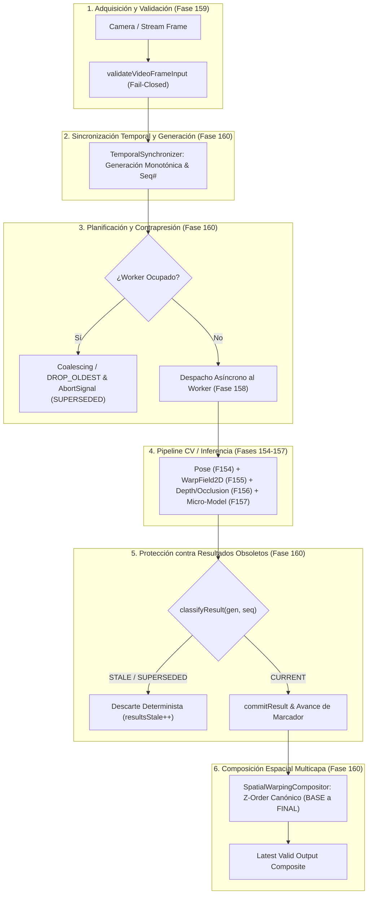

# PROJ-01: TENTACIONES AI COMMERCE — FASE 160

## Real-Time Computer Vision Continuous Processing Loop, Frame Temporal Synchronization & Spatial Warping Compositor

```text
================================================================================
AI OPERATING PLATFORM — CANONICAL TECHNICAL REPORT
================================================================================
Fase Funcional:         FASE 160 — PROJ-01 Tentaciones AI Commerce
Componente:             Real-Time CV Continuous Processing Loop & Spatial Compositor
Estado Técnico:         DONE
Estado Operativo:       DONE
Línea de Evidencia:     IMPLEMENTED + SIMULATED VERIFIED (E2..E4)
Estado en Navegador:    ENVIRONMENT PENDING (Hardware GPU / Cámara física)
Resolución de Hallazgo: HAL-005 (TECHNICAL_DEBT) RESUELTO
Fecha:                  2026-10-02
================================================================================
```

---

## 1. Resumen Ejecutivo y Resolución de Deuda Técnica (HAL-005)

La **Fase 160** formaliza e implementa la infraestructura de ciclo continuo de visión computacional, sincronización temporal y composición espacial sobre el dispositivo para el subsistema de prueba virtual (*Virtual Try-On - VTO*) de **PROJ-01: Tentaciones AI Commerce**.

Esta fase resuelve de forma directa y concluyente la deuda técnica identificada en la auditoría transversal `AUD-FASE-001`:

> **HAL-005 (`TECHNICAL_DEBT`)**: *Ausencia de un bucle continuo de procesamiento en tiempo real que sincronice automáticamente la llegada de frames con la deformación y composición espacial sin depender de avance manual paso a paso.*

A través de la Fase 160, el flujo de procesamiento se transforma de un conjunto de etapas estáticas aisladas a un **pipeline continuo, determinista y reactivo** capaz de orquestar la llegada ininterrumpida de tramas de video, gestionar la contrapresión, descartar resultados obsoletos producidos fuera de orden, y componer espacialmente las capas visuales garantizando que **el estado visual más reciente siempre prevalezca sobre el estado rezagado**.

---

## 2. Principios de Arquitectura e Invariantes Rectores

El diseño del ciclo continuo opera bajo seis invariantes arquitectónicos no negociables:



### Reglas Rectoras:
1. **Prioridad Absoluta de la Trama Reciente**:  
   $$\text{LATEST VALID FRAME} > \text{OLD FRAME}$$
   $$\text{LATEST VALID RESULT} > \text{STALE RESULT}$$
2. **Separación de Responsabilidades**: El `Loop` (o `Coordinator`) es la política de planificación temporal continua; el `Worker` o proveedor de inferencia es un recurso de cómputo intercambiable.
3. **Determinismo bajo Saturación**: Si la tasa de captura excede la capacidad de cómputo ($\text{capture rate} > \text{processing rate}$), la cola de ingestión acota el uso de memoria reemplazando la trama en espera (*coalescing*) o descartando la más antigua (`DROP_OLDEST`).
4. **Cancelación Cooperativa**: Se propaga `AbortSignal` con causa `SUPERSEDED` para interrumpir tempranamente el cómputo de tramas ya superadas, distinguiendo cancelaciones normales de errores de hardware.
5. **Composición Bilineal Continua (`WarpField2D`)**: Se reitera que el sistema utiliza rejillas de deformación continua con muestreo bilineal. Queda estrictamente prohibido el uso o reclamo de Thin-Plate Splines (TPS).
6. **Privacidad por Diseño**: La telemetría y métricas del ciclo agregan exclusivamente magnitudes numéricas (latencias, conteos); cero retención en memoria o almacenamiento de buffers de píxeles, imágenes crudas o rasgos biométricos.

---

## 3. Máquina de Estados del Ciclo Continuo

El componente `ContinuousProcessingCoordinator` gobierna el ciclo de vida mediante la máquina de estados finita formalizada en `src/domain/vto/continuous-processing-loop.ts`:

```text
               ┌───────────────┐
               │ UNINITIALIZED │
               └───────┬───────┘
                       │ start()
                       ▼
               ┌───────────────┐
               │   STARTING    │
               └───────┬───────┘
                       │
                       ▼
     pause()   ┌───────────────┐   resume()
   ┌───────────┤    RUNNING    │◄───────────┐
   │           └───────┬───────┘            │
   ▼                   │                    │
┌───────────────┐      │ stop()      ┌───────────────┐
│    PAUSED     ├──────┘             │     PAUSED    │
└───────┬───────┘                    └───────────────┘
        │ stop()
        ▼
┌───────────────┐           ┌───────────────┐
│   STOPPING    ├──────────►│    STOPPED    │
└───────────────┘           └───────┬───────┘
                                    │ dispose()
                                    ▼
                            ┌───────────────┐
                            │   DISPOSED    │ (Terminal)
                            └───────────────┘
```

Las transiciones inválidas (por ejemplo, transicionar de `UNINITIALIZED` a `RUNNING` o invocar operaciones tras `DISPOSED`) son rechazadas fail-closed mediante `isValidLoopStateTransition()`.

---

## 4. Sincronización Temporal y Control de Épocas

El módulo `TemporalSynchronizer` (`src/domain/vto/temporal-synchronizer.ts`) administra las marcas temporales y secuencias numéricas requeridas para coordinar el paralelismo asíncrono:

1. **Secuencia Monotónica (`sequenceNumber`)**: Asignada progresivamente a cada trama ingresada ($1, 2, 3, \dots$).
2. **Generación / Época Lógica (`generation`)**: Contador global que identifica de manera unívoca la versión del pipeline para cada ciclo de ejecución.
3. **Ventana de Registros Acotada**: Mantiene un búfer circular en memoria (por defecto 100 registros) que poda entradas históricas para evitar fugas de memoria (*memory leaks*).

---

## 5. Política de Descarte de Resultados Obsoletos (Stale Results)

En arquitecturas asíncronas con hilos WebWorker o aceleradores GPU, es común que una tarea iniciada más tarde termine antes que una tarea anterior (ejecución fuera de orden).

Para evitar que un resultado desfasado sobrescriba visualmente un frame más nuevo en pantalla, el sincronizador clasifica todo resultado entrante:

$$\text{classifyResult}(\text{generation}, \text{sequenceNumber}) \in \{\text{CURRENT}, \text{STALE}, \text{SUPERSEDED}, \text{DUPLICATE}, \text{UNKNOWN}\}$$

### Matriz de Decisión:

```text
Caso de Prueba Golden Journey:
Frame 10, Frame 11 y Frame 12 ingresan al pipeline.
Por variaciones de carga, los resultados concluyen en el orden: 12 -> 10 -> 11.

1. Llega Resultado 12:
   - latestCommittedSequence = 0
   - 12 > 0 -> Clasificado como CURRENT
   - committed: latestCommittedSequence = 12
   - Salida visual: ACEPTADA y EMITIDA

2. Llega Resultado 10:
   - latestCommittedSequence = 12
   - 10 < 12 -> Clasificado como STALE / SUPERSEDED
   - committed: RECHAZADO (false)
   - latestCommittedSequence permanece en 12
   - Métrica: resultsStale++, resultsDiscarded++
   - Salida visual: DESCARTADA SIN SOBREESCRIBIR

3. Llega Resultado 11:
   - latestCommittedSequence = 12
   - 11 < 12 -> Clasificado como STALE / SUPERSEDED
   - committed: RECHAZADO (false)
   - latestCommittedSequence permanece en 12
   - Métrica: resultsStale++, resultsDiscarded++
   - Salida visual: DESCARTADA SIN SOBREESCRIBIR
```

---

## 6. Compositor Espacial Multicapa (`SpatialWarpingCompositor`)

El compositor espacial (`src/domain/vto/spatial-warping-compositor.ts`) ensambla de manera determinista y agnóstica al motor gráfico las distintas dimensiones calculadas por las fases anteriores:

| Nivel Z | Capa (`SpatialLayerKind`) | Contenido Estructural | Fuente de Datos / Fase |
| :---: | :--- | :--- | :--- |
| **0** | `BASE` | Fondo de video en vivo / Frame de cámara | Fase 159 (`VideoFrameInput`) |
| **10** | `BODY` | Silueta corporal o máscara semántica de usuario | Fase 154 (Pose) / Fase 155 (Person Mask) |
| **20** | `GARMENT` | Deformación continua bilineal de la prenda | Fase 155 (`WarpField2D` bilineal, no TPS) |
| **30** | `OCCLUSION` | Mapa de oclusión dinámica y profundidad | Fase 156 (`DynamicOcclusionMap`, `DepthMap`) |
| **40** | `MATERIAL` | Pistas de apariencia, reflejo y rigidez | Fase 156 (`MaterialAppearanceHints`) |
| **50** | `FINAL_COMPOSITE` | Metadatos de ensamblado y puntuación de calidad | Fase 157 (`vto-alignment-quality-v1`) |

### Política de Resultados Parciales y Reutilización Temporal:
Si en un frame de alta velocidad el cálculo de deformación de prenda se retrasa ligeramente, el compositor aplica la política `REUSE_PREVIOUS_VALID`:
- Reutiliza el `WarpField2D` del frame inmediatamente anterior.
- Marca el estado del composite como `DEGRADED` y la calidad como `*_TEMPORAL_REUSE`.
- Evita el parpadeo (*visual stutter*) en el visor interactivo.

---

## 7. Doble de Pruebas y Simulación Determinista

Para garantizar cobertura completa sin depender de cronómetros no deterministas ni de hardware físico, se implementó `SimulatedContinuousPipeline` en `src/application/vto/simulated-continuous-pipeline.ts`:
- Generación de frames sintéticos conformes (`createSyntheticVideoFrame`).
- Modo de resolución manual diferida (`setSimulatedDelay(-1)`), permitiendo resolver tramas exactamente en el orden deseado (ej. Frame 12 antes que 10 y 11).
- Inyección de fallos controlados para probar resiliencia ante excepciones del worker.

---

## 8. Verificación y Cobertura Automatizada

### 8.1 Pruebas Unitarias de Fase 160 (`tests/unit/vto-continuous-processing-loop.test.ts`)
- **14 pruebas unitarias passing al 100% (8 suites)** cubriendo:
  1. Máquina de estados y transiciones válidas/inválidas.
  2. Progresión monotónica de secuencias y generaciones.
  3. Bounded record window y prevención de fugas de memoria.
  4. Prioridad de último frame y coalescing en cola.
  5. Contrapresión `DROP_OLDEST` con límite estricto de profundidad.
  6. Descarte determinista de resultados obsoletos fuera de orden.
  7. Detección y rechazo de duplicados.
  8. Cancelación cooperativa mediante `AbortSignal`.
  9. Manejo de excepciones sin caída del loop.
  10. Ensamblado de composite respetando jerarquía Z canónica.
  11. Confirmación de `WarpField2D` (64 celdas, no TPS).
  12. Reutilización temporal de deformaciones de prendas anteriores.
  13. Pureza de métricas y privacidad por diseño (cero píxeles/biometría).

### 8.2 Pruebas E2E Golden Journey (`tests/e2e/vto-continuous-pipeline-golden-journey.test.ts`)
- **4 pruebas Golden Journey passing al 100%**:
  - `GJ-1`: Superseding dinámico (Frame 1 procesando $\to$ llega Frame 2 $\to$ Frame 1 descartado $\to$ Frame 2 aceptado).
  - `GJ-2`: Ráfaga fuera de orden (Frames 10, 11, 12 resueltos como 12, 10, 11 $\to$ 12 aceptado, 10 y 11 descartados sin sobreescritura).
  - `GJ-3`: Integración completa de fases 154 a 160 (Frame $\to$ Loop $\to$ Pose $\to$ Warp $\to$ Depth $\to$ Model $\to$ Composite).
  - `GJ-4`: Ráfaga de streaming continuo (30 frames a alta cadencia) demostrando cola acotada ($\le 1$) y avance estrictamente monotónico.

---

## 9. Métricas de Rendimiento: Objetivos de Diseño vs Estado Ambiental

En estricta adhesión a los protocolos de gobernanza de calidad:

| Dimensión | Estado / Clasificación | Detalle Técnico |
| :--- | :--- | :--- |
| **Meta de Diseño (*Design Target*)** | 60 fps / latencia $< 16.6\text{ ms}$ | Objetivo de ingeniería para mantener el hilo principal libre de bloqueos. |
| **Medición en Node.js (Simulada)** | $\approx 10\text{ ms}$ por paso sintético | Validación lógica en suite de pruebas de Node.js con dobles de prueba. |
| **Ejecución en Silicio / Navegador Físico** | `ENVIRONMENT PENDING` | Pendiente de aprovisionamiento de GPU física y dispositivo óptico en entorno browser real. |

---

## 10. Privacidad por Diseño y Seguridad

- **Cero Persistencia de Video**: Los frames de video se procesan en memoria volátil de corta vida y se liberan de inmediato.
- **Cero Datos Biométricos en Telemetría**: El snapshot de métricas expone únicamente conteos y promedios numéricos (`framesReceived`, `framesAccepted`, `framesDropped`, `averageLoopLatencyMs`, etc.).
- **Sandboxing Hexagonal**: `src/domain/vto/` conserva el 100% de pureza respecto a APIs del DOM y Web Workers.

---

## 11. Conclusión y Próximo Hito Canónico

La **Fase 160** queda formalmente implementada, verificada y aprobada. El hallazgo `HAL-005` ha sido remediado en su totalidad mediante una solución arquitectónicamente pura, reactiva y matemáticamente determinista.

La plataforma cuenta ahora con un **pipeline continuo de visión computacional y composición espacial en tiempo real**, habilitando la formalización del siguiente tramo en el Master Work Plan:

```text
Próxima Fase Funcional Canónica:
FASE 161 — PROJ-01 TENTACIONES AI COMMERCE:
Three.js Canvas Render Adapter, Viewport Projection & Interactive 3D Try-On Scene
```
