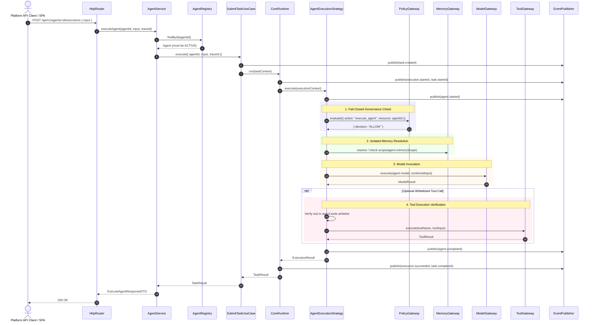

# Agents Architecture (v0.8)

## 1. Architectural Overview

In **v0.8**, `Agent` is introduced as a first-class domain capability within the hexagonal architecture of the `ai-operating-platform`.

An `Agent` acts as an operational capability profile that binds:
- A specific model configuration (`model`)
- Declared behavioral instructions (`instructions`)
- An authorized set of tools (`tools`)
- A partition of memory storage (`memoryScope`)
- Lifecycle state management (`status`: `ACTIVE` | `INACTIVE`)

Crucially:
> **AGENT DOES NOT REPLACE EXECUTION.**
> The platform maintains a single execution runtime (`CoreRuntime`) and a single execution lifecycle (`Execution`).

---

## 2. Component Architecture Diagram

```text
+---------------------------------------------------------------------------------------------+
|                                    PLATFORM API / HTTP                                      |
|  POST /api/v1/agents                                                                        |
|  GET  /api/v1/agents/:id                                                                    |
|  POST /api/v1/agents/:id/executions                                                         |
+----------------------------------------------+----------------------------------------------+
                                               |
                                               v
+---------------------------------------------------------------------------------------------+
|                                     APPLICATION LAYER                                       |
|                                                                                             |
|   +--------------------------+                         +--------------------------------+   |
|   |       AgentService       |                         |         SubmitTask             |   |
|   |  - createAgent()         |                         |  - creates Task (QUEUED)       |   |
|   |  - executeAgent()  ------+------------------------>|  - invokes CoreRuntime         |   |
|   +------------+-------------+                         +---------------+----------------+   |
|                |                                                       |                    |
|                v                                                       v                    |
|   +--------------------------+                         +--------------------------------+   |
|   |   AgentRegistry (Port)   |                         |          CoreRuntime           |   |
|   +--------------------------+                         +---------------+----------------+   |
|                                                                        |                    |
|                                                                        v                    |
|                                                        +--------------------------------+   |
|                                                        |     AgentExecutionStrategy     |   |
|                                                        +---------------+----------------+   |
+------------------------------------------------------------------------|--------------------+
                                                                         |
                        +------------------------------------------------+
                        |
                        v
+---------------------------------------------------------------------------------------------+
|                                        DOMAIN PORTS                                         |
|                                                                                             |
|   +-------------------+    +-------------------+    +------------------+    +-----------+   |
|   |   PolicyGateway   |    |   MemoryGateway   |    |   ModelGateway   |    |ToolGateway|   |
|   |  (Governance)     |    |    (Isolation)    |    |  (Model Binding) |    |(Whitelist)|   |
|   +-------------------+    +-------------------+    +------------------+    +-----------+   |
+---------------------------------------------------------------------------------------------+
```

---

## 3. End-to-End Execution Sequence

The sequence below illustrates the execution of an Agent through the single `CoreRuntime` path:



---

## 4. Failure Modes & Invariants

| Scenario | System Behavior | Exit State |
| :--- | :--- | :--- |
| **Inactive Agent** | Rejected in `AgentService.executeAgent()` before Task creation | `400 Bad Request` (`AgentInactiveError`) |
| **Unknown Agent** | Rejected in `AgentService.executeAgent()` | `404 Not Found` (`AgentNotFoundError`) |
| **Policy Denial** | `PolicyGateway` returns `DENY` | Task `FAILED`, Execution `FAILED`, `agent.failed` event emitted |
| **Policy Gateway Offline** | Fail-Closed principle | `PolicyDeniedError`, Task `FAILED`, execution halts |
| **Unauthorized Tool** | Tool not in `agent.tools` array | Execution halts immediately, Task `FAILED` |
| **Memory Isolation Breach** | Attempting to access key outside `agent.memoryScope` | Access denied, operation isolated |

---

## 5. Architectural Boundaries

1. **Domain Layer**:
   - `Agent` entity and `AgentRegistry` port defined in `src/domain/agent/`.
   - Domain errors (`AgentValidationError`, `AgentNotFoundError`, `AgentInactiveError`, `AgentAlreadyExistsError`).
   - Domain events (`agent.started`, `agent.completed`, `agent.failed`).
2. **Application Layer**:
   - `AgentService` handles CRUD, activation, deactivation, and coordinates execution with `SubmitTask`.
   - `AgentExecutionStrategy` implements the Core Engine's `ExecutionStrategy` interface.
   - `AgentQueryPort` and `AgentProjection` defined in `src/application/ports/query-ports.ts`.
3. **Infrastructure Layer**:
   - `InMemoryAgentRegistry` fulfills `AgentRegistry` domain port and `AgentQueryPort`.
4. **Platform API Layer**:
   - `PlatformService` orchestrates DTO transformation and calls `AgentService`.
   - `HttpRouter` exposes clean REST endpoints under `/api/v1/agents*`.
5. **Web Platform Control Plane**:
   - Pure DOM Single-Page Application consumes only `/api/v1` via `api-client.js`.
   - Zero internal imports into Core Engine or domain.
