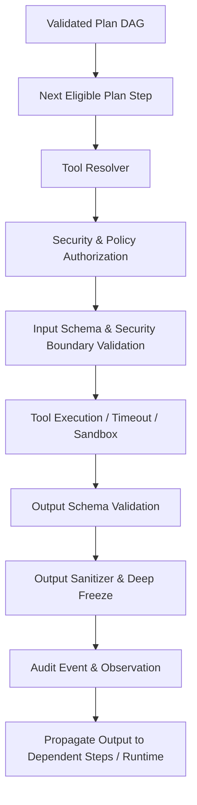

# Implementation Plan: Dynamic Tool Registry & Tool Invocation Runtime (Prompt 54)

## Problem & Context

In **Phase 15 (Real Intelligence Runtime)**, we have established the `ModelGateway` (Prompt 52) and the structured `LLMPlanner` (Prompt 53). Now, in **Prompt 54**, we must implement the **Dynamic Tool Registry** and the **Tool Invocation Runtime** to allow validated, declarative plans to execute real tools in a strictly verified, authorized, sandboxed, and observable manner.

### Fundamental Principle
> **"A registered tool does not mean any agent can execute it. A plan referencing a tool does not grant authorization. The LLM never executes tools directly."**

Execution pipeline:

---

## Proposed Changes

### 1. Tool Domain Contracts (`src/domain/tools/tool-registry.ts`)
- Consolidate domain types:
  - `ToolRiskLevel`: `"LOW" | "MEDIUM" | "HIGH" | "CRITICAL"`
  - `ToolExecutionMode`: `"READ_ONLY" | "IDEMPOTENT" | "SIDE_EFFECTING" | "DESTRUCTIVE"`
  - `ToolInputSchema` & `ToolOutputSchema` (supports typed properties or JSON Schema definitions)
  - `ToolDefinition`: `id`, `name`, `version`, `description`, `inputSchema`, `outputSchema`, `permissions`, `riskLevel`, `executionMode`, `timeoutMs`, `requiresApproval`, `metadata`
  - `ToolExecutionContext`: Immutable context carrying `traceId`, `taskId`, `executionId`, `operationId`, `principalId`, `tenantId`, `agentId`, `toolId`, `toolVersion`, `riskLevel`, `deadline`, `idempotencyKey`
  - `ToolExecutionResult`: `output`, `metadata`, `sanitized`, `bytesTruncated`, `durationMs`
  - Standardized domain error classes:
    - `ToolNotFoundError`, `ToolVersionNotFoundError`, `ToolUnauthorizedError`, `ToolInputValidationError`, `ToolOutputValidationError`, `ToolTimeoutError`, `ToolCancelledError`, `ToolRateLimitedError`, `ToolApprovalRequiredError`, `ToolPolicyRejectedError`, `ToolExecutionError`, `ToolDefinitionError`
  - Resource limits constants:
    - `MAX_TOOL_INPUT_SIZE = 65536` (64KB)
    - `MAX_TOOL_OUTPUT_SIZE = 1048576` (1MB)
    - `DEFAULT_TOOL_TIMEOUT_MS = 30000` (30s)
    - `MAX_TOOL_TIMEOUT_MS = 300000` (5min)
    - `MAX_CONCURRENT_TOOLS = 10`

### 2. Domain Events (`src/domain/events/events.ts`)
- Add domain event types:
  - `tool.registered`, `tool.unregistered`, `tool.invocation.requested`, `tool.authorized`, `tool.rejected`, `tool.execution.started`, `tool.execution.completed`, `tool.execution.failed`, `tool.execution.timed_out`, `tool.execution.cancelled`, `tool.approval_required`

### 3. Dynamic Tool Registry (`src/infrastructure/tools/in-memory-tool-registry.ts` & domain interface)
- Upgrade `InMemoryToolRegistry`:
  - Versioned registration: map keyed by `toolId` and `version` (`${toolId}@${version}`).
  - Lookups: `get(toolId, version?)`, `find(toolId, version?)`, `list()`, `listVersions(toolId)`.
  - Disallow replacing built-in/system tools by unauthorized callers.
  - Safe discovery: `discoverSafeDefinitions(options)` filters metadata and strips secrets, handlers, private properties, returning only public schemas and capability descriptions.

### 4. Tool Invocation Runtime & Gateway (`src/application/tools/tool-invocation-runtime.ts` & `tool-gateway.ts`)
- Create `ToolInvocationRuntime`:
  1. **Resolve**: Look up tool and version from `ToolRegistry`.
  2. **Authorize**: Validate `SecurityContext`, evaluate `PolicyGateway`, verify `SecurityBoundaryEnforcer` (agent tool allowlist, RBAC permissions, tenant boundary, risk level escalation prevention).
  3. **Approval Check**: If `tool.requiresApproval` or `riskLevel === "CRITICAL"`, check for valid human approval token before execution.
  4. **Input Validation**: Re-validate input against `tool.inputSchema`, payload size limits, and security injection checks (`__proto__`, `constructor`, `roles`, `permissions`, `tenantId`).
  5. **Execute**: Run tool with timeout deadline (`Promise.race` with timer cleanup) and bounded execution context.
  6. **Output Validation & Sanitization**: Validate against `tool.outputSchema` if defined, sanitize secrets (`sanitizeBoundedValue`), deep-freeze output.
  7. **Audit & Events**: Emit structured audit events through `EventPublisher`.

### 5. DAG-Aware Plan Execution Engine (`src/application/autonomy/plan-execution-engine.ts`)
- Implement declarative plan execution:
  - Executes a validated `Plan` according to its step dependencies (DAG).
  - Maintains step execution states: `PENDING`, `RUNNING`, `COMPLETED`, `FAILED`, `SKIPPED`, `CANCELLED`.
  - Propagates outputs from completed steps to dependent steps.
  - **Failure Propagation**: If Step A fails, dependent steps (e.g. Step B depending on A) transition to `SKIPPED` without execution. Independent branches continue if policy allows.
  - Honors `CancellationToken` gracefully.

### 6. Integration & Composition (`src/interfaces/composition.ts`)
- Wire `ToolInvocationRuntime`, `InMemoryToolRegistry`, and `PlanExecutionEngine` in `createPlatform()`.
- Register built-in tools (`CalculatorTool`, mock catalog search tools).

---

## Verification Plan

### Automated Tests
1. **Unit Tests**:
   - `tests/unit/tool-registry-dynamic.test.ts`: Versioning, duplicates, unregister, safe discovery, immutable definitions.
   - `tests/unit/tool-invocation-runtime.test.ts`: Input validation, output validation, timeout, cancellation, retry policies, secret sanitization, approval hooks, risk level immutability, tenant isolation.
   - `tests/unit/plan-execution-engine.test.ts`: Linear DAG execution, branching DAG execution, failure propagation (`SKIPPED`), partial branch execution, cancellation token.
2. **Security & Boundary Tests**:
   - `tests/unit/tool-security-boundaries.test.ts`: Tenant escape attempts, forged caller principal/role, prototype pollution, dangerous tool authorization, secret redaction.
3. **Architecture Isolation Tests**:
   - `tests/unit/architecture-isolation.test.ts`: Verify `ToolInvocationRuntime` and `PlanExecutionEngine` adhere to isolation boundaries.
4. **Full Regression Suite**:
   - `npm run check` and `npm test` verifying 752+ tests passing with 0 failures.
